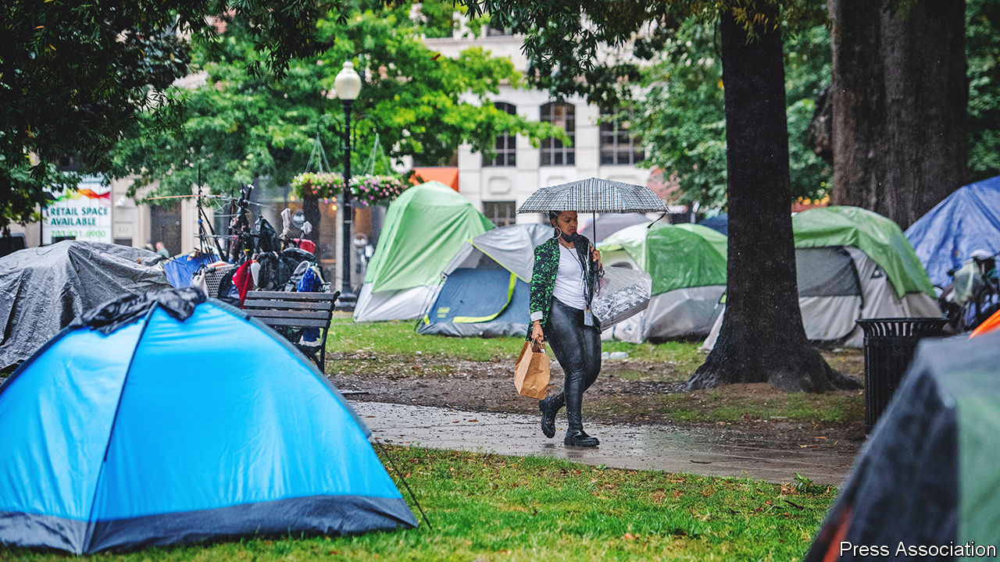

###### Cause for celebration

# Homelessness is declining in Washington, DC 

##### Despite the abundance of tents in the capital, the city is doing a good job 

 

> Nov 24th 2022 

Most inhabitants of the nation’s capital would probably be surprised to learn that homelessness rates are declining in the city. Some people have lived on the streets for years, but encampments multiplied during the covid-19 pandemic. One such tent community greets commuters as they trek between Union Station, the city’s main rail hub, and the us Capitol.

Yet there is cause for celebration. Despite appearances, homelessness has actually decreased by 47% (from 8,350 to 4,410 people) in Washington, dc, since 2016. Muriel Bowser, the mayor, credits her initiative, Homeward dc, for the improvement. Launched in 2016, the programme replaced a large shelter, dc General, with smaller facilities and support services, revamped the family homeless services system and opened a new men’s shelter.

Before it was closed, as many as 1,000 people (or 270 families) sheltered in dc General, a dilapidated former hospital. Almost nine years ago a young girl named Relisha Rudd disappeared from the facility. She was never found. Ms Bowser closed the facility in 2018 and replaced it with seven smaller shelters, each of which houses 50 families or fewer. The city now provides temporary housing year-round to families, rather than only when legally required during cold winter weather.

The city has also tried to intervene earlier, offering support to people before they become homeless, explains Laura Zeilinger, the director of dc’s Department of Human Services. This might include help with a utility bill, assistance with a landlord, or mediation services to help housemates solve conflicts that might otherwise land a person on the streets. All told the initiative has cost the city $300m since 2016. It is supported mostly with local funds, federal covid relief funding and the American Rescue Plan.

Yet despite the improvement, the tents remain. The unsheltered homeless are the hardest to help: they are more likely to be unemployed and to have severe health problems. During the pandemic, the Centres for Disease Control and Prevention encouraged officials to leave tent communities alone. Campers became more settled, explains Ms Zeilinger. While the number of homeless people living in encampments stayed steady, some accumulated belongings and multiple tents. This created the appearance of a growing community, she explains.

Jurisdictions matter too. Some tent communities in the District of Columbia are on federal land, such as the encampment between Union Station and the Capitol, and thus beyond the city’s reach. The National Park Service cleared the tents in June, but some have since returned.

dc is hardly alone in having a homelessness problem. The Department of Housing and Urban Development, a federal agency, reported that 326,000 Americans were in shelters on a single night last year (a decrease from 354,000 in January 2020). This measure does not capture everything, though. Whereas many seek help in shelters, some live on the streets or in dwellings where they are difficult to track. Others live in vehicles or stay with friends or acquaintances temporarily. People also move in and out of homelessness throughout the year, a fact that will be missed by a data point captured in one evening. School data can provide some insight. According to the National School Boards Association, nearly 1.4m pupils were homeless at one time in 2019.

While dc’s efforts have been impressive, the single best policy for reducing homelessness is to expand the housing supply. Studies have found that as many as half of people in shelters participated in the labour market, but wages are often not enough to avoid homelessness. According to the National Low Income Housing Coalition (NLIHC), no person working full-time on the federal minimum wage ($7.25 per hour for 40 hours for 52 weeks per year) can afford a two-bedroom rental in any state. In Arkansas (the most affordable state) a person needs to earn $14.89 per hour to afford a two-bedroom rental, while the state minimum wage is $11 per hour. Hawaii is the worst. A person needs $40.63 per hour in Hawaii, over three times the state minimum wage of $12 per hour. A one-line manifesto for homelessness in America would be: copy dc, clear the tents and build more.■


