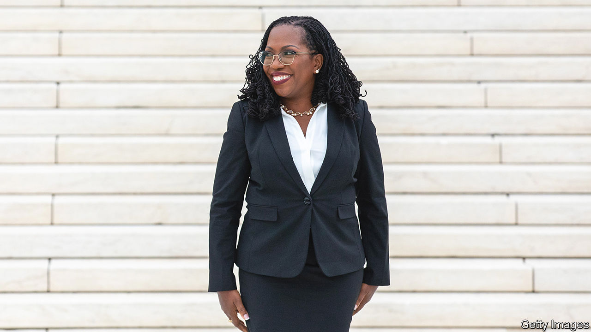
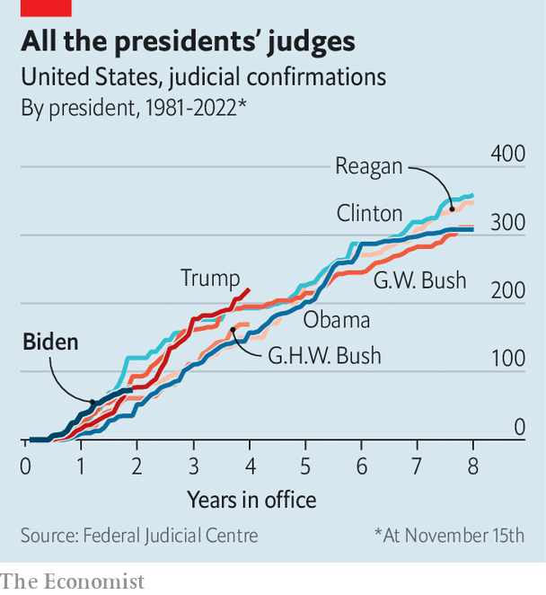

###### Bench press

# Joe Biden has a chance to rebalance America’s judiciary 

##### A Democratic majority in the Senate should have plenty of time to focus on the nominations 

 

> Nov 24th 2022 

THE MOST enduring legacy of Donald Trump’s presidency are the 234 judges he installed in the federal courts, amounting to more than a quarter of America’s judiciary and a third of the Supreme Court. Now that Democrats have retained control of the Senate, Joe Biden can make a mark of his own. He has already seated 85 judges, including 25 to the powerful circuit courts of appeal and one—Ketanji Brown Jackson—to the Supreme Court.

Whereas Mr Trump’s judges style themselves as “originalists”—followers of what they take to be the original meaning of the constitution—Mr Biden’s appointees largely eschew labels. Leah Litman, of the University of Michigan, says the 85 are “quite moderate and cautious”, in contrast to Trump appointees who “pen opinions suggesting courts should radically revisit the law”. Two caustic examples are James Ho of the Fifth Circuit Court of Appeals, who has opined on the “moral tragedy of abortion”, and Lawrence VanDyke of the Ninth Circuit, who in January mocked his colleagues by filing a bizarre faux opinion in a case involving covid restrictions and the right to bear arms. 

 


The less ostentatious jurists who have joined the federal bench under Mr Biden are the most diverse in history. Of the 85, 64 (or 75%) are women. Nearly a quarter are African-American; two-thirds are non-white. Mr Trump’s judges are mostly male (76%) and white (84%). Mr Biden is taking a cue from his predecessor on youthfulness: the average age of his nominees is 47; two recent choices for appeals-court seats are still in their 30s. According to Russell Wheeler of the Brookings Institution, a think-tank, more than a third of Mr Biden’s first-year appointees had worked as public defenders, including then-Judge Jackson. Progressive lawyers focusing on racial equality, voting rights and reproductive liberty have been in the mix, too

In 2022 Mr Biden has nominated more former prosecutors (six, up from two in 2021). John Collins, of George Washington University law school, sees this as a sign he is reaching out to Republican senators to “keep the nomination pipeline flowing”. Mr Collins notes that several former prosecutors—Cindy Chung in Pennsylvania, Doris Pryor in Indiana and Jabari Wamble in Kansas—have nominations pending for seats in red or purple states. Justice Jackson’s vacant seat on the DC Circuit Court was filled by Florence Pan, a moderate who clerked for a conservative judge. On one occasion Mr Biden’s deference to Republicans spurred a backlash among his supporters, and he backtracked on plans to nominate an anti-abortion judge in Kentucky as part of an ill-fated deal with Senate Republican leader, Mitch McConnell. 

Mr Biden’s aisle-crossing appeals may have helped smooth the path for his judicial nominees in a 50-50 Senate. None has been voted down. Most have received some Republican support. Only a handful of votes in the Judiciary Committee have split down the middle, spurring “discharge petitions” to get the nomination to a full Senate vote. And only once has vice-president Kamala Harris been needed to break a tie.

If Raphael Warnock wins re-election in Georgia in his run-off election on December 6th against Herschel Walker, the impact, according to Josh Chafetz of Georgetown law school, would be “huge”. A 51-49 Senate would move more efficiently, lining up floor votes without the risk of time-consuming discharge petitions. Democrats would press on with controversial judicial nominees even if one of their caucus is absent for a vote, notes Brandon Hasbrouck, of Washington and Lee University. Mr Collins reckons the extra seat might liberate Mr Biden to be “a little more aggressive” by choosing more progressive nominees. 

Democrats may have another weapon up their sleeves. During the Trump administration Senator Chuck Grassley, as Republican chair of the Judiciary Committee, abandoned the tradition of giving a potential circuit-court nominee’s home-state senators veto power over the nomination. Dick Durbin, the committee chair for the Democratic majority since 2021, has not revived this erstwhile “blue slip” process for appeals-court judges. But blue slips remain for district-court vacancies. If the GOP chooses “maximal obstruction” in the new Congress, Mr Chafetz says, Democrats may “get fed up and do away with blue slips” for those seats, too. 

With the House of Representatives moving to Republican control and legislative prospects dimmed, Mr Biden and the Democratic majority in the Senate should have plenty of time to focus on judicial nominations. Of the 116 current or expected vacancies in federal courts, 50 await a nominee. But no matter how quickly Democrats rush to fill those, Mr Biden’s confirmation record by the end of his term may not quite match that of his predecessor. Mr Collins says there are only 17 more circuit judges appointed by Democratic presidents who will be eligible to retire by the end of the 118th Congress. “Republican-appointed circuit judges”, he adds, “just aren’t retiring under Biden”. ■


