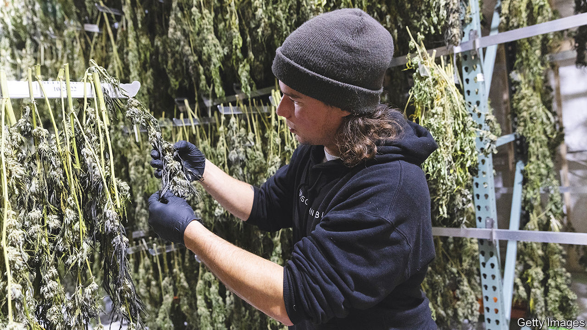

###### Surfing the third wave

# New York state reckons it’s got cannabis legalisation right 

##### The advantage of not going first 

 

> Nov 24th 2022 

ZuRong Chen faces steep competition. His unassuming shop, Long Wong Bakery II, is one of seven hawking red-bean buns and egg tarts along a small stretch of Avenue U in Brooklyn. When he embarks on his new business venture, however, Mr Chen will briefly encounter hardly any competition at all.

On November 21st Mr Chen was one of 28 entrepreneurs to be granted New York’s first retail licences for cannabis. Like the others, Mr Chen operates a small business and has a marijuana-related conviction or is closely related to someone who does. The state’s goal is to push those harmed by the war on drugs to the front of the queue in New York’s burgeoning recreational-weed market before retail licences open for all by the middle of next year. A further eight licences went to nonprofit organisations, such as Housing Works, which says it will use weed sales to support New York’s homeless HIV-positive population.

New York is not the first state to prioritise “social equity” in its cannabis-licensing roll-out. But its size makes it matter more than most. Its cannabis market could be worth $4.2bn by 2027, according to MPG, a consulting group. New Frontier Data, an industry-intelligence firm, expects New York to surpass all but California in sales within just three years. 

New York’s entry into weed retail is leading a third wave of legalisation, after California’s pioneering licensing of medical marijuana in 1996 and the recreational markets set up in Colorado and Washington state a decade ago. When New York became the 15th state to legalise adult-use cannabis, in 2021, it could learn from a rich array of existing market models. 

There is ample room for improvement. Connecticut reserved half its retail licences for people with cannabis convictions, but is charging an out-of-reach $3m a pop. New Jersey let its existing medical-marijuana operators gobble up retail permits, squeezing out upstarts. Florida requires its dispensaries to be vertically integrated—from cultivation to transport—all but guaranteeing that only big firms can enter. Just 22 companies operate 475 dispensaries; one, Trulieve, runs a quarter of them. And Oklahoma has enacted virtually no licensing restrictions apart from a $2,500 fee. Oversupply is an understatement: it has fewer than 4m people and more than 2,000 dispensaries, more than any other state. 

Axel Bernabe, senior policy director of New York’s Office of Cannabis Management (OCM), says the state will mimic Washington’s “two-tier market”. Just as Budweiser cannot run a liquor shop, big cannabis brands will not be allowed to operate their own retail stores, in order to democratise shelf space. At the launch Damian Fagon, OCM’s chief equity officer, addressed critics of the thoughtful, if somewhat convoluted, roll-out. “When they tell us there are easier ways to do this, we will ask: easier for ?” 

A few groups spring to mind. Cultivators, who were granted conditional growing licences months ahead of any sellers, have a $750m glut of product sitting in the fields. Next, law enforcement awaits a practical mechanism to stop the unlicensed sale of weed. Many consider California’s illicit market, which has undercut its regulated one, to be a cautionary tale. Lastly, OCM itself could have defined its application criteria more loosely and had an easier time of things. A legal challenge from an applicant who was convicted out-of-state has blocked OCM’s licensing roll-out in several regions. The office plans to award 175 equity licences before it opens up general licensing next year; it has so far distributed one-fifth of them.

Mr Fagon’s question is nonetheless a good one. Balancing the interests of investors, activists, small entrepreneurs and the established medical providers, in an historically unjust and federally still-illegal industry, is hardly a straightforward task. New York is attempting to acknowledge, if not satisfy, all the various parties.

Licensees do not yet have bricks-and-mortar premises, which will be built by the state, but they can soon start deliveries. Naiomy Guerrero, an art historian from the Bronx, is ready to go. After all, she says, she is from “a family of legacy operators”. ■


