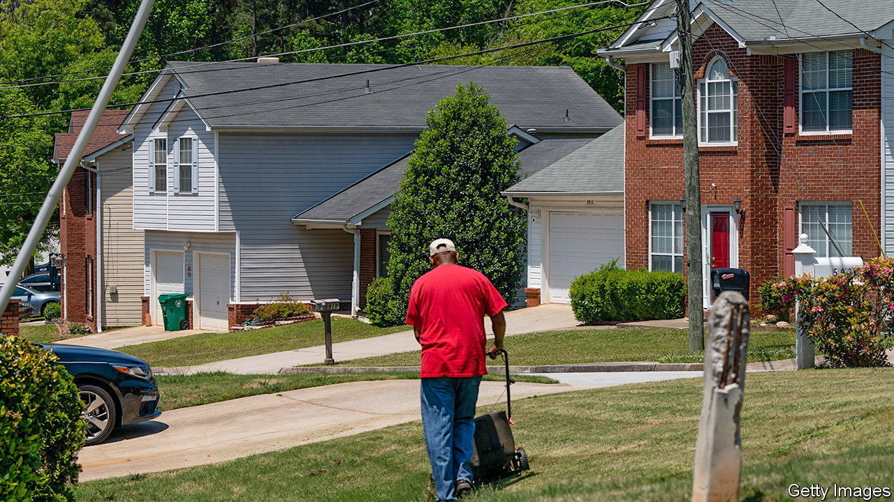
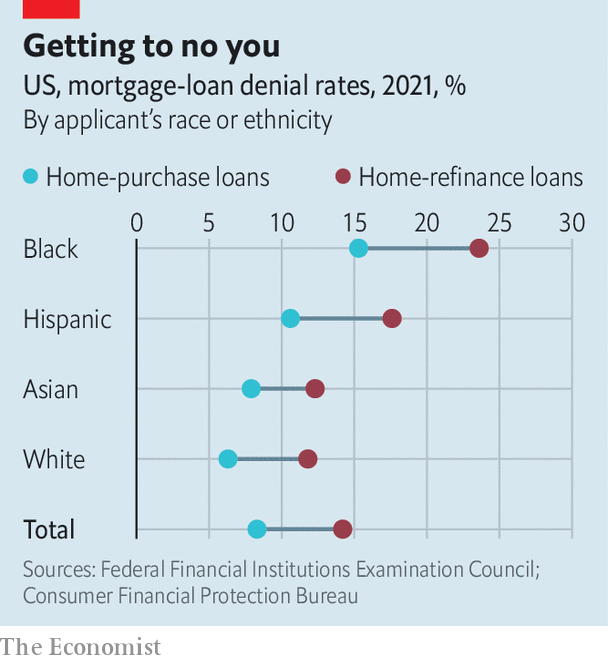

###### Loan to values

# Racial discrimination in mortgage lending has declined sharply in America 

##### Control for factors like credit scores and troubling racial gaps almost disappear 

 

> Nov 24th 2022 

“ATLANTA’S BLACK neighbourhoods are under attack.” So wrote the editors of the  in May of 1988 upon the release of “The Colour of Money”, a series of articles documenting racial disparities in mortgage lending in Georgia’s most populous city. The Pulitzer Prize-winning investigation, which analysed $6bn-worth of home loans made over six years, found that Atlanta banks made five times as many loans to white neighbourhoods as black ones, and rejected black applicants four times as often. The reaction was swift. Demonstrators marched through bank lobbies, the NAACP urged black residents to withdraw their bank deposits and the Justice Department launched an investigation into discriminatory lending practices. 

Much has changed in the 35 years since “The Colour of Money”, and yet racial disparities in mortgage lending remain. Data reported under the Home Mortgage Disclosure Act (HMDA) show that 15% of black applicants were denied conventional mortgage loans in 2021, compared with just 6% of white applicants, a ratio of more than two-to-one. Black homeowners seeking to refinance their existing loans were rejected 24% of the time, compared with 12% of the time for whites. Some lenders have been singled out. A recent analysis by  found that Wells Fargo, a bank, approved less than half of refinancing applications filed by black homeowners in 2020, compared with nearly three-quarters of those filed by white customers. 

 


To many Americans, such wide discrepancies in lending are proof of discrimination. A survey conducted in 2020 by the Pew Research Centre, a think-tank, found that 49% of American adults—and 86% of African-Americans—believe that black people are treated less fairly than white people when applying for a mortgage. But bankers have long argued that imbalances in mortgage approval rates reflect underlying differences in creditworthiness, not racial bias. Indeed African-Americans fare significantly worse than whites on several key lending criteria. Credit scores of black borrowers, for example, are about 8% lower than those of white borrowers. Their debt-to-income levels, meanwhile, are about 10% higher. Black borrowers have much higher loan delinquency rates, too. 

For decades the conventional wisdom was that both economic factors and discrimination played a role in lending patterns. A seminal study by economists at the Federal Reserve Bank of Boston, published in the  in 1996, analysed nearly 3,000 loan applications submitted to Boston-area lenders in 1990. The researchers found that credit histories, debt-to-income ratios, loan-to-value ratios, and other strictly economic factors explained more than half of the difference in denial rates between black and white applicants. But race mattered, too. Even after accounting for their creditworthiness, black mortgage applicants were rejected about 1.8 times as often as whites. 

But new research by economists at the Federal Reserve Board suggests that such discrimination is less widespread than it was 30 years ago.* Using a dataset of nearly 9m loan applications submitted in 2018 and 2019, the authors found that 17% of black applicants were turned down, compared with 8% of white applicants. But after controlling for the results of automated underwriting systems, which reflect the underwriting guidelines of government-sponsored entities like Fannie Mae and Freddie Mac, and cannot take race into account, this gap was cut in half. After other relevant risk characteristics such as credit scores were controlled for, this figure fell to less than two points—a result that the authors describe as “significant progress”. 

What explains the improvement? Laurie Goodman of the Urban Institute, a think-tank, says that the decline of manual underwriting is one factor. “I’m sure automated underwriting, where very little is done manually, has made a difference because it leaves less discretion.” Stricter enforcement of the Fair Housing Act and the Equal Credit Opportunity Act, which prohibit discrimination in lending on the basis of race, is another. Last year the Justice Department launched an effort to crack down on “redlining” by financial institutions—the practice of denying credit to particular neighbourhoods. Since then the department has reported four lawsuits and settlements worth a combined $38m. 

Experts point out that although mortgage underwriting systems are becoming less biased, the data fed into them may still reflect historical discrimination. These data can be improved, says Ms Goodman. “If the issue is credit scores, let’s figure out how to make credit scores better and more reflective of people’s true creditworthiness.” Overall, though, the picture is one of progress. “I think it’s fair to say that there’s still some discrimination, but it’s not very common,” says John Yinger, an economics professor at Syracuse University. ■


*“How Much Does Racial Bias Affect Mortgage Lending? Evidence from Human and Algorithmic Credit Decisions,” N. Bhutta, A. Hizmo and D. Ringo (Board of Governors of the Federal Reserve System).

