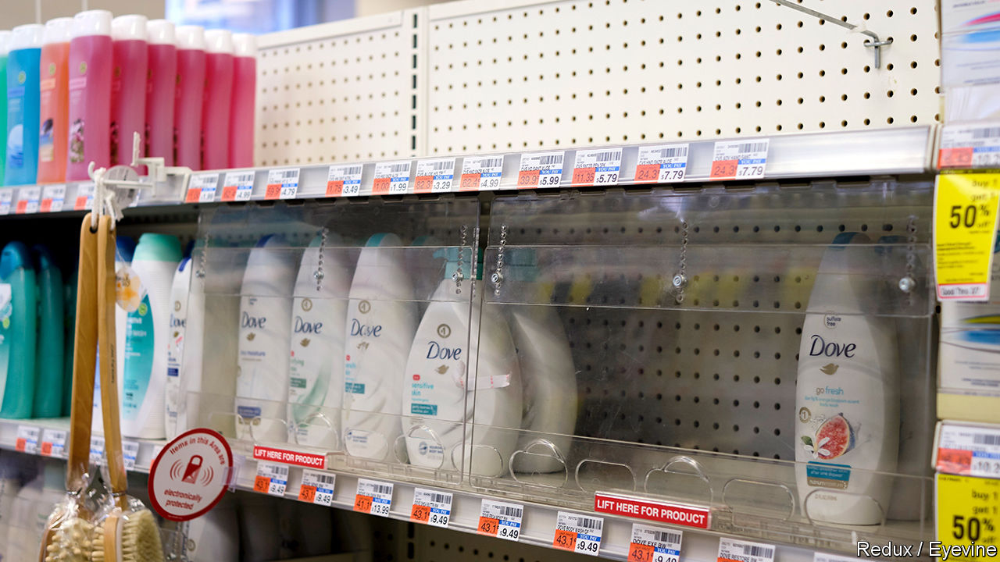
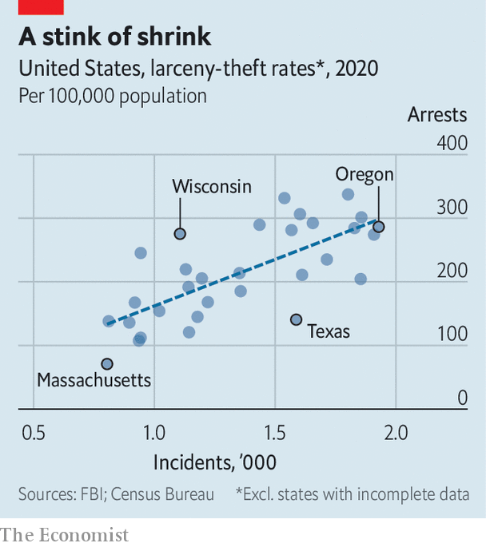

###### Orc invasion

# Why it’s hard to buy deodorant in Manhattan 

##### Organised retail crime gangs are behind a shoplifting spike 

 

> Nov 24th 2022 

Customers dashing into a Manhattan pharmacy for deodorant these days are confronted with shelves of locked glass boxes. Buttons marked “call for assistance” bring managers over to unlock them on request. Stores have responded to an uptick in shoplifting by revamping security systems, or closing down. Rite Aid, a pharmacy, closed a branch in Hell’s Kitchen in February after losing $200,000 worth of stuff last winter. And last week Target, a big retailer, reported that a rise in “shrink” (to use the industry jargon) had reduced its gross profit margin by $400m so far this year. The National Retail Federation says inventory loss, largely driven by theft, cost retailers a record $95bn last year. 

 


What is behind this unwelcome rise? Some speculated that prosecutors had gone soft on looting after the Black Lives Matter protests in 2020. But it is hard to see any such trend in the data: generally states with more shoplifting prosecute more shoplifters (see chart). A more likely culprit is a rise in organised retail crime (orc). Carefully planned operations, where criminal groups steal large amounts of swag to flog for a profit, have grown “exponentially” in scope and sophistication in the last few years, says Lisa LaBruno of the Retail Industry Leaders Association.

The most stolen items include deodorant, laundry detergent, razors and infant formula, which are in consistent demand and are easy to sell on. orc groups typically use online marketplaces to sell their stolen wares. Last summer a couple in Alabama pled guilty to shifting $300,000-worth of stolen baby formula on eBay. Despite this, Ms LaBruno notes, there has been “little to no progress” in convincing e-commerce firms to identify and shut down criminal actors and suspicious sales. A federal law making it tougher to sell stolen goods online is making its way through Congress. The bill would force high-volume third-party sellers to provide a physical address, bank account number, and tax id, making illicit transactions riskier. This could be voted into law as early as December.

On October 17th the Department of Homeland Security launched “Operation Boiling Point”, a co-ordinated federal and local effort to disrupt orc gangs. Several states have established organised retail crime task-forces, including Utah, Illinois and California. This is a start. But as Karl Langhorst of the University of Cincinnati, points out, many of these gangs operate across state lines. He thinks the government should go further and pass the first federal law creating a nationwide database of offenders. 


