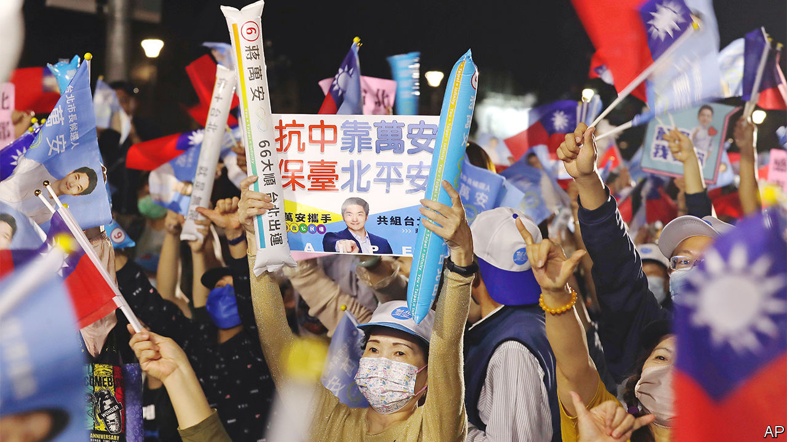

###### Taiwan’s election

# Across the Taiwan Strait, another lockdown protest 

##### Taiwanese voters give the Democratic Progressive Party a kicking 

 

> Nov 29th 2022 

The kuomintang (KMT) is one of the few remaining Taiwanese institutions to hold that China and Taiwan are one country. And the party of Chiang Kai-shek, which fled to the island in 1949 after its defeat by Mao Zedong’s Red Army, has suffered for that anti-independence position. Polls conducted in the run-up to Taiwan’s local elections on November 26th found that most Taiwanese believed they had a separate cultural identity from China. Support for independence was at nearly the highest level on record, while support for the KMT was at 14%, a record low.

Yet the KMT did much better in the elections—and the ruling Democratic Progressive Party (DPP) much worse—than this would suggest. Among over 11,000 posts up for grabs, the most prestigious were for 21 mayors and county commissioners. The KMT won 13, including plum positions in Taipei and northern Taoyuan, giving it control of four of the island’s six biggest cities. Underlining its resurgence, a great-grandson of Chiang, Wayne Chiang Wan-an, was elected mayor of Taipei. The job is often seen as a route to the presidency.

The pro-independence DPP suffered its worst thrashing in over three decades. It won only five of the top jobs, including none in the island’s north and centre. The island’s DPP president, , announced that she would resign as the party’s chairwoman to atone for the disaster. 

At a time of high tension across the Taiwan Strait—following an unprecedented series of  in August—these were striking results. Yet they probably do not signal change in Taiwanese sentiment towards China, which has never played a big role in local politics. As elsewhere, voters mainly seemed anxious about the economy and aggrieved by the coronavirus-related strictures their leaders had placed on it. While Taiwanese  thrived during the pandemic, many small businesses were hard hit by bans on indoor dining and entertainment.

The KMT’s local patronage networks—developed during its 40 years of single-party rule—made it well-placed to exploit anti-incumbency sentiment. The opposition party did not project a unified campaign message. Its candidates mostly talked about their individual records or the government’s failures. At a KMT rally in Taoyuan, not even Taiwan’s usual campaign festivities (including a troupe of saxophonists illuminated by disco lights beside a red-eaved temple) could raise the electoral mood. Many in the crowd griped that the DPP had not kept its promises.

Ms Tsai launched a late effort to make the vote a show of defiance to Beijing. “We will use our votes to let the world see that Taiwanese people are determined to uphold freedom and democracy,” she declared. It got her nowhere. Albert Chiu of Tunghai University in central Taiwan suggests many Taiwanese are tired of squabbles over national identity, especially after Ms Tsai’s refusal last year to accept an offer of much-needed vaccines from China during a severe covid outbreak. Prudently, China gave the DPP leader no added cause for grievance during the campaign. Unlike in previous elections, according to Joseph Wu, Taiwan’s foreign minister, the government in Beijing made no significant effort to sway Taiwanese voters. 

If the results were driven by domestic concerns, they could have geopolitical consequences. China does not trust the KMT, but much prefers it to the DPP. The election may persuade it that Taiwan is not drifting inexorably towards independence. China praised the results, claiming in a statement that they “revealed that mainstream public opinion on the island is for peace, stability and a good life.”

Ms Tsai, a skilled diplomat attuned to American feeling on Taiwan, will now take a back seat as her party looks for a candidate for the presidential election due in 2024. It will probably be her vice-president, William Lai, a more forthright advocate of independence. The KMT would hope to deny him. Yet it may need to adopt a more popular position on China before it can challenge for national power. Its recent triumph may make that less likely.■

