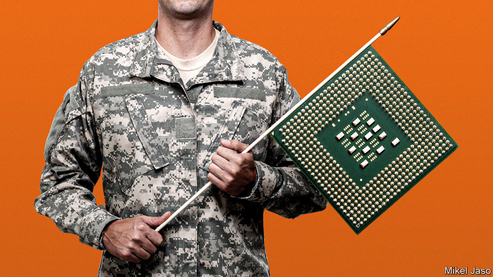

###### When the chips are down

# America’s Asian allies dislike its tech war on China 

##### What looks black and white to America is fraught for its friends in Asia 

 

> Dec 1st 2022 

America has declared a technology war on China. In August Joe Biden signed the Chips and Science Act which includes $52bn in incentives and subsidies to ramp up semiconductor manufacturing in America. The president’s landmark Inflation Reduction Act was passed the same month, with subsidies for made-in-America electric vehicles and the like, meant in part to bring supply chains back from China. In October Mr Biden announced unprecedented curbs on tech exports, intended to cut Chinese companies off from advanced semiconductors made anywhere in the world with American equipment or know-how. The aim is to control China’s rise, by thwarting technological development that could boost its capabilities, especially in the military and cyber spheres.

Those waging war usually seek allies. America is duly leaning on its Asian friends, including Japan, Singapore, South Korea and Taiwan (which makes nine-tenths of the world’s advanced semiconductors), to join the tech fight against China. For example, it has for months been urging Japan, another tech giant, and the Netherlands, home to asml, a crucial supplier of chip-manufacturing technology, to enshrine its tech goals in a trilateral pact.

The Asians are somewhat reluctant to play ball. It is not that they fundamentally disagree with America’s analysis of the risks of China’s rising power and capabilities. And none of them wants America to abdicate its role as the guarantor of security in the Indo-Pacific region. But they dislike being seen to be bossed around. And they have much less appetite than America for a Manichean superpower struggle. Nearly all the countries of the region have deep economic ties with China that they are loth to rupture.

That even goes for Taiwan, the world’s pre-eminent semiconductor powerhouse, which is firmly in the Western camp and subject to relentless Chinese bullying. China accounts for over a quarter of the global annual demand for semiconductor equipment. About 60% of the chips Taiwan makes are sold to it, Tony Phoo of Standard Chartered, a bank, estimates. Yet Taiwan relies so heavily on American companies for business, and on the American government for weapons, that it has little choice but to comply with America’s export-control regime and cut sales of advanced chips to China. Economists expect that to hit Taiwan’s growth next year.

Until recently, strategic competition in Asia ran on parallel tracks to the story of Asia’s growing economic integration. Now competition has jumped the tracks and careened into the economic story. For now, Asian officials say, there is no point in challenging the American line. Some Asian firms are even taking measures to go along with it. With the help of subsidies, tsmc, the world’s leading chipmaker, is building a foundry in Arizona, and another in southern Japan. South Korea’s Samsung Electronics is building a chip-plant in Texas. This week Mr Biden visited a South Korean semiconductor facility in Michigan.

Such “friend-shoring”, a euphemism for shifting sensitive operations out of or farther away from China, helps allay American fears over high-tech supply chains. But, say Asian policymakers and companies, there are limits to it.

In the case of Taiwan’s chipmakers, even if some production moves to America, the development of next-generation chips continues to take place on the island. It has a complex and thriving research environment involving hundreds of established companies and institutes that cannot simply be packed up and exported, even if the political will to do so existed. Many Taiwanese view the semiconductor industry not only as a source of jobs and prosperity. They see it as Taiwan’s security guarantee: without it, they say, America and its allies would be less likely to defend the island if it is attacked by China. The industry is known locally as the —the magic mountain that protects Taiwan. President Tsai Ing-wen calls its semiconductors “democracy chips”.

In South Korea, there is resentment over American protectionism benefiting home-grown firms. In theory, foreigners manufacturing in America are eligible for subsidies. But local-content rules are hard to satisfy. South Korean makers of electric vehicles in America transgress them because they use Chinese batteries.

Japan will probably sign up to America’s agenda in the end, but at a cost. Chipmaking equipment is Japan’s second-biggest source of exports, and a third of it goes to China. When it comes to semiconductors, a Japanese official recalls telling an American counterpart, “our interests and your interests are not identical.” Japanese companies also specialise in sophisticated components for high-tech products that are not covered by the American restrictions. But what if, say, Chinese-made smartphones that contain them end up being covered? As a minimum precaution, some Japanese tech companies, such as Murata, which supplies smartphone-makers, may need to create twin supply chains, one facing America, the other China.

Perhaps, a Singaporean expert suggests, the American approach will not prove to be as draconian as many fear. Certainly, China will be denied the top slice of the most sophisticated chips, with implications for those supplying them. But the hope of some in the Biden administration for a complete bifurcation in tech trade between Chinese and American spheres may prove to be forlorn. American companies are lobbying hard against it. The majority of iPhones, it should be noted, are still produced in China. The task of decoupling American and Chinese supply chains looks to many—including some other members of the administration—to be just too big to be realistic.

But what if America persists? Andrew Yang, a Taiwanese former deputy defence minister, is indeed convinced it will step up its efforts, because “China is [America’s] number one competitor.” That logic is amplified by Evan Feigenbaum of the Carnegie Endowment for International Peace, a think-tank in Washington, dc. America, he says, is trying to elicit from its friends “voluntary compliance. And if it cannot…[it] is going to bring the hammer down.” Yet as America’s competition with China intensifies, can it really afford strained relations with its Asian friends?■

