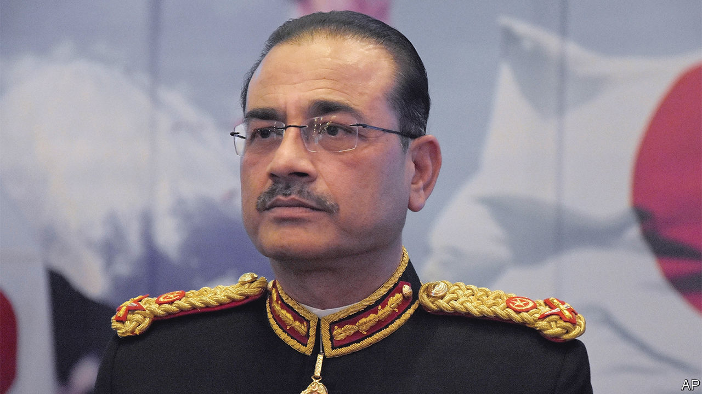

###### Hail the new chief

# Pakistanis turn against the army 

##### General Asim Munir has an opportunity to mind his own business 

 

> Dec 1st 2022 

The malacca cane symbolises arguably the highest power in Pakistan. On November 29th the cane, a ceremonial baton of command, changed hands for the first time in six years when General Qamar Javed Bajwa handed it to General Asim Munir, anointing him army chief.

General Munir, who used to head Pakistan’s powerful spy agency, isi, will now run the country’s most powerful institution and self-appointed arbiter of Pakistani democracy. Army chiefs are hired by the prime minister. They often return the favour by deposing their appointer. This is the main reason none of Pakistan’s 22 prime ministers has completed a full term, and none knows it better than the incumbent, Shehbaz Sharif. His elder brother Nawaz, a three-time former prime minister, appointed Pervez Musharraf army chief in 1998, then was toppled by him in a coup. In 2016 Nawaz appointed General Bajwa and, allegedly at the army chief’s behest, was duly stripped of his office by the Supreme Court and banned from politics for life. 

If Shehbaz Sharif fares better at General Munir’s hands, it may be because of his predecessor, Imran Khan. A former army favourite (who was helped to power by General Bajwa), Mr Khan was ousted in a vote of no-confidence in April which, yet again, had the army chief’s handprints all over it. A charismatic rabble-rouser and conspiracy theorist, Mr Khan promptly accused General Bajwa of plotting with America against him. After this accusation helped his party win a clutch of by-elections, he upped the ante. Mr Khan accuses a senior army officer, Mr Sharif and the interior minister, Rana Sanaullah Khan, of orchestrating an assassination attempt that left him wounded last month.

General Bajwa tried to put Mr Khan in his place by inducing the current isi boss and other bigwigs to denounce him. If anything this increased Mr Khan’s popularity—which extends to the army’s rank-and-file. The former prime minister may be the biggest domestic challenge Pakistan’s generals have faced. Tens of thousands flocked to hear him at a rally in Rawalpindi—the army’s main garrison—last week. “I’m more worried about the freedom of Pakistan than my life,” he thundered, while seated because of his bullet wounds. 

General Munir must be worried. Yet his best hope of foiling Mr Khan, General Bajwa’s blundering suggests, is to sit tight. Mr Khan wants an election and is threatening to dissolve the assemblies of Punjab and Khyber-Pakhtunkhwa, which his party controls, to try to force one. But dissolving Parliament is Mr Sharif’s prerogative, and he has vowed to carry on until its term ends in August. The army chief should support that constitutional process. 

He has duties of his own to attend to. The Pakistani Taliban have abandoned a ceasefire. Relations with the Afghan Taliban are poor. And the economy, stricken by pandemic shocks, political turmoil and floods, cannot afford any additional stress.

Pakistan has enough foreign-currency reserves to cover only a month of imports. The risk of default in the bond market has soared. Past army chiefs might have considered that such dire circumstances warranted a military intervention. General Munir would distinguish himself by utterly disdaining such nonsense. ■

