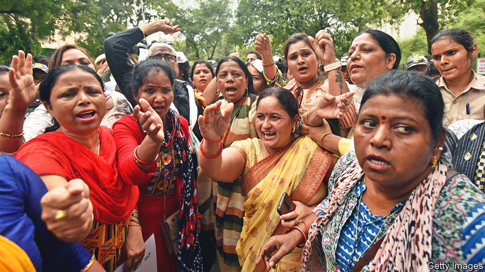
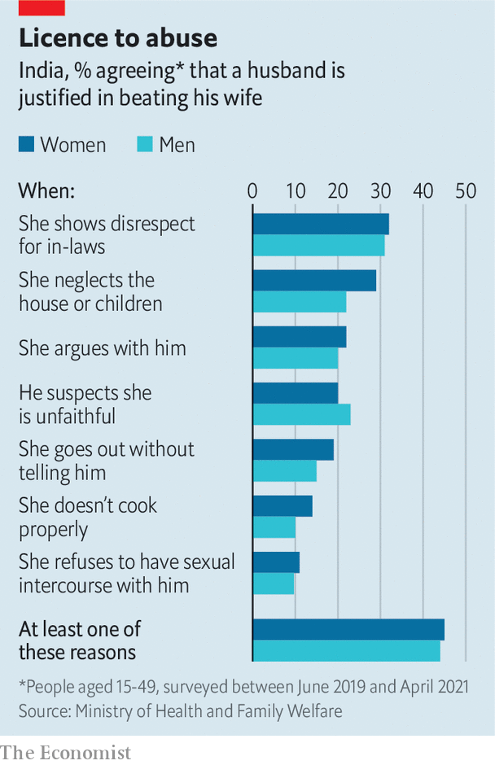

###### No safe space

# What two crimes reveal about violence against Indian women 

##### Despite some improvements, domestic abuse is rampant 

 

> Nov 29th 2022 

On a cold December night ten years ago a 23-year-old physiotherapy student on her way home from the cinema boarded a bus in the suburbs of Delhi. As it rattled around India’s capital, Jyoti Singh was raped and mutilated by six men, including the driver, and dumped by the roadside. She died of her injuries two weeks later. The case provoked global revulsion and sober promises from Indian politicians to make the country safer for women. 

Yet, a decade on, the killing of another young professional woman in Delhi has underlined the peril that millions of Indian women still face. Shraddha Walkar, a 27-year-old call-centre worker from Mumbai, disappeared in Delhi six months ago. She had previously, it emerged, filed a police complaint against her partner, Aftab Poonawala, accusing him of beating and threatening to dismember her. He was arrested this month and, the police say, confessed to killing Ms Walkar and chopping her into 35 pieces, which he stored in a specially purchased freezer before dispersing them around the capital. (His lawyer denied that he had confessed to the crime.)

Ms Walkar’s killing, which has dominated national news, is a reminder that most violence against Indian women happens at home. Reliable statistics are hard to come by, but those that exist suggest domestic abuse is routine. Some 30% of currently or previously married women aged between 18 and 49 told the National Family Health Survey they had been subject to it. Of those who said they had experienced sexual violence, 96% said a husband or former husband was the perpetrator. Delhi recorded six cases a day of rape and 15 of cruelty by a husband or in-laws during the first half of this year, which activists reckon reflects a tenth of the total. Securing a conviction in such cases can take years.

The backlash to Jyoti Singh’s murder did lead to progress. “It forced members of the elite and the middle class to consider that it could be them,” says Shrayana Bhattacharya, an economist and author of a book on Indian women. The case led to the creation of a special commission, on whose recommendation parliament passed several laws making it easier to prosecute sexual assault and related offences such as stalking or voyeurism. Fast-track courts were set up to try rape cases. 

For a few years, the share of victims who report sex crimes to the police went up. Then it levelled off. Some states are trying to tackle this, for example by hiring more female cops and creating women’s help desks or all-female police stations.

Recent efforts to bolster women’s status could be even more beneficial. The Supreme Court has played a particular role in promoting equality. It has expanded women’s right to inherit property, expanded access to abortion for single women and stressed sexual autonomy in relationships in a ruling that decriminalised adultery. It also ruled that the Muslim practice of “triple talaq”, an easy divorce option for men (but not women), was unconstitutional. 

Yet legal and institutional responses go only so far. Social attitudes matter more and are harder to change.

 


There are some signs that harassment in public spaces is becoming less acceptable, particularly in cities. “Urban women no longer take any nonsense,” says Ranjana Kumari, the director of the Centre for Social Research in Delhi. Yet things look bleaker in the home. Over half of Indian men and women say it is acceptable for husbands to beat their wives on occasion (see chart). The marital exemption for rape has been challenged in the Supreme Court but continues to enjoy majority support. 

Laws to protect women are often used against them. Research by Rukmini S, a journalist, suggests women are often pressed into making bogus rape allegations against a partner of whom their relatives disapprove. Several states have passed laws against “love jihad”, a conspiracy theory that Muslim men are seeking to lure Hindu women away from their faith, thereby making inter-religious relationships even harder than they already are. 

On the flipside, where women are in danger, social pressures can impede the law. Ms Walkar later retracted her police complaint against Mr Poonawala, allegedly under pressure from him and his family. 

The best answer to the violence, ultimately, is empowering women. The more educated, free to choose a mate and economically independent women are, the less they are abused. This suggests big improvements will take time.

Indian women are becoming more educated, albeit from a very low base. The number entering university increased by 18% between 2016 and 2020. And though over 90% of marriages are arranged, here too there is progress; middle-class women increasingly decide whom they marry. Yet the share of Indian women who work was among the lowest in the world even before the pandemic sent it even lower. It is only beginning to recover. “A woman, a mother holds the highest position, highest regard in our country,” Narendra Modi, the prime minister, once said. If only it were true. ■


