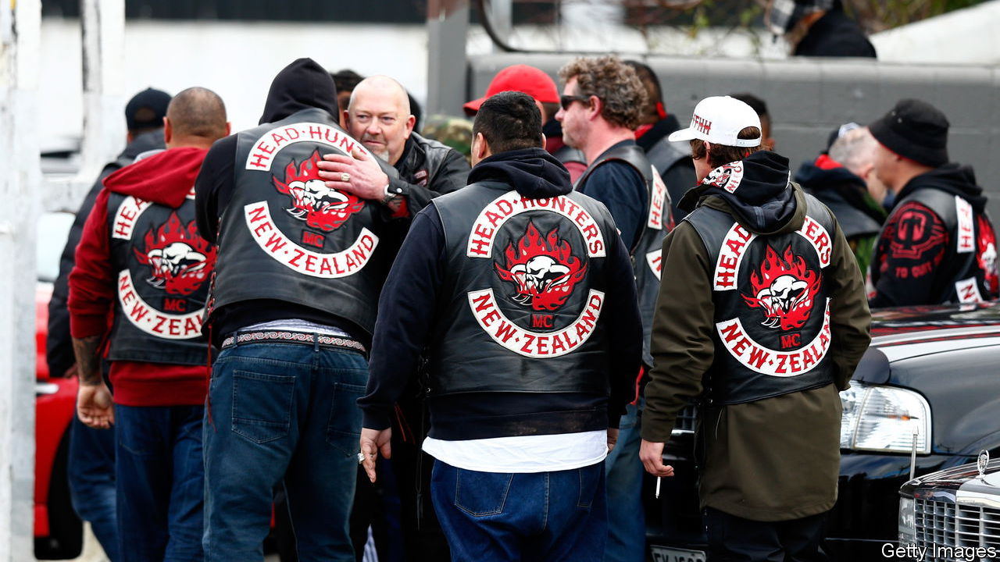

###### Mongrel mobsters

# Why New Zealand has such a high rate of gang membership 

##### Australia is only partly to blame 

 

> Dec 1st 2022 

A fter ihaka’s father died, his mother hit the bottle and the Maori teenager got into drugs. “I had all these mental frustrations that I didn’t know how to cope with,” he recalls, now aged 24 and awaiting trial for assault. “My family disowned me so I ended up living on the streets. That’s how I became a gang member.” 

Such stories are common among New Zealand’s Maori minority. They are the main reason the country of 5m has dozens of mainly Maori gangs and one of the highest rates of gang membership in the world. “The gangs gave me a sense of belonging and a purpose,” said Ihaka, speaking at a rehabilitation centre for former gangsters in Rotorua, a sulphurous town on the country’s North Island. “They showed me what the true meaning of family was.” Many others on the programme—mostly well-built Maori inked with gang slogans and insignia—said similar things. They claimed to have been drawn to gangs in search of family. 

As a messy form of community-building among the country’s indigenous people, the gangs have a degree of acceptance. Members of Black Power, which has been around since the 1970s, performed a haka at the funeral of Robert Muldoon, a former conservative prime minister. A chapter of Mongrel Mob, the biggest Maori gang, has a press officer. Yet recent growth in both gang membership and, on its heels, gang violence is causing serious concern.

Gang membership is estimated almost to have doubled since 2016, to over 8,300 And official figures probably underestimate the problem, says Billy McFarlane, a former methamphetamine dealer who runs the rehab programme in Rotorua. He reckons around 30,000 Kiwis are “closely involved” with gangs. The growth is causing turf wars. During two weeks in May and June the city of Auckland saw 23 drive-by shootings in a feud between two motorcycle crews, the Tribesmen and Killer Beez. 

Many New Zealanders blame the upheaval on their usual bugbear: Australia. It has repatriated several mob bosses under a policy of deporting long-term foreign residents who commit crimes. The former gangsters in Rotorua said the returnees had brought a more ruthless culture. They “bring heaps of bullshit with them that New Zealand never had before”, said Ihaka.

The police broadly agree. The deportees have links to transnational crime groups, says Greg Williams, head of New Zealand’s organised-crime police department. Some have also established rival gangs. The Comancheros, an Australian biker group with a penchant for gold-plated motorcycles, set up a Kiwi chapter in 2018. The new arrivals often poach members from established mobs. That makes “some of the local gangs arm themselves and be ready for heavier violence”, says Mr McFarlane. 

Yet the gangs were becoming more organised even before the repatriations on the back of their main business, dealing drugs. They have almost a monopoly on the supply of methamphetamine, which has a street price in New Zealand up to 20 times higher than in America. Mr Williams estimates that gangs make NZ$300m ($279m) a year dealing meth alone. Many mobsters are hooked on it.

The violence has become a big political issue. The conservative opposition party, National, wants to ban gang insignia. The Labour government, led by Jacinda Ardern, generally takes a more careful approach; though it is recruiting more police officers. “We need to get to the root causes,” says the police minister, Chris Hipkins.

Mr McFarlane’s programme, in which he teaches Maori offenders about their language and culture, looks like a good start. The former drug-dealer talks of helping them “find a sense of direction, and stop[ping] the flow of our people in and out of prison.” Jail can exacerbate the problem. Roughly a third of inmates in New Zealand are gangsters, which makes prisons mob recruiting grounds. “Everything I was looking for in my life was in jail—all my bros that I grew up with,” says Makiha Mihaka, a former member of the Mongrel Mob. It was there, he says, that “I grew as a mobster.”■

