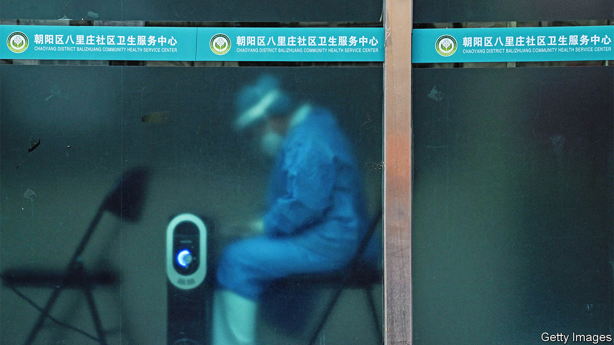
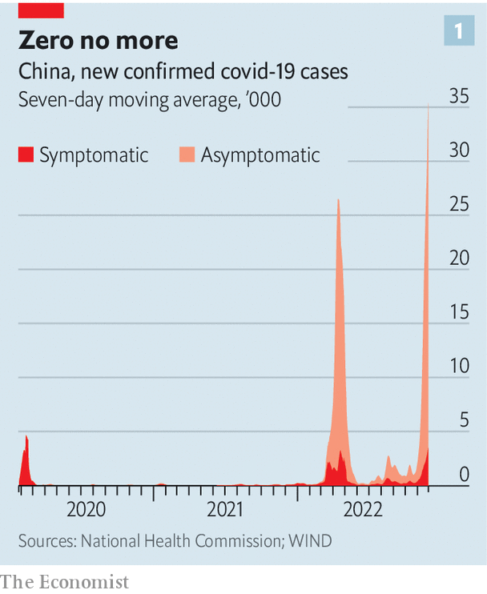
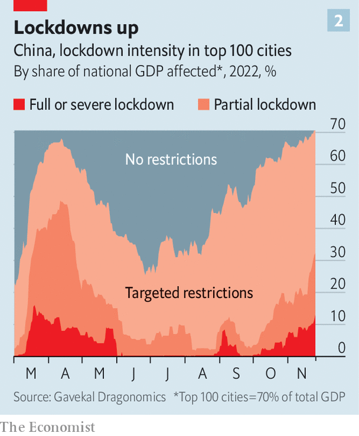
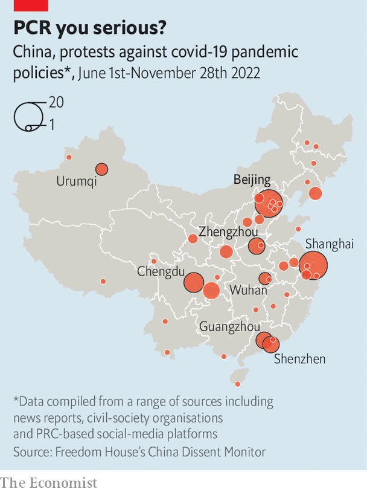
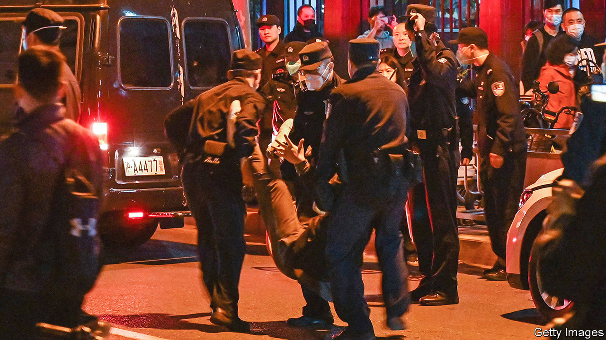

###### China v covid-19

# China’s failing covid strategy leaves Xi Jinping with no good options 

##### Loosen up and deaths soar. Clamp down and the economy swoons 

 

> Dec 1st 2022 

Readers of the , the Communist Party’s official mouthpiece, could scan the issue of November 29th and come away thinking that the fight against covid-19 is going splendidly. A front-page commentary on Xi Jinping’s first decade as China’s leader praised him for controlling the pandemic, stabilising the economy and defusing crises. Of the surging number of new infections, of the dire state of the economy owing to widespread, strict and enduring public-health restrictions, and of the protests that have erupted around the country against Mr Xi’s “zero-covid” strategy, there was not a whisper.

 


Reality, however, is not as biddable as the . Mr Xi is in a crisis of his own making, with no quick or painless route out. New covid cases are near record levels (see chart 1). The disease has spread to more than 85% of China’s cities. Clamp down even harder to bring it back under control, and the economic costs will rise yet higher, further fuelling public anger. Allow it to spread and hundreds of thousands of people will die, if not more.  has modelled the likely progress of China’s current outbreak. If it is allowed to proceed unchecked, even assuming all patients who need intensive care receive it (which they would not), some 680,000 people are likely to die. China’s leaders appear to be searching for a middle ground, but it is not clear there is any.

Zero-covid is a vast undertaking, built around a daunting goal: to detect every person who has the virus and to quarantine them and their close contacts within hours. Refusing to live with the virus, China has used mass testing to screen hundreds of millions of people in a single day, built pop-up quarantine centres across the country and locked down whole cities and even regions for months. Party leaders call this the only way to keep China’s people safe, given its large population, weak health system and many old people.

In 2020 and 2021 zero-covid worked remarkably well. Officials like to contrast mainland China’s official death count from the pandemic of 5,233 with the more than 1m people killed in America. This, they argue, is proof of Western decadence. But Omicron and its subvariants are more contagious than the variants that prevailed in the early stages of the pandemic, straining the effectiveness of zero-covid and spurring lockdowns that bankrupt businesses and exhaust citizens. The public is losing confidence that it is worthwhile.

The ideal would be a gradual opening once preparations for the inevitable surge in infections are in place. This is the path taken by such formerly closed-off places as Australia, Singapore and Taiwan. It involves administering vaccines and boosters, stockpiling anti-viral drugs, training medical staff, expanding intensive-care units (icus) and adopting protocols to decide which patients to treat where.

But China is not ready for an orderly exit of this sort, says Yanzhong Huang of Seton Hall University in America. China’s leaders have failed to vaccinate the population properly, especially the old. A course of three locally made vaccines provides good protection against severe disease and death, but only 40% of those over 80 have had the full three. A campaign to encourage the old to get jabbed, announced on November 29th, will take time. Giving everyone a fourth booster would allow for a much safer exit, but work on that has barely begun. 

That raises the prospect of a chaotic retreat from zero-covid, in which authorities lose control of infections and icus are overwhelmed. It is a bad time to appease public anger by easing restrictions. Winter is coming; the air is colder and drier, and people huddle indoors where viruses spread easily. A sudden opening would let covid rip through a country that has little or no immunity from previous infections. 

Small wonder, then, that the authorities appear to be trying to stick to zero-covid, while attempting to make it more palatable to ordinary people and less damaging to the economy. This is leading to confusing results. The city of Guangzhou, for instance, has eased restrictions despite a surge in cases, after protesters clashed with police. But a similar loosening, in the city of Shijiazhuang, was reversed just weeks ago. Many other locked-down cities show no sign of easing restrictions.

Meanwhile the current outbreak is growing. Ominous recent articles in the  call for officials to prepare to feed large numbers of people and improve the management of vast quarantine sites. Sticking with zero-covid, given how widely the disease is spreading, would be tantamount to cracking down harder, which would pummel the economy and further infuriate ordinary citizens. 

For nearly three years, zero-covid was broadly tolerated, indeed welcomed, because at any moment its heaviest costs fell on a minority of China’s 1.4bn people, be it residents of a city shut down by an outbreak, parents of children forced to learn online or business types struggling with barriers to travel. For most Chinese, life felt relatively normal, and safe.

But the oases of normality have been shrinking. Many places have locked down several times. Frustrations are boiling over. Some recent protests in big cities and on university campuses have had a political edge, as young Chinese denounce zero-covid for robbing them of their freedoms. Other public displays of anger have been largely apolitical, as when residents of a gritty suburb of Beijing kicked down quarantine fences to get to work. Citizens of Urumqi, in the western province of Xinjiang, marched to demand an end to a lockdown that saw ten people burned to death on November 24th in an apartment tower whose fire exits had been sealed, according to locals (Xinjiang officials blamed the victims for failing to save themselves).

The Biggest White

All discontent with zero-covid is a rebuke for Mr Xi, who is hailed by official media as commander-in-chief of a people’s war against the virus. It is a response, too, to the way he has used the policy to extend the reach of the state and the party into every corner of life. This has involved high-technology surveillance tools, such as movement-tracking smartphone apps, as well as low-tech campaigns to use grassroots party members to enforce quarantines. “Big Whites”, the nickname for covid workers in white protective overalls, have become icons of unaccountable coercion. Despite the best efforts of censors, social media is flooded with smartphone videos of citizens being beaten for walking outdoors without a face mask, of people being padlocked in their own homes and of parents trying to carry sick children through checkpoints. Freedoms have not felt this constrained in many years.

If sticking with zero-covid is becoming politically painful, it is economically still less tenable. Until recently, a few metres from ’s bureau in Beijing, a shivering Big White sat outdoors in below-freezing weather, guarding a roped-off apartment block that has been sealed for nearly a week, trapping residents at home because of a single case of covid. Move outside the compound that houses the bureau, and all restaurants and most shops are closed, and the streets quiet. Beijing’s schools have migrated online, again. To enter any public building, or board a taxi or bus, residents must register with their smartphones, and show a green health code with evidence of a recent covid test. Long queues can be seen at testing huts.

The cost of all this is staggering. The 35 largest firms producing covid-19 tests raked in some 150bn yuan ($21bn) in revenues in the first half of 2022 alone. A broker, Soochow Securities, has estimated China’s bill for covid testing at 1.7trn yuan this year, or around 1.5% of gdp. That number, which some consider an underestimate, equates to nearly half of all China’s public spending on education in 2020.

Worse, lockdowns and restrictions on movement have stunted consumer confidence and growth. During the week of November 14th, as covid cases rose, the number of domestic flights fell by 45% year on year. The three biggest airlines lost a combined 74bn yuan in the first nine months of 2022. Subway traffic in the ten largest cities was down by 32% year on year, according to Macquarie, an Australian bank. A measure of road freight in the week to November 25th was 33% below its level the year before. Box-office revenues, a gauge of people’s willingness to go out and about, tumbled by 64%. Only 37% of cinemas were open on November 28th.

 


Full or partial lockdowns are now in place in cities accounting for about a third of China’s gdp, according to an index compiled by Gavekal Dragonomics, a research firm, although rules are changing fast. Every city is subject to some restrictions, worse than at the height of the previous surge, in April (see chart 2).

Inevitably, it is not just services that are suffering disruptions, but manufacturing, too. A recent lockdown at a plant that assembles iPhones in the city of Zhengzhou has diminished Apple’s supply of the coveted devices at the height of the holiday shopping season. The factory, which employs 200,000 people and is owned by Foxconn, a Taiwanese company, suffered from an outbreak in October. The authorities resorted to “closed-loop management”, a euphemism for sealing factories and making workers sleep near their production lines for weeks on end. Food became scarce. Rubbish piled up. In early November many employees made a run for it, hopping over walls and walking down motorways in an attempt to get home.

To resolve the labour shortages, officials in Henan province, where the factory is located, have called on low-level Communist Party functionaries to begin staffing production lines while Foxconn tries to recruit more workers. Production will probably still fall short. And the problem is not unique to Apple. China’s purchasing manager’s index (pmi) for manufacturing fell from 49.2 in October to 48.0 this month (anything below 50 indicates a contraction in activity). New domestic and exports orders are weakening and supply chains are growing more fragile. Capital Economics, a consultancy, notes, “Delivery times lengthened at the most rapid pace since May while firms dug deeper into their inventories of raw materials.”

Policymakers are attempting to gin up the economy. The central bank has cut the amount of cash banks have to hold in reserve to encourage them to lend more. Technocrats have attempted to breathe new life and confidence into the property market, where sales have plummeted over the past year. They are trying to help struggling developers gain access to credit, so that they can continue building. But even if new apartments get built, continued lockdowns and dire consumer confidence will deter many potential homebuyers.

In principle, renewed, massive lockdowns could keep zero-covid alive, says Ben Cowling, a professor of epidemiology at the University of Hong Kong. Shanghai locked most of its 25m residents indoors for more than two months in the spring of this year, an event still remembered with horror in that city. But it worked. “Shanghai is the nuclear option. Cases were rising rapidly, isolation sites were full and mass testing was overwhelmed.” Without a lockdown half of Shanghai’s population could have been infected, says Mr Cowling. Instead, the outbreak was wrestled back to zero, or close to it.

Public-health experts, however, question the purpose of such heroic efforts without a credible exit strategy. Each victory over covid only postpones an inevitable reckoning with the virus, which in the meantime keeps evolving. “What if the next variant is as transmissible as Omicron, but the severity is as bad as earlier variants like Delta?” asks Mr Cowling. 

The economic benefits of containing the virus might not be as big as before, either. For one thing, boards in Europe shudder at images of workers kept behind fences by guards, says Joerg Wuttke, president of the eu Chamber of Commerce in China: “There is a human-rights component to this.” More importantly, China’s focus on supply-side policies cannot conceal a crisis in consumer demand. “People who are scared don’t buy stuff.” Any resort to harsher lockdowns will see sentiment turn sharply against China, Mr Wuttke suggests. “To lock this virus down, you have to try North Korean methods, and nobody does business with North Korea.”

 


In addition, over the past six months there has been a steady stream of protests against onerous public-health restrictions, with the incidence increasing markedly after the deadly fire in Urumqi in late November (see map). Young people on the streets of Beijing, Shanghai and other cities chanted, “We don’t want covid tests; we want freedom.”

Yet even an orderly exit from zero-covid would be politically excruciating for Mr Xi. Until recently the party cited the policy as proof of its wisdom and benevolence. In the spring of 2020 the collective self-sacrifice of hundreds of millions of Chinese surprised the world, when their willingness to stay indoors for weeks halted the outbreak that began in Wuhan. Mr Xi over-learned the lessons of that success, declaring self-discipline, vigilance and isolation the key to defeating the pandemic. Rather than use zero-covid to buy time to prepare for an eventual opening, with the help of effective vaccines and new anti-viral medicines, China largely halted nationwide vaccination campaigns in early 2022 and put its faith in grit.

In May party leaders condemned debate about covid strictures as disloyalty and embraced the slogan “Persistence is Victory”. In July the Western-educated head of China’s Centre for Disease Control, George Gao, who had fretted openly about the efficacy of China’s vaccines, was pushed into retirement aged 60 (though officials of his rank often serve for longer) and replaced by a scientist publicly charged with upholding Mr Xi’s orders “to the letter”.

The stifling of debate has had baleful consequences. China has not approved the use of foreign vaccines, including the most effective ones, the mRNA jabs made by Pfizer-BioNTech and Moderna. Studies from Hong Kong show that three shots of Chinese-made vaccines offer the same high protection against serious illness and death as two mRNA doses. But the protection accorded by Chinese shots appears to wane significantly after six months. Worse, the authorities have focused on testing and building quarantine sites this year, while failing to administer third (or even fourth) doses to all, even though these would require no new infrastructure or political messaging. European diplomats were aghast on visiting a high-tech covid-vaccine factory in a suburb of Beijing in late November. They found it idle, with no sign of big new government orders.

Under-investment in health care also makes an orderly end to zero-covid more difficult. China has built aircraft-carriers, sent spaceships to the Moon and staged two Olympic games in the past 20 years. But it has just 4.3 icu beds per 100,000 people, a number that proved cruelly inadequate during the first covid outbreak in Wuhan. By April 2020, 29 provinces had sent 42,600 medical personnel to Wuhan, including 19,000 icu doctors and nurses. No such solidarity would be on offer if dozens of cities suffer mass outbreaks at the same time.

The government recently vowed to expand China’s icu capacity. At the height of the outbreak in Wuhan, the authorities built a 1,000-bed hospital in six days. But training new ICU medics takes years. Only a small minority of Chinese doctors have seven-year medical degrees. Indeed, 42% of doctors do not have a university degree of any sort.

Any increase in infections and deaths poses a problem for propagandists. Since the start of the pandemic, state media have played up the ravages of covid in the West and publicised the side-effects of foreign vaccines. As recently as October 13th a senior health official, Liang Wannian, used a press conference to discuss the “unknown” dangers of “long covid”. Almost every evening the main television news still reports the latest death count from covid in America. Such fear-mongering has paid political dividends. At an anti-lockdown protest in Beijing on November 27th, an old man berated young demonstrators lighting candles for the victims of the fire in Urumqi, citing America’s death toll and asking what China has to mourn.

But the party line is changing. Sun Chunlan, a deputy prime minister who is China’s top covid enforcer, talked about the “weakening” of the Omicron variant on November 30th. Official media have begun interviewing covid patients about their mild symptoms. The first covid deaths in months were reported in November. But at no point has the party braced the public for the truth that covid causes large numbers of deaths in every country, sooner or later.

What is more, even a carefully orchestrated exit from zero-covid would be a drawn-out affair, with lots of ups and downs. Local officials—struggling with orders to be neither too harsh nor too lax—are already resorting to stealthy controls. Businesses in Beijing have reportedly received unsubtle “invitations” to close down, or been told to shut up shop via oral instructions from police patrols.

A bumpy Chinese opening could exacerbate the slowdown in commerce. Both shopkeepers and shoppers might choose to shelter at home. Factories could temporarily stop running as infections sweep across production floors. Some local officials, who have been trained to avoid covid cases at all costs and who will face terrible strains on their health services, could be tempted to form city-, province- or even region-sized bubbles to reproduce some of the effects of zero-covid.

 


China is a vast, surprisingly decentralised place. Throughout the pandemic, national leaders have had to chide local authorities for closing borders to lorry drivers and migrants. In one memorable incident in 2020, the lifting of a lockdown of Hubei province, where the virus was first detected, provoked scuffles between police from Hubei and their counterparts from the neighbouring province, Jiangxi. Officers joined thousands of locals in a mêlée on a border bridge over the Yangzi River, after Jiangxi police tried to stop Hubei residents from crossing.

Chaotic conditions, if the transmission of the virus is allowed to proceed fairly rapidly, could last for three months at a minimum. Ting Lu of Nomura, a Japanese bank, says that the regions covered by lockdowns during this phase could account for as much as 40% of gdp, with output falling over one or two quarters. Even if China were to end zero-covid immediately, the positive economic effects would probably not be felt until 2024, say analysts at Capital Economics.

But the biggest risk of backing away from zero-covid is a surge of infections that overwhelms hospitals and causes vast numbers of deaths. A glimpse of what China might suffer in a chaotic exit is offered by the fate of Hong Kong earlier this year. The territory had pursued a version of zero-covid, imposing quarantine on arriving travellers and strict social distancing. It was nonetheless overwhelmed when Omicron hit in January. There were 10,000 deaths in a population of 7.5m, with almost all of the victims old and unvaccinated. Though Hong Kong has a more advanced health system than mainland China, hospitals were swamped. At one point, bodies were left in bags on the floors of wards next to living patients. Some of the sick were treated on stretchers in car parks.

Identical, horrifying images were seen in Wuhan in early 2020, though in China they were swiftly censored and grieving relatives were warned by police not to speak to the press. The repetition of such scenes is exactly what China’s rulers have tried to avoid by adhering to zero-covid. But that is what they are likely to get in the absence of severe and lasting lockdowns, according to ’s modelling.

We calculated the likely number of infections, icu admissions and deaths under three different scenarios: a reversion to strict lockdowns, a complete opening and a middle path that slows the spread of the virus by a third. We accounted for the age structure of China’s population and the extent of vaccination. The scenarios are static, meaning that they do not allow for changes in policy. They are also conservative, in that they do not incorporate the expected reduction in the effectiveness of vaccines over time, since there are no good data on that for China’s vaccines. In addition, we assume that every patient who needs treatment in an icu gets it, which will not be the case if the current surge continues to grow exponentially. 

Exponential threat

We found that if covid were allowed to spread unchecked 96% of the population would end up catching it, with new infections peaking at 45m people a day after a month. In this scenario, fatalities would reach 680,000, assuming no lack of icus. But China would need 410,000 icu beds at the peak of the outbreak, which is almost seven times the current total. That suggests the true number of deaths would in fact be much higher. It could be reduced by widespread use of antiviral drugs (this scenario assumes that only 10% of patients will receive them), but the extent of China’s stocks is unknown. 

Our modelling also illustrates how a runaway epidemic would test the party’s decision-making. If each case seeded just over three more infections and a national lockdown were imposed in a week, the number of infections would peak at 500,000. If the authorities waited three weeks, however, infections would reach 17m. A more moderate course, in which each infection seeded two others, would only reduce total infections by 14%. But it would spread the cases out over a longer period, which would ease pressure on icus. Even then, there would probably be four patients needing intensive care for every icu bed. Only if China managed to give three vaccine doses to 90% of the population, up from the current two-thirds, would icus not be overwhelmed.

In other words, Mr Xi faces the choice between enforcing zero-covid even more strictly, even though that would invite a recession and public fury, or allowing the disease to spread very widely, with calamitous loss of life. Attempting to chart a middle path is only helpful if he uses the time he gains to raise vaccination rates, stock up on antivirals and expand icus. And not only are all Mr Xi’s options unpalatable; he is running out of time to choose one. ■


