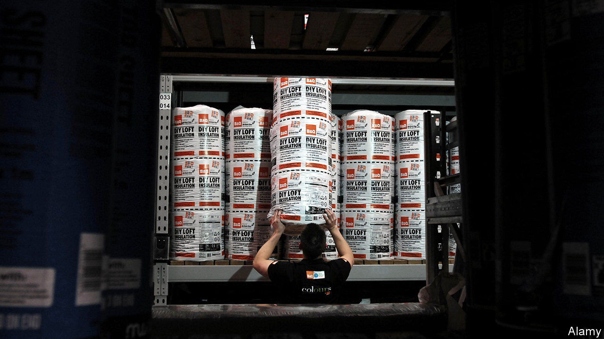
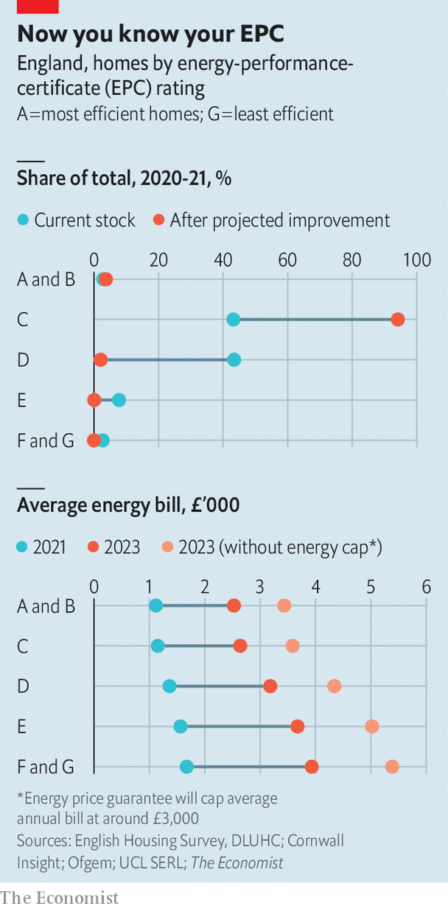

###### Heated debate

# Britain gets serious about sealing up its draughty homes 

##### Insulation is part of the solution to the energy crisis 

 

> Nov 28th 2022 


The task of sheltering households and businesses from eye-watering  has fallen initially to the government. A price-guarantee scheme ensures that the average British household will pay no more than £3,000 ($3,600) a year for its energy until April 2024. But cushioning the blow of bigger bills will cost taxpayers a lot (£40bn, on latest estimates) while weakening incentives to reduce consumption. The government is now signalling that households must do their bit; Jeremy Hunt, the chancellor of the exchequer, describes  as a “national mission”. 

Some savings can come from changes in behaviour. The government has finally approved an information campaign which will doubtless remind Britons that showers are more energy-efficient than baths and that electrical appliances don’t have to be left on standby for eternity. Turning things down or off only gets you so far, however. The problem is not just people, but also the buildings they live in.

Britain’s 30m dwellings are among the least energy-efficient in Europe. The stock is old and often decrepit. One-third of homes were built before 1945 and their construction paid no heed to efficiency. Although the stock has improved, progress has been patchy. Schemes to encourage insulation have come and gone; the number of homes being insulated fell sharply in the mid-2010s after David Cameron’s government cut funding. 

Attitudes are shifting again. Energy efficiency forms a pillar of Britain’s legally binding mandate to reach net-zero greenhouse-gas emissions by 2050. Housing accounts for around one-third of the country’s energy needs and about one-fifth of its emissions. The Climate Change Committee (CCC), an independent body scrutinising the government’s climate policies, says that household energy use must fall by 30% to help halve building emissions by 2035. The war in Ukraine has now injected urgency into the task of reducing demand. 

A building’s energy efficiency is assessed with an energy-performance certificate (EPC). Every home in Britain requires an EPC when it is built, or marketed for sale or rent. A brief inspection by a certified assessor determines the home’s energy use. Thermal efficiency is estimated from the building’s age and construction material, as well as from visible signs of retrofitting such as insulation and double-glazing. 

 


The headline figure from an EPC is a measure of a home’s total cost of energy use per square metre of floor space, indexed from 1 to 100 and divided into ratings from A (the least costly homes) to G (the most expensive). The government has said that it wants every dwelling in Britain to achieve at least an EPC rating of C—a score of at least 69—by 2035. That means fixing 13m properties in England that do not currently meet the standard (see charts). 

An analysis by finds that thermal efficiency tends to correlate with income. Among England’s 15m owner-occupied homes the poorest decile of households consume 30% more energy to heat each square metre of floor space than the richest decile. A similar pattern is observable among the 5m tenants renting from private-sector landlords. The government has suggested that all newly let properties will need an EPC of C or above by 2030, but landlords may sell them rather than incur the costs of refurbishment. 

According to the latest official assessment, published in July, it will cost around £130bn at today’s prices for all homes to have an EPC of C. The financial case for making homes more energy-efficient has become a lot more compelling. The average retrofit cost is £10,000. At October’s prices the resulting energy savings would reduce average bills by £650-1,000 each year, implying a payback period of ten to 15 years. 

The ability of households to fund the upfront costs of insulating lofts, cavity walls and the like varies substantially, however. On November 28th the government announced an expanded £1bn scheme for insulation grants, bringing total government funding to £7.6bn. More help will surely be needed to support less affluent households. The government supported 150,000 retrofits in 2021, but to meet the EPC C target that number needs to hit 500,000 a year by 2025 and 1m by 2030, according to the CCC. 

Money is not the only problem; finding enough people to do the work is another. By one estimate as many as 500,000 skilled tradespeople are needed to meet Britain’s insulation goals. Brexit, among other things, has caused the number of construction workers to fall since 2019. Russell Smith of Parity Projects, an energy consultancy, wants the government to improve training and introduce something for retrofits akin to the “Kitemark” certification to “kick out the cowboys”. 

Britain cannot reach net-zero emissions or reduce its vulnerability to soaring gas prices with insulation alone. Among other things, it must also decarbonise the electricity grid and replace gas boilers with electric heat pumps. The government says it wants to take a “fabric-first” approach to housing: insulating properties before replacing the heating system. That task has been made easier by rising prices; households have much more reason to embrace energy efficiency than they did. If only more progress had already been made. ■

