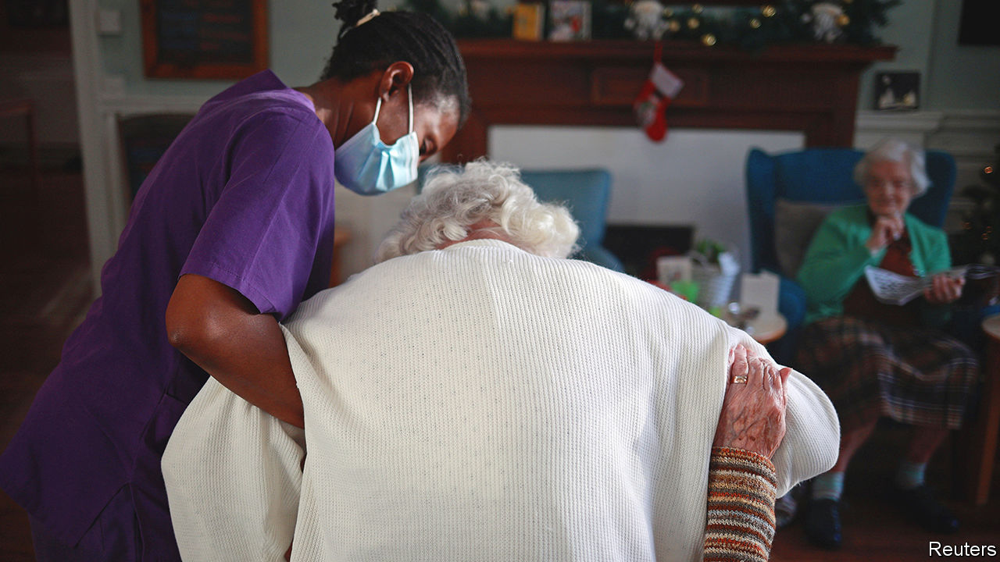
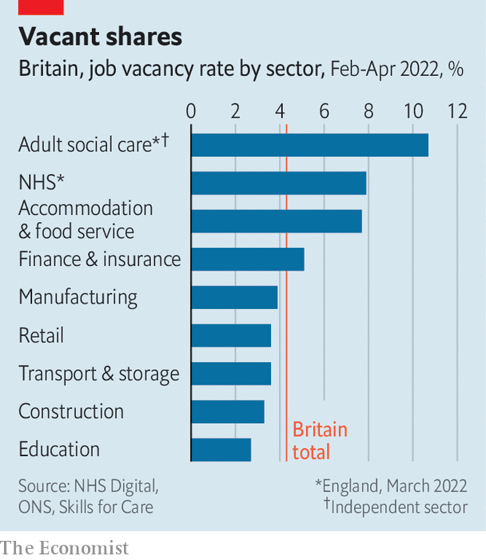

###### Wear and care

# Britain’s social-care sector is in even worse shape than its health service 

##### That is awful for the old and the vulnerable 

 

> Nov 28th 2022 


The  Health Service (NHS) in England is under unprecedented strain. So it is baffling that more than one in ten of its beds are occupied by patients who do not need them. Some 13,600 inpatients are medically ready to be discharged yet remain in hospital—more than double the number five years ago. This is bad for them. It is even worse for the sick people waiting outside in ambulances,  to get in. 

Discharging a patient requires a dizzying amount of administrative work, much of it still done on paper. “It is easier to track a pizza than it is our patients across health and social care,” says John O’Connell, who is leading an NHS pilot scheme to digitise the process. One problem, however, cannot be solved by technology. Increasingly, when elderly patients are ready to leave, there are no carers to look after them.

In 2021 the number of workers in adult social care fell by 50,000, the first decline in the decade that there have been records. There are 165,000 vacancies; one in 11 posts is unfilled. As the workforce dwindles, so does the quantity and quality of care on offer. The proportion of older people receiving state-supported long-term care is decreasing, but this does not seem to be because their needs are diminishing. Public satisfaction with social care fell from 29% three years ago to a dismal 15% in 2021. 

 


Frustration stems in part from a complicated system. Long-term social care, consisting of both in-home care and care in nursing and residential homes, is supplied by thousands of mostly private providers. It is difficult to get publicly funded care. In order to qualify, a person must typically be deemed by their local authority to have both high needs and assets of less than £23,250 ($28,100). Separate funding streams hobble efforts to integrate the NHS and the social-care system: money for social care is still primarily funnelled to local authorities through the Department for Levelling Up, Housing and Communities, not the Department of Health. 

More fundamentally, in the decade from 2010 the funding of local authorities fell by half in real terms. Some losses were made up by rises in local council tax and by the introduction of a special social-care “precept”, or levy. But in 2020-21 prices, social-care spending still dropped from £514 per adult citizen in 2010-11 to £478 per adult ten years later.

Josh Hawker of AbleCare Homes, which runs six care homes in the south-west, says his firm needs £800-1,000 per week to look after a client. That seems cheap given that it costs the NHS at least £2,500 per week to keep someone in hospital. But Mr Hawker says that Bristol city council pays £771 for each state-funded client, almost irrespective of their needs. The “council just aren’t paying what it costs to look after people”, he says. Self-funders, who make up the remaining third of residents, end up paying more to subsidise others.

The miserliness exerts downward pressure on wages. In March the median hourly wage of a care worker was £9.50, less than that for an easier job stacking supermarket shelves. One of Mr Hawker’s employees had been an “excellent” care worker for a decade. But when she quit for an entry-level job as an administrator in the NHS, she instantly received a pay bump of 30%. Some providers fill gaps with pricey agency workers. Others make do with fewer staff.

The losers are among society’s most vulnerable. Age UK, a charity, estimates that around 2.6m adults who need care are not receiving it. In the first quarter of 2022, 2.2m hours of home care could not be delivered because of staff shortages. Providers such as Right at Home, a home-care franchise, are focusing more on self-funding clients. “It means we can pay our workers more,” says Lucy Campbell, the CEO. 

Care homes must contend with soaring energy costs, too. That means making tough choices. At best, carpets grow shabbier and walls aren’t repainted. At worst, clients with more complex (ie, costlier) needs are turned away. Profit margins are at their lowest since the Care Quality Commission, a regulator, began monitoring them in 2015. “You’d be mad to open a care home at the moment,” says Mr Hawker.

The autumn statement did bring some relief. Jeremy Hunt, the chancellor of the exchequer, pledged up to £7.5bn of extra money for social care over two years, a chunk of which will come from allowing local authorities to raise council tax. Around a third of the money is tied to hospital discharges, to be split with the NHS; some of the rest will probably go on wages. 

Mr Hunt described the cash as “the biggest increase [in social-care funding] under any government of any colour in history”. But the money fell short of his own assessment of what was needed when he chaired the health and social-care select committee: in December 2021 he said that social care needed an extra £7bn a year. 

“These are tiny sums of money given the issues,” says Geoff Butcher, who runs Blackadder care homes in the West Midlands. “I honestly cannot see them addressing the problem.” Clive Lewis, the leader of Wokingham council, in the south-east, agrees. To save money for social care, he is still considering reducing the bin collection from weekly to fortnightly. He is already relocating council employees in order to rent out the top two floors of their offices.

Some of the extra cash has been found by deferring a plan to cap the lifetime costs of personal care paid by individuals in England at £86,000. Councils say that the cap could never have been implemented by October 2023, as originally scheduled. Others (including the plan’s architect, Sir Andrew Dilnot) feel that delay is short-sighted: the introduction of a cap would bring peace of mind to many. Around one in seven over-65s face bills of more than £100,000 for their own care. The government is plugging holes in social care but “the public wants more than that,” says Simon Bottery of The King’s Fund, a think-tank. “They want a better, fairer system.” ■

