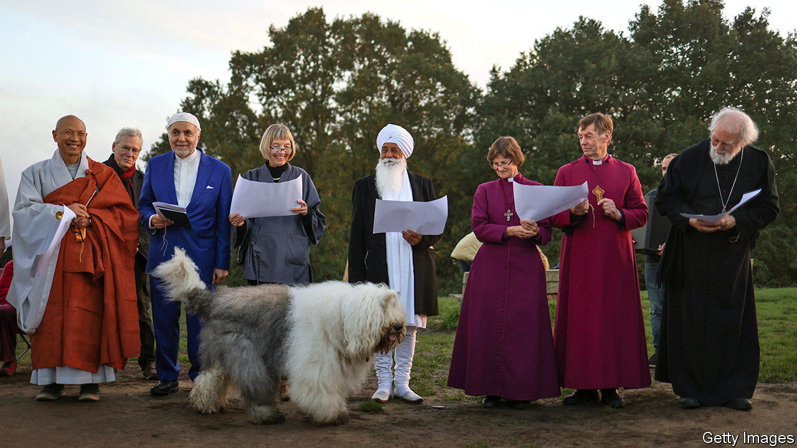
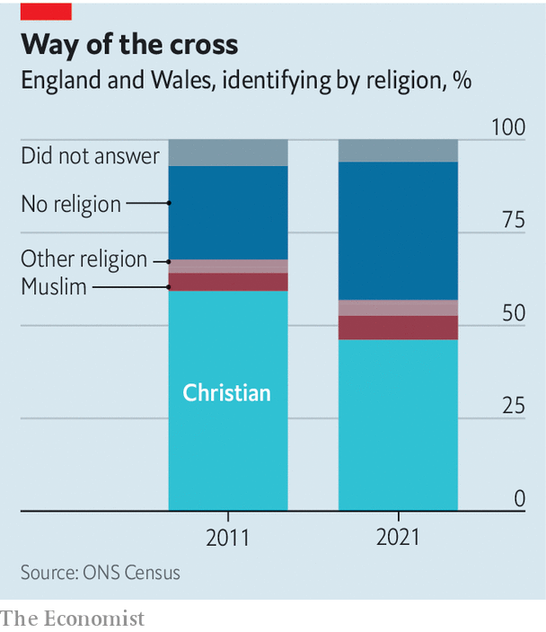

###### Few on pews

# Christianity is a minority religion in England and Wales 

##### Other faiths are on the up 

 

> Nov 30th 2022 


AT TIMES AND in places, Britain can still look and feel like a Christian country. December, when pubs and high streets sparkle. The House of Lords, where 26 seats are reserved for bishops from the Church of England (CofE). The state’s deep entanglement with its established church was vividly illustrated in September when Queen Elizabeth, Defender of the Faith and Supreme Governor of the CofE, was buried with spectacular Protestant pomp.

Most Britons are no longer connected to these things by religious belief. Very many people who celebrate Christmas are not marking the birth of their saviour. The presence of senior clergy in Parliament’s upper chamber may mean more diversity of views but has long been an anachronism. Many people who filled the streets outside Westminster Abbey during the queen’s funeral were grieving a beloved monarch, not praying for her soul. For years only a small (and falling) proportion of Britons have regularly gone to church; polls suggest the figure is now around 5%.

 


The ebbing of Christian belief in Britain reached a watershed moment on November 29th, when a fresh batch of figures from the 2021 census were published by the Office for National Statistics. They showed that, for the first time, less than half of the population of England and Wales consider themselves to be Christians (see chart). Their number fell by 17% in a decade, to 27.5m; the number of people who ticked the “no religion” box rocketed by 57%, to 22.2m. 

Yet even as England is becoming more secular, some religions are growing. The census showed that the number of Muslims has risen by 42%; they now constitute 7% of the population. British Hindus hit the million mark for the first time. These changes reflect big demographic shifts. One in six of those who filled in the census was born abroad, compared with one in ten a decade ago. Three cities are “majority-minority”: Birmingham (51.4%), Leicester (59.1%) and Luton (54.8%). 

If immigration continues to rise, secularisation will slow. Immigrants tend to have a reviving effect on all religions; that is largely why church attendance has held up better in London than it has in other places. The capital is the least secular region, Wales the most. (Scotland’s census was delayed for a year by the pandemic.)

The revelation that Christianity is now a minority religion is being bewailed by some on the right. But will passing this symbolic threshold actually change anything? It could influence discussions over the state funding of faith schools. Most are still Christian; an increasing number are not. There are concerns that non-Christian faith schools may exacerbate ethnic segregation: Hindu schools, for example, tend to be populated only by children of immigrants from south Asian countries.

Groups that campaign against religious privilege, like the National Secular Society, use such moments to argue it is past time to cut ties between church and state. The Labour Party is proposing to abolish the House of Lords, bishops and all. Yet the most distinctive element of Britain’s form of theocracy is likely to adapt rather than disappear. Though he promised in September to “inviolably maintain and preserve the settlement of the true Protestant religion” King Charles III seems taken by the practices of other believers, too. At his coronation next May, he may try to cast himself as defender of all faiths. It helps that he is king alongside a Hindu prime minister and a Muslim mayor of London. ■

