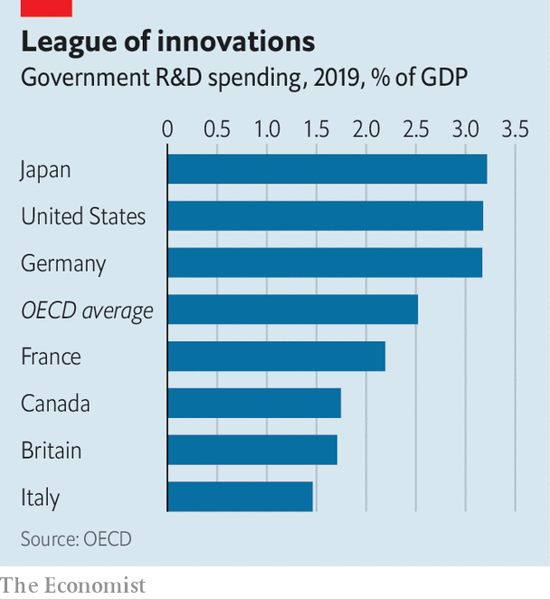

###### The new new things

# Does Britain have a problem with R&D spending? 

##### Quality matters as much as quantity 

 

> Dec 1st 2022 


Britain boasts top-tier researchers in world-class universities. In 2020 only America and China had a bigger share of scientific citations. The Times Higher Education World University Rankings 2023 place three British universities in the top ten. And yet in the debate over Britain’s long-running productivity problem, research and development (R&amp;D) is often pointed to as a culprit. What is going on?

Some worries are specific and short-term. The one that looms largest for scientific researchers is that rows over Brexit will compromise access to Horizon Europe, a European funding scheme. According to the Centre for European Reform (CER), a think-tank, the uncertainty over British participation in Horizon has already hit EU funding for British academic science by around 2.5% relative to the 2004-16 trend. Although the money can be replaced, the opportunities for collaboration that Horizon offers cannot. 

Another concern is the government’s drive to reduce the amount of fraud associated with tax incentives for private-sector R&amp;D. Its solution has been to cut the amount of tax relief on offer to small firms. Rosamond Deegan, boss of OMass Therapeutics, an Oxford-based biotechnology company, warns that she may rethink where the company grows as a result. 

 


The entrenched problems come in two flavours. One relates to the level of overall R&amp;D spending. In 2017 the government pledged to raise it to 2.4% of GDP by 2027 to match the average within the OECD, a club of mostly rich countries. Although a recent statistical revision seems to have boosted spending by enough to meet this target, Britain should aim higher than merely being average; in 2019 Germany and America both spent 3.2% of GDP on R&amp;D. Growth in official R&amp;D spending—from current stingy levels (see chart)—will be constrained by pinched finances. So far the government has protected the R&amp;D budget in cash terms, but inflation has eroded its value.

As important as the level of R&amp;D spending is the second issue: how the money is spent. Dame Ottoline Leyser, chief executive of UK Research and Innovation (UKRI), a public funding body, says that too often there aren’t strong enough incentives to spread ideas between academia and the private or public sectors. UKRI has updated the information it requires in funding applications to include contributions to the wider research-and-innovation system. “This sounds trivial but it’s actually a huge deal,” she argues.

“Catapult centres” are already meant to connect businesses with researchers, and have been in place since 2011. But a recent report by John Springford and Zach Meyers of the CER says that even after a 35% increase in their funding in last month’s autumn statement, these centres are only modestly funded in comparison with their German equivalents. They also argue that ad hoc reviews into the Catapult network have clouded it in uncertainty.

The balance between top-down research and the bottom-up sort also deserves scrutiny. Adam Hawksbee of Onward, a think-tank, points out that Britain is an outlier in how much latitude the government gives the private sector when funding innovation. The ratio of funding via tax credits to directed investment is unusually high, at 4.1, compared with 0.9 in America and 1.5 across the OECD. 

Given the enormous pile of stuff that the government needs to get done, from net zero to making the National Health Service (NHS) more efficient, Richard Jones of the University of Manchester thinks that this balance is off. Mr Hawksbee agrees that Britain should be more courageous when it comes to using large-scale government procurement to encourage innovation, particularly via the NHS.

There are some signs of a firmer government hand on the tiller. The Advanced Research and Invention Agency is a new body designed to funnel public funds into high-risk, high-reward bets. The National Science and Technology Council, a committee chaired by the prime minister, is meant to set goals and co-ordinate policies. The government’s ambitions to make Britain the world’s “next Silicon Valley” may sound far-fetched. But a clearer focus on connecting boffins with businesses and a greater sense of priorities—all backed up by more cash—would help. ■

