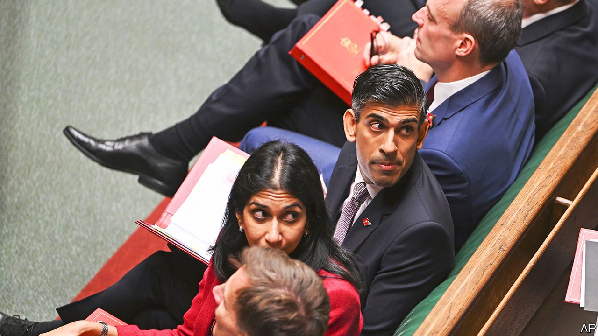

###### Tory jarheads

# The Conservative Party’s addiction to brawling 

##### The recreational-violence theory of politics 

 

> Dec 1st 2022 


IN “JARHEAD”, Anthony Swofford recalls life in an American marine platoon on the eve of the first Gulf war. These are highly trained killers at the tip of one of the mightiest invasion forces in history. They spend most of their time beating each other up; not out of anger, but for pleasure and to alleviate the boredom. 

Brawling of this sort is a condition familiar to the Conservative Party. It is a formidable election-winning machine but it has spent much of the past 12 years at war with itself. Sometimes, such as during the Brexit years, the fighting reflects deep ideological schisms. At other times, such as the oustings from Downing Street this year of Boris Johnson and Liz Truss, bitter personal feuds fuel the fighting. 

Under Rishi Sunak the infighting appears to have taken on a different form—recreational violence, indulged in to dispel the ennui of life on the backbenches. “It doesn’t matter whom you punch,” writes Mr Swofford of a scrap that unfolds in the sand as war reporters and a horrified staff sergeant look on. “This is fun, plain mindless fun, the kind grunts are best at.”

Rishi Sunak’s government is a little over a month old. He was installed by MPs in late October in a bid to restore stability after the chaotic reigns of his predecessors. Yet many of those same MPs have scarcely taken a breath before returning to the melee. The composition of the cabinet; planning reform; renewable energy; the fate of Albanian migrants; China; the European Union: all are becoming battlegrounds. Ageing rebels declare they are “worried” or “furious” about policies; their faces betray otherwise. Conspiracy is a lot more fun than loyalty, and gets former ministers back on the telly to boot. 

The party’s discipline is fraying again just as Britain’s government becomes more purposeful and focused, in intent at least. The autumn statement of Jeremy Hunt, the chancellor of the exchequer, has calmed financial markets. Mr Hunt has junked the fuzzy plans of Mr Johnson and Ms Truss to reindustrialise small towns through subsidies and tax breaks. He intends to play to Britain’s comparative strengths in life sciences, tech and finance, and to use universities as springboards for the regeneration of poorer places. 

Mr Sunak is a Brexiteer but he favours narrowing a review of EU laws that are still on the statute books to a few high-productivity sectors where divergence with Brussels can have a real impact. Austerity is proving the mother of moderation. Ms Truss’s expansive programme of energy subsidies, scheduled to last two years, will be scaled back and Britons encouraged to cut their energy use. 

A pragmatic shift is under way in Britain’s foreign policy, too. In an address on November 28th Mr Sunak declared his intention to engage with China, while reducing Britain’s economic dependence on the country. His approach would mean rejecting “simplistic cold war rhetoric”. Importantly, he has promised more “respectful, mature” relations with the EU.

All of which would make a coherent agenda for a new government with a long stretch in office ahead of it. But a Conservative victory at the next election is unlikely: the Labour Party enjoyed polling leads of between 15 and 27 points in November, which would imply a heavy defeat for the government. Some in the cabinet hope for a repeat of the 2015 contest, in which the party squeaked to victory by focusing voters’ attention on questions of economic management and leadership. Britons have a far more favourable view of Mr Sunak than of his party, and also reckon he is a more capable prime minister than Sir Keir Starmer, the Labour leader, would be. 

But if there is a route to victory, the party shows little inclination to follow it. Mr Sunak had hoped an inoffensive “levelling up” bill would unite the Tories. Instead it has become a wrestling ring for two wings of the party, one pushing an amendment to make housebuilding harder and the other keen to make it easier to erect wind turbines onshore. The signatories to the wind-farm amendment include Ms Truss and Mr Johnson; the bill is the work of Michael Gove, who was instrumental in both their defenestrations. Neither of these attempted ram-raids on the statute book reflect an interest in serious policymaking. 

Mr Sunak’s government has been turned on by colleagues with remarkable speed. Some Tory backbenchers have had enough of the dust-ups. Among those who plan not to run at the next general election are William Wragg, the 34-year-old chairman of one of Parliament’s most august committees, and Dehenna Davison, a 29-year-old minister who has been an MP only since 2019. Both their seats look vulnerable at the next election. Ms Davison said she just wanted a normal life. 

“You are tired,” recounts Mr Swofford of the jarhead’s lot. “You are stupid. You are bored. You are a bad shot. You drank the night before.” If that sounds like your idea of fun, the Tories have much to offer. ■

