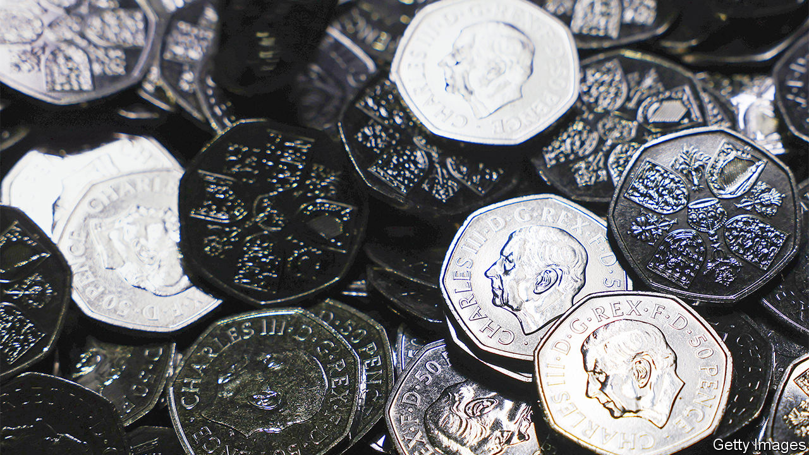

###### Royal erosion

# The Elizabethan era is not yet at an end 

##### This has consequences for coins and ketchup bottles 

 

> Dec 1st 2022 


The death certificate is clear. The form gives all the usual information about the deceased. In one box it gives her marital state (widowed); in another her home postcode (SL4 1NJ). In another, beneath the brisk “When died”, it offers: “2022 September Eighth, 1510 hours”. And in another still, with slightly excitable capitalisation, her occupation: “Her Majesty The Queen”.

The queen’s death certificate is right, and it is also wrong. Queen Elizabeth II did die at 3.10pm. But for the world, she continued to live. For over three hours, she was merely “extremely unwell” or “comfortable and at Balmoral”. Her death, for most people, only happened later, at a few minutes past 6.30pm, when a footman walked from Buckingham Palace holding a black-edged sign; when the bbc went black; when the national anthem played. A queen has two birthdays; she also has many deaths. 

According to the law she has none: “the King never dies”, as the legal maxim has it. A monarch’s heart might stop; the monarch’s heart does not. The king is dead; long live the king. But the law is not life and a king is more than a man in a crown. Britain did not abruptly change from being Victorian to Edwardian on January 22nd 1901; Charles III did not instantly feel like Britain’s new king at 6.30pm on that Thursday, but like a man playing a part. Kingship comes not in a moment but by the slow accumulation of kingly things.

This has begun. The nation’s pronouns have already changed. Her Majesty’s Government is now His; criminals are now detained in His Majesty’s prisons, not Hers. In Qatar, God is called upon by English footballers to save their gracious king, not their queen. On military buttons and police badges and the breasts of Beefeaters, CIIIR will gradually start to replace EIIR. Shoals of coins bearing the words “Charles III Rex” started to fall from the Royal Mint in October. A king is being made into a coin; a man is being made into a monarch. 

The corollary of this is that a queen is being undone. Elizabeth’s “E” will be unpicked from the embroidered tunics of the Beefeaters and replaced with Charles’s “C”; her crest will cease to appear on ketchup bottles as the royal warrants that signify suppliers to the royal household expire; worn banknotes bearing her face will be gathered and shredded on a rolling basis. In the Inns of Court in London, the signs for Queen’s Counsel barristers have been repainted, a fresh coat of cream covering the old qcs. In a constitutional monarchy queens do not so much die as erode.

History, the novelist Hilary Mantel once said, “is not the past…It’s what’s left in the sieve when the centuries have run through it”. Monarchs who in their own lives might be many different things come to be seen as something much simpler. As Tom Holland, a historian, puts it, they “provide useful shorthand for entire periods”.

Rarely does this shorthand transcribe what the era itself would have imagined: the Victorians considered themselves thrillingly modern, not a byword for fustiness. Quite what the second Elizabethan era will mean is not yet clear and will not be so for years. For now, there are changes to coins and buttons and ketchup bottles as a queen is reshaped into an idea. ■

