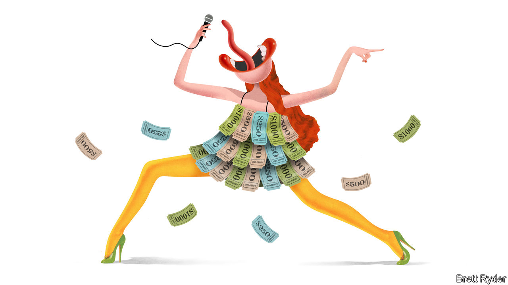

###### Schumpeter

# If Ticketmaster is a greedy capitalist, so is Taylor Swift 

##### What America can learn from Britain about the other gig economy 

 

> Dec 1st 2022 

In America, it has been a disillusioning few weeks for music fans. Though her “Swifties” are far too loyal to blame her, Taylor Swift helped botch the sale of a 52-night stadium tour by trying to sell more concert tickets in one go than had ever been done before. Bruce Springsteen, acknowledging that he had upset fans by selling tickets at prices as high as $5,000, offered no remorse. “If there’s any complaints on the way out, you can have your money back,” he gruffly told . Bob Dylan, who sold 900 “hand-signed” copies of his new book for $599 apiece, was forced to admit that he used a writing machine for the signature instead. 

Mr Dylan has long lavished disdain on his devotees. But few have a better reputation with fans than T.S. and the Boss. Reading reactions to the dynamic-pricing system used by Mr Springsteen for his next tour is like a reprise of the great rock’n’roll swindle. “Bruce has replaced the scalper,” laments Lori S., a fan since the 1970s, on Backstreets, the website for Springsteen aficionados. 

Ms S. is unusual. Most frustrated concertgoers direct their ire not at the stars but at Ticketmaster, America’s dominant ticketing system, and the promotional colossus it merged with 12 years ago, Live Nation Entertainment. In October, weeks before Ticketmaster’s systems crashed while millions of Ms Swift’s fans were buying tickets, consumer groups had launched a campaign called “Break Up Ticketmaster”, accusing it and Live Nation of operating a monopoly to “rip off” music fans. Reportedly, the Department of Justice (DoJ) is revisiting the merger, first cleared in 2010, on antitrust grounds. Live Nation denies that it is anticompetitive. 

Amid the genuine angst over high-priced tickets, and the overhyped politicisation of the matter (Representative Bill Pascrell, a New Jersey Democrat, promotes the “BOSS Act” against ticket-price gouging, named before Mr Springsteen started to behave like any other fat cat), the brouhaha misses two points. The first is that it is mostly the artists, not Ticketmaster, who set the cost of the tickets. They also give the green light to the use of dynamic prices, like those used for airline seats, that allows Ticketmaster to charge more when demand outstrips supply. The second is that a big part of the price inflation comes from secondary resellers (ie, scalpers or touts) who use bots and other means to acquire batches of tickets. As a Brit, your columnist considers these strange oversights. In his home country, Ticketmaster and Live Nation have big market shares, as they do in America, but it is resellers that attract the most flak. In this transatlantic divide lie some interesting lessons about the “gigenomics” of live entertainment.

To begin with, look at the contrasting antitrust targets. In America, the DoJ is almost exclusively focused on Live Nation and Ticketmaster. Since the merger in 2010, the concert giant has operated under a “consent decree” forbidding it from strong-arming venues to use Ticketmaster. In 2020 that was extended to 2025 after the DoJ accused it of violations. But its critics want a bigger crackdown, accusing the conglomerate not just of bullying venues but of using its dominance to drive prices higher. They want the Biden administration’s reinvigorated trustbusters to break it up, rather than merely impose measures to promote good behaviour. 

In contrast, Britain’s competition authorities waved through the Live Nation-Ticketmaster merger without conditions 12 years ago but have been notably warier when it comes to resellers. To approve the $4bn acquisition by Viagogo, a giant reseller, of StubHub, an American rival, they demanded that the combined entity shed StubHub’s non-American business because of their huge market share in Britain. Ticketmaster mostly gets better press in Britain than the touts. During a parliamentary inquiry in 2019 FanFair Alliance, a concertgoer lobby group, praised it for shutting down its secondary resale sites. Its promotion of paperless ticketing and actions to verify a buyer’s identity were also welcomed. 

That points to a second difference, concerning the nature of tickets themselves. In America, critics of Ticketmaster argue that a ticket confers ownership, meaning it should be possible to buy and sell it as freely as a second-hand car. They note that people purchase tickets months before a concert and should be able to resell them to whom and at whatever price they want. They dislike things that impede that, such as paperless tickets. 

Those on the other side of that argument treat tickets more like a licence to visit an event, and view limits on transferability as a healthy way to impede touts. Pearl Jam, a Seattle rock band that 28 years ago butted heads with Ticketmaster over antitrust concerns, now treats the ticketing site as an ally, using its non-transferable, mobile-only ticketing services to ensure it keeps prices low and scalpers at bay. It has also opposed Mr Pascrell’s BOSS Act, whose provisions include a ban on non-transferable ticketing. This, the grunge rockers say, would mostly benefit secondary sellers.

Pearl Jam is a rare American band that has sought to rein in ticket prices (a few British stars, such as Ed Sheeran, try to do the same). Most are much less altruistic, for reasons that are easy to understand. Until the covid-19 pandemic stopped live events, bands had for years been making more money from touring than from recording. Now that tours are back on, they have lost income to recuperate. After the pandemic, concertgoers appear particularly keen to splash out on shows, the bigger the better. And the competition between megastars to stage the most Instagrammable event is so intense that they invest fortunes to produce a spectacle.

Only the strong survive 

In other words, for all their folksy or countercultural veneer, superstars tend to be capitalists. Like Live Nation, they have an incentive to be as big as possible and to earn the highest rewards. As the ones sweating on stage, they have every right to charge whatever they like—though they need to balance that against the risk of alienating some fans. Live Nation can be as greedy as it likes, too. But it has to be prepared to sweat in the political heat. ■


