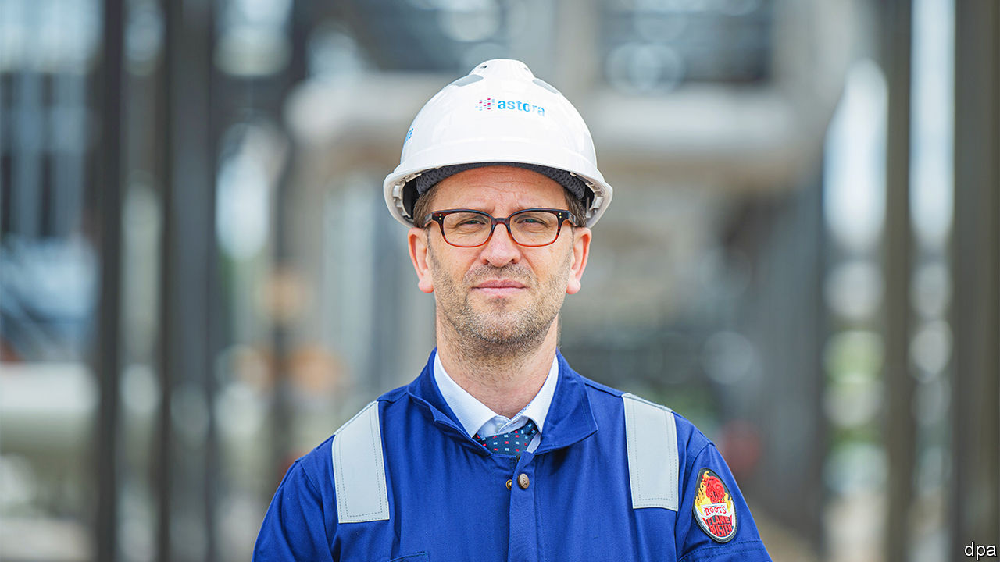

###### The hand on the tap

# Meet the man who may decide the fate of German industry 

##### Klaus Müller should have been an anonymous bureaucrat, but he’s become a celebrity 

 

> Dec 1st 2022 

When Klaus Müller accepted the job as boss of the Federal Network Agency, Germany’s regulator for electricity, natural gas, telecommunications, post and railway markets, he hoped he would spend his time on expanding renewables and laying fibre-optic cables. A former state minister for the environment and agriculture in Schleswig-Holstein, he is close to Robert Habeck, the federal economy minister and a fellow Green. He cares deeply about the Greens’ favourite causes, such as a rapid shift to carbon-neutrality, which make captains of German industry uneasy. 

Those priorities will have to wait, Mr Müller admits to  at his office in Bonn. He took over a few days after Russia attacked Ukraine. From day one he has spent the bulk of his time thinking about the supply and distribution of natural gas—the lifeblood of Germany’s industrial economy, the flow of which has been staunched by Russia in response to Western sanctions. “We are in significantly better shape than everyone forecast this summer,” he says reassuringly. But, he quickly adds, it is not an all-clear. 

The war in Ukraine has turned Mr Müller from an anonymous bureaucrat into a celebrity. He is a frequent guest of popular tv talk shows and has tens of thousands of followers on Twitter. His agency’s detailed updates every weekday on the state of gas supply are read by millions. When he strikes an optimistic note, the nation breathes a collective sigh of relief. When he sends a note of caution, as he did in a tweet on November 28th warning that the temperature in Germany for the next seven days would be 2°C below the average for the period over the past four years, it shudders. 

The reason Germans—and German industrialists in particular—hang on Mr Müller’s every word is that he could yet be in charge of rationing gas for the country. Were the government to take the unprecedented step of declaring a gas emergency, his agency is ready to mobilise 75 staff working in shifts around the clock from a windowless room in one of the agency’s nondescript 1960s office blocks, equipped with huge communication terminals, its own diesel-powered generator for electricity, a water tank, showers, around 20 camp beds and stocks of freeze-dried food. 

Hospitals, schools, kindergartens, the armed forces, the police, fire departments, prisons, households and small businesses such as bakeries would get priority, Mr Müller explains. Big businesses (as well as energy-hungry luxuries such as heated swimming pools, saunas and the like) would be first in line for significant cuts. Beyond that, Mr Müller says, there is no preordained order for whose gas gets cut first. The decision will take into consideration six criteria, including a company’s size, what it produces (makers of food and medicines would probably be spared) and how much time a company needs in order to reduce output without damaging its plant and equipment. To streamline the process, the agency has developed a digital gas-security platform for the country’s 2,500 biggest corporate gas users. 

Yet even managed carefully, such a gas emergency could lead to a severe disruption of supply chains, bankruptcies and unemployment. One particularly gloomy forecast in late September by the IFO Institute in Munich and other leading economic-research institutes, estimated that Germany’s gdp could shrink by 7.9% next year should such an emergency be declared. That would be worse than the recessions sparked by the global financial crisis of 2007-09 and the covid-19 pandemic.

This horror scenario may be avoided this winter. Gas-storage facilities are filled to the brim with Russian gas imported earlier this year, before Vladimir Putin, Russia’s warmongering president, all but turned off the taps in September (Russia used to provide 55% of German gas imports). Germany’s main supplier of piped gas is now Norway, followed by the Netherlands, Belgium and France. By Christmas Germany will have three floating import terminals for liquefied natural gas (LNG) in Wilhelmshaven, Lubmin and Brunsbüttel, built in record time. By next winter the country should have another three or four LNG terminals. 

Even this, though, will not compensate for the loss of Russian gas, as Mr Müller points out. Germany needs to continue to use at least 20% less gas than it historically has, which will get harder as the days get colder. “Please save gas in spite of the cold!” he tweeted along with the temperature forecast on November 28th. 

So far Germans have listened to his pleas. A study by the Hertie School, a university, published on November 1st, found that German industry used 19% less gas in September than would otherwise be expected for this time of year; households and smaller businesses reduced their gas consumption by as much as 36%. On November 22nd the IFO Institute released a survey showing that of the 59% of manufacturers that use natural gas for their production, three in four managed to save gas without reducing output. What happens next is less clear. Many companies say they don’t think they can save more gas without cuts to production. 

“Germany’s preparation for this crisis was suboptimal,” admits Mr Müller in a characteristically understated manner. He nevertheless thinks that Germany has at least learned three lessons from the energy crisis. First, “we learned to never again expose ourselves to such a cluster risk,” he says, referring to Germany’s historic overreliance on Russian gas. This realisation is already influencing a nationwide debate on the country’s deep economic ties with another autocracy, China. His two other lessons—the need to be less dependent on fossil fuels and to bet massively on renewables—should also make the country more resilient in the long run. And they allow Mr Muller to think about some of the Green priorities for Germany that he had been hoping to focus on. ■


