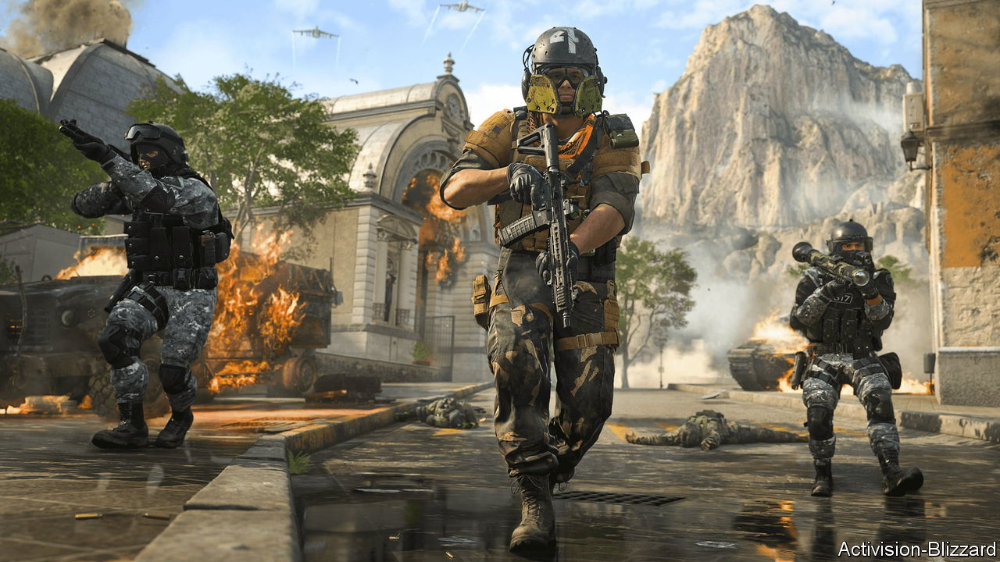
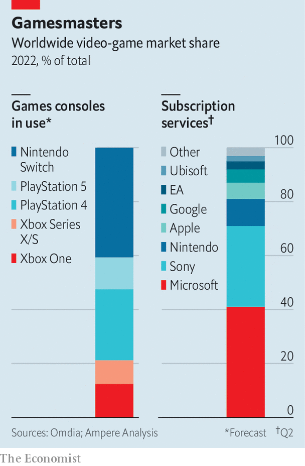

###### Game on or game over?

# Microsoft, Activision-Blizzard and the future of gaming 

##### The shift towards subscriptions and streaming complicates a giant merger 

 

> Nov 29th 2022 

The highest-grossing film of the year so far, “”, took $1bn in its first month. The biggest game, “Call of Duty: Modern Warfare II”, took the same amount in just ten days. Spurred on by the pandemic, which saw video-game spending increase by nearly a quarter in 2020, the games industry will be worth more than $170bn  in worldwide revenues, about five times as much as the global box office.

Gaming’s growth is drawing the attention of regulators. In January Microsoft, which makes the Xbox console, , publisher of titles including the “Call of Duty” franchise, for $69bn. It is the biggest acquisition in Microsoft’s history and by far the biggest in that of the games industry. Regulators from 16 territories have probed the deal. In the past two months Britain’s Competition and Markets Authority (CMA) and the European Commission have scrutinised it in detail; America’s Federal Trade Commission (FTC) is expected to make a decision imminently. If any of those three mega-regulators says no, it could be game over.

 


Trustbusters’ immediate concern is the console market. For two decades  and Nintendo have had the upper hand in the “console wars”, even as supply-chain problems have inhibited sales of Sony’s latest PlayStation (see chart). Nonetheless, Sony worries that gamers might desert the PlayStation if Microsoft made “Call of Duty” exclusive to Xbox. Some 45% of PlayStation owners play the game, according to MIDiA Research, a data firm.

Sony’s complaint seems a bit rich. “None of the console players are in a position to preach on exclusivity,” says George Jijiashvili of Omdia, a research company, who notes that Sony has kept PlayStation games such as “Uncharted” and “God of War” off the Xbox. Microsoft in any case says that keeping “Call of Duty” on the PlayStation, where it rakes in hundreds of millions of dollars a year, is “a commercial imperative for…the economics of the transaction”. Earlier this month it offered Sony a ten-year deal to keep “Call of Duty” on the platform. Phil Spencer, who runs the Xbox business, later told the , an online publication, that the PlayStation would get not just “the next game [in the series, but] the next, next, next, next, next”.

Such assurances might once have been enough. Not any more. Two things complicate the picture.

One is a change in the regulatory weather. Microsoft insiders grumble that until a few years ago the Activision deal would have sailed through. Lately, though, trustbusters have turned on big tech firms, alarmed at their rapacious growth. (Last year Microsoft became the second company after Apple to breach the $2trn mark in terms of market capitalisation, though its value has since dipped.) Under Lina Khan, a new head appointed last year, the FTC has launched investigations into Amazon, Meta and others. In September European judges upheld a fine of more than $4bn against Google for abusing its market power in mobile operating systems.

Britain’s CMA, energised by Brexit and with a bulked-up staff, has emerged as an unlikely end-of-level boss in the antitrust game. It is investigating Google’s and Meta’s ad platforms, Amazon’s marketplace and Apple’s and Google’s mobile browsers. Last month it ordered Meta to undo its acquisition of Giphy, a meme platform. Few had considered that deal a problem. The CMA has declared a preference for “structural” remedies, such as forcing companies to sell parts of their business, over “behavioural” ones, like forbidding them from doing certain things. That worries Microsoft, which seems prepared to accept restrictions on its use of “Call of Duty” but would be loth to let it go.

The second complication is a change in the games market. Microsoft plays up the weakness of its position: “Last place in console, seventh place in PC and nowhere in mobile,” as it told the CMA. Yet it has taken a lead in the emerging business of game subscriptions and is well placed in the still-newer one of cloud-based gaming, in which the action is streamed, Netflix-style. Microsoft accounts for 41% of the subscription market, against Sony’s 30% and Nintendo’s 10%, according to Ampere Analysis, another research firm. Among subscription services with game libraries (as opposed to those dedicated to multiplayer gaming, for instance), Microsoft’s Game Pass service has a share of 57%.

Adding “Call of Duty” to Microsoft’s library would make Game Pass still more appealing, regardless of the title’s continued availability on PlayStation. Indeed, as Mr Jijiashvili puts it, “It will make Game Pass even more valuable when you have this game available elsewhere for $60 a pop.”

A shift towards subscriptions and cloud gaming could “reshape the competitive landscape”, argues the CMA, which fears the Activision merger could “tip…the market in Microsoft’s favour before future rivals have a chance to develop”. Yet it is unclear when—or whether—such a shift will in fact happen. Subscription gaming is growing fast, but even in five years will represent less than 10% of game spending, estimates Ampere. 

Streaming from the cloud is still less popular. Google will shut down Stadia, its unloved cloud-gaming service, in January. Amazon’s Luna service has yet to take off. Microsoft, which separately runs Azure, the world’s second-largest cloud network, is well placed for cloud gaming if and when it emerges. But for the time being cloud streaming services represent well under 1% of games spending.

In defending its Activision acquisition, “Microsoft’s argument is positioned in the present,” says Piers Harding-Rolls of Ampere, whereas “the CMA is more focused on the potential and the longer-term implications.” Most observers expect the acquisition to go ahead eventually, with a few conditions; blocking the deal on the basis of what the games market might look like in the distant future would be hard for regulators to defend. Nonetheless, trustbusters’ past short-sightedness in reviewing tech mergers has made them ultra-vigilant about the implications of today’s deals. Microsoft is playing the mergers game on the hardest setting. ■


