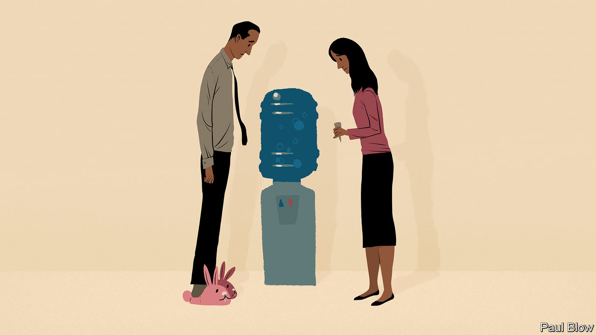

###### Bartleby

# The open questions of hybrid working 

##### A mix of office and home has become the norm for many. There is lots still to figure out 

 

> Dec 1st 2022 

At first the question was how quickly people would get back to the office. Then it was whether they would ever return. Almost three years after reports surfaced of an unusual respiratory illness in Wuhan, the legacy of the covid-19 pandemic on employees in America and Europe is becoming clear. The disease has ushered in a profound change in white-collar working patterns. The office is not dead but many professionals have settled into a hybrid arrangement of some office days and some remote days. 

Hybrid working has much to recommend it: flexibility for employees, periods of concentration at home, bursts of co-operation in the office. A new paper from Raj Choudhury, Tarun Khanna and Kyle Schirmann of Harvard Business School and Christos Makridis of Columbia Business School describes an experiment in which workers at BRAC, a huge non-profit organisation in Bangladesh, were randomly assigned to three groups, each spending different amounts of time working from home. The intermediate group, who spent between 23% and 40% of their time in the office, performed best on various performance measures. 

But a shift of this magnitude is bound to raise thorny issues. In workplaces that have moved to hybrid work, there are still plenty of open questions. One is how to handle the impact of less time in the office for new joiners and younger workers. Research by Natalia Emanuel of the Federal Reserve Bank of New York, Emma Harrington of the University of Iowa and Amanda Pallais of Harvard University shows that software engineers receive more online feedback on their code when the team sits next to each other. The people who get disproportionately more feedback from colleagues when they are in proximity are young engineers and female ones. These developers were also most likely to quit when the pandemic forced everyone to go remote. 

Not every study points in the same direction. In a recent survey of hybrid workers in London, the youngest cohort was more likely than older ones to think that it was easier to put themselves forward for important tasks when working remotely. But according to Nicholas Bloom of Stanford University, making new employees spend more time than others in the office can be a good way of steeping them in company culture. Whatever expectations firms set for the bulk of their hybrid workforce, an extra day of commuting may make sense for newbies. 

A second question concerns how strictly to enforce attendance on days when teams are meant to be in the office. An emerging consensus holds that there should be agreed “anchor days” on which people come in; since the idea is to spend time together, as many people as possible should be there. But one person on the team might have moved somewhere godforsaken for the scenery back in 2020; someone else might have asked to stay home to let the plumber in. In practice, therefore, hybrid working still often means a mixture of people on screen and people in the flesh. 

“One virtual, all virtual” was an early refrain for these circumstances. At a meeting where some people were in the room and others were working from home, everyone dialled in on their own screens and deafened each other with feedback. But the research by Ms Emanuel and colleagues suggests that moving everything online is harmful. Before the pandemic, having a single colleague in a different building was associated with less feedback. Treating remote workers as second-class citizens may actually make sense on those days when people are expected to be in. 

That logic also applies in reverse. One of the great worries about hybrid working is that it can encourage “proximity bias”, the phenomenon whereby bosses prefer employees with whom they have more face-to-face contact (“Fred may be useless but at least he’s being useless here”). Mr Bloom reckons that this problem can be alleviated if bosses who like the office make sure to work at home occasionally (Fred cannot gain as much of an edge by being seen if the boss isn’t always there to see him). 

Other questions abound. How to define performance measures so managers do not spend time fretting about slackers at home? Do you require company-wide anchor days or team-level ones? The era of hybrid working is only just beginning, so it will take time for answers to emerge. But if there is a message from this first full year of hybridity, it is that flexibility does not mean a free-for-all. The elastic week needs some fairly rigid scaffolding. ■


