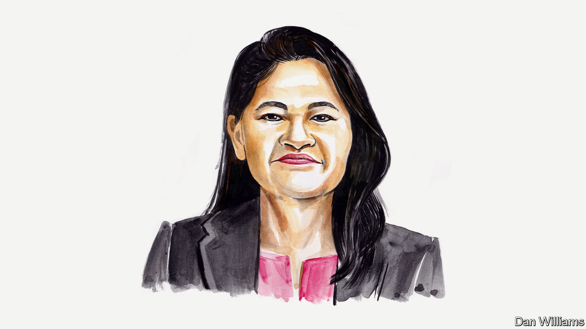

###### Chinese politics

# The Chinese government exercises control through local busybodies, explains Lynette H. Ong 

##### It will fret that citizens no longer trust them, argues the expert on state repression 

 

> Dec 1st 2022 

THE CENTRALISATION of political power in China allows the Chinese Communist Party (CCP) to tightly control society. In the past week demonstrations over President Xi Jinping’s “zero-covid” policy in cities across the country, involving people from a variety of backgrounds, came as a surprise. That is probably because citizens rarely protest against government measures in this way; simultaneous national resistance to them is less common even than in other autocratic states, such as Russia. The party learned tough lessons in Tiananmen Square in 1989. It has since meticulously designed a system that can pre-empt major protests before they occur.

One part of the system relies on technology. Cameras with facial-recognition capabilities and clever uses of AI on social-media platforms can identify and intimidate those voicing dissent. Another part of the system relies on the social fabric of the country. The CCP tries to avoid using violence, but instead outsources repression to prominent figures in communities around China. These might include neighbourhood gossips, residents’ committees or even street hooligans. This has augmented the power of the government in peoples’ everyday lives.

Mobilising the masses to control society—which I call “outsourcing repression” in my research—has imperial roots. In the  system, introduced in the Song dynasty and perfected in the Ming and Qing dynasties, the government would bundle together a few households into a group and make them spy on each other. Mutual surveillance also entailed collective punishment: deviant or subversive behaviour of any individual would implicate all the other families. Mao Zedong found this kind of grassroots spying useful, too. He used the so-called Red Guards in the Cultural Revolution of the 1960s and 1970s to defeat supporters of his enemies. Outsourcing repression works because it draws on dense social relations. Anyone who refuses to comply risks becoming an outcast. Social reprimand is arguably worse than fines or formal punishment as China runs on , or connections. 

This dual system of control, combining high-tech and low-tech surveillance, underpinned the initial success of the zero-covid drive. Locally enforced lockdowns produced low infection rates that were once the envy of the world. Neighbourhood committees and trusted local volunteers have faithfully implemented the policies, delivering food supplies to residents in lockdown, taking residents’ temperatures and monitoring their movements. At the beginning of the pandemic, they persuaded citizens to comply with lockdowns, but rarely had to coerce them into submission with violence.

The nature of the top-down autocratic system in China, however, creates immense pressure for low-level officials to meet targets. The more the zero-covid policy gained prominence, the more local officials strained to stop the pandemic’s spread. Case numbers became a metric watched hawkishly, much like economic-growth figures. Pressure to succeed in the battle against covid-19 mounted after Mr Xi presented low infection rates as a source both of national pride and of Chinese superiority over the West. Failure to contain covid could mean a lack of advancement, or punishment, or both, for apparatchiks. 

Unsurprisingly, efforts to curb the pandemic went from being reasonable to being zealous and then preposterous. Persuasion wasn’t enough to get citizens to obey extreme measures. Elderly patients in need of urgent medical attention did not receive the treatment they needed, and consequently died, because of delays due to pandemic measures. Infants were separated from their mothers and sent to quarantine facilities for monitoring. 

By the middle of 2022 many citizens felt that the ends of zero-covid no longer justified the means. The chaotic lockdown in Shanghai showed as much. Trust broke down between committees and the residents with whom they worked, leading to the use of more coercive measures, such as hiring street hooligans to enforce compliance. That erosion of trust matters because China’s governance model relies on grassroots brokers for the routine implementation of challenging policies.

The protests seem to have fizzled out for now and some cities have announced easing of certain covid restrictions. Even so, the demonstrations will scar the party and bruise the legitimacy of its social-control methods. Citizens are starting to challenge the repressive structures the CCP depends upon at the local level. That means that everyday policies, once implemented through persuasion, may now meet resistance instead. Forcing people to take covid tests, for example, through violent or other means will only make matters worse. And deteriorating relations between communities and committees could destabilise the CCP’s entire system of repression. That would make governing China far harder for Mr Xi than it has ever been before. ■

_______________ 


