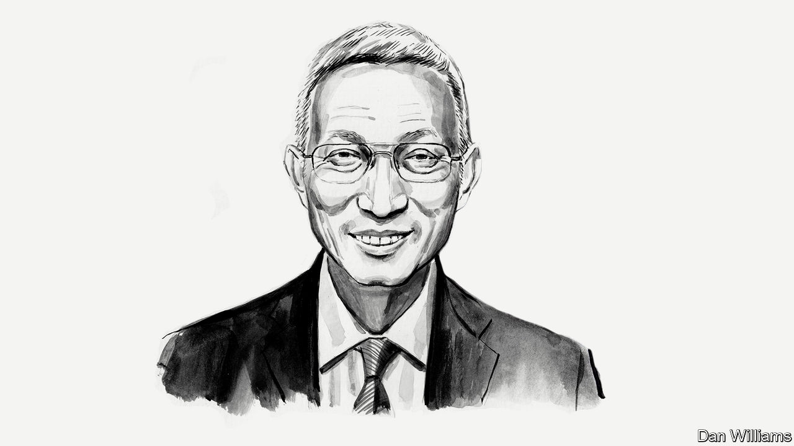

###### Chinese politics

# The protests in China may change the way Xi Jinping runs the country, says Minxin Pei 

##### The Chinese-American academic believes they will influence government policy for years 

 

> Nov 30th 2022 

THE SUDDEN eruption of anti-lockdown protests across China in the past week caught its leaders—and the world—by surprise. The first demonstrations took place in Xinjiang and Shanghai and the Chinese Communist Party (CCP), which has crushed countless mass protests in the past with ruthless efficiency, scrambled to respond. 

Chinese authorities have now adopted a mixed approach to curb the demonstrations. It combines an increased police presence and intimidation of protesters with promises of more refined implementation of the government’s “zero-covid” policy—which remains unchanged. Whatever the immediate outcomes of the protests, which now appear to be over, they will probably influence policy for the remainder of President Xi Jinping’s time in power.

The protests were the most politically charged public expression of discontent since the crackdown on the Tiananmen pro-democracy movement in June 1989. People from different social backgrounds—university students, migrant labourers and wealthy city-dwellers—joined forces in denouncing the inadequacies of their government’s harsh zero-covid policy. As the CCP’s greatest fear is criticism from a coalition of diverse groups, the anti-lockdown protests augur badly for the government.

Another factor that must trouble Mr Xi is that protests took place simultaneously in politically important cities. Besides Beijing, the capital, demonstrations broke out in provincial capitals, including Shanghai, Guangzhou, Wuhan, Nanjing, Lanzhou, Urumqi and Chengdu. The demonstrations in 1989 also had a wide geographic reach, though the numbers of protesters and cities involved that year were far greater.

For a regime obsessed with preserving its tough image, the political defiance of the recent protests will seem shocking. The gatherings were initially triggered by allegations that a local lockdown was responsible for the deaths of ten residents in a burning building in Urumqi, Xinjiang’s capital, on November 24th. But some protesters quickly directed their anger at Mr Xi and the CCP, calling for them to “step down”. Not a single public gathering in the post-Tiananmen era has targeted China’s leader and its ruling party. That raises the stakes. If Mr Xi does not respond to such an open challenge to his personal authority forcibly, he risks damaging his carefully cultivated image as a strong leader.

The anti-lockdown protests have also revealed the limits of the party’s surveillance. The state failed to detect early signs of trouble even though the party has invested a fortune in systems capable of monitoring ordinary people’s movements and communications. Under ordinary circumstances, surveillance is quite effective because it targets a relatively small number of individuals known to the authorities as potential troublemakers. But targeted surveillance is ill-suited to the prevention of mass demonstrations precipitated by ordinary people who are not on the authorities’ watchlist. And once citizens had taken to the streets, facial recognition cameras, AI-assisted surveillance of social media and other fancy tools performed miserably in deterring protesters. They simply donned masks and wore other protective gear to disguise themselves. 

To be sure, fear of government reprisals probably kept more disgruntled people from joining the protests. But the fact that such politically charged protests can happen at all under pervasive state surveillance may well have diminished fear of the party and its security apparatus. That means the CCP cannot depend on technology to forestall challenges to its authority.

Mr Xi also faces the task of reburnishing his image in the wake of the protests. Their eruption comes shortly after he gained an unprecedented third term as leader and packed the party’s top ranks with loyalists at its 20th national congress in October. The demonstrations can easily be seen as a popular rebuke. In a society where authority and personality are often intertwined, any public expression of ire against Mr Xi erodes his aura as a great leader.

Regaining public support in the wake of the protests may require Mr Xi to pivot away from policies he has been pursuing since assuming power in November 2012. In the past decade the party has replaced Deng Xiaoping’s focus on economic development with Mr Xi’s strategy. It pushes orthodox ideology, social control, assertive foreign policy and economic statism. The return of “politics in command” may have worked wonders for Mr Xi when he wanted to amass power and reassert control over a party softened by decades of economic prosperity and ideological laxity. But the costs of this shift are mounting for ordinary people. Growth has slowed down dramatically in the past decade, from 9.6% in 2011 to 3.2% this year according to a forecast from the International Monetary Fund. And a slow-motion implosion of the property sector has wiped out a huge chunk of the middle class’s wealth on paper. Homes were once considered their greatest assets. 

Mr Xi’s zero-covid policy may be the last straw for many. Even though this policy scored early success, the Chinese government stuck with it for too long. Officials came to believe that eradicating covid-19 was a project to demonstrate the superiority of the Chinese political system. That also explains why vaccination drives were not made a priority. Until recently just 40% of people aged over 80 in China had had a third booster shot. Officials now say the share is 66%. 

Mr Xi now faces two difficult quandaries. The first is how to act on protesters’ demands without unleashing a wave of covid-19 that overwhelms China’s health systems. The second is how he should govern in the coming decade if his uncompromising style and ideological agenda are no longer palatable to the country’s people. He may even see the latter as the more daunting challenge.■

_______________


