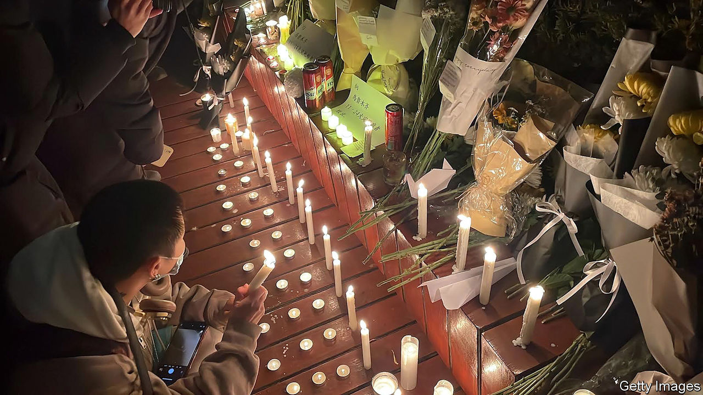

###### Solidarity, of a sort

# Harsh lockdowns have united the Chinese 

##### But ethnicity still divides them 

 

> Dec 1st 2022 

“We are all in the same building, only the fire hasn’t reached us yet.” So said a protester in Hunan province on November 27th. He was referring to a blaze three days earlier that killed ten people in an apartment block in Urumqi, the capital of Xinjiang. Many Chinese believe the country’s covid restrictions contributed to the tragedy. So, in a rare moment of regional solidarity, hundreds of them  in cities across China, voicing their displeasure with the “zero-covid” policy.

The solidarity only goes so far, though. Neither Chinese officials nor the protesters mentioned the ethnicity of the fire victims. Most, if not all, are Uyghurs, members of a mostly Muslim minority who have suffered under a  of mass detention, forced labour and cultural erasure in the name of counter-terrorism. It is too dangerous for Uyghurs to be involved in the protests. But members of China’s dominant ethnic group, the Han Chinese, show little sympathy for their broader plight, either because the Han are not aware of it, don’t believe it is happening or think that addressing it would cross a red line set by the government.

This has led to awkward moments. At a vigil for the fire victims in Beijing on November 27th, one demonstrator said, “I am from Xinjiang, thank you all for coming!” Another replied pointedly: “We are all Chinese!” Abroad, where Uyghurs can protest without fear of arrest, things have got uncomfortable at times. There were two vigils in Amsterdam on November 28th, one led by Uyghurs, the other by Han Chinese. The two groups started arguing when the Uyghurs raised an East Turkestan flag, a symbol of independence. The Han protesters did not want to be associated with separatism; some criticised the Uyghurs for asserting that they were not Chinese. It was “frustrating” and “ridiculous”, says a Han participant who had hoped the groups could stand together.

Han protesters are missing the bigger picture, says Abduweli Ayup, a Uyghur activist in Norway. He notes that the apartment block that caught fire was located in a Uyghur district of the city, close to where riots broke out in 2009. So the building was not only under a covid lockdown, it was also hemmed in by roadblocks put up in the name of security (a common feature in Uyghur areas). Videos showed water from fire trucks falling short of the blaze, apparently because they could not get close enough. A callous official said the victims had been “too weak” to save themselves. At least one survivor of the fire has since been detained, according to Mr Ayup.

Some of China’s longest and harshest lockdowns have been in border regions such as Xinjiang and Tibet, both of which have been largely sealed off for months. Residents have struggled with shortages of food and medicine—and with a lack of public attention. In October hundreds of anti-lockdown protesters clashed with police in Lhasa, the capital of Tibet, a situation ignored by Chinese media. Three Xinjiang residents were investigated in November after flooding a livestream of State Council proceedings with comments of “Urumqi Urumqi Urumqi”. The government has worked hard to keep these remote areas out of the public consciousness through censorship and policing. The fire in Urumqi changed that. 

Victims now, victims then

Still, the protests in China’s big cities ring hollow to Abdulhafiz Maimaitimin, a Uyghur in Switzerland who says his aunt and at least one of her children died in the fire. For Uyghurs, who have long lived under invasive surveillance and the constant threat of police raids, covid restrictions are merely the latest method of government control. Mr Maimaitimin says his aunt’s husband and oldest son have been missing since 2017, when hundreds of thousands of Uyghurs and other minorities were thrown into “re-education” camps. Some have since been released, while others have been moved to prisons or labour facilities.

The Chinese who demonstrated in recent days do not mention any of this. “In 2017, when so many Uyghurs were taken, why did they not protest? Why did they not speak for us?” asks Mr Maimaitimin. “They are protesting now for themselves, for their own freedom.” ■


