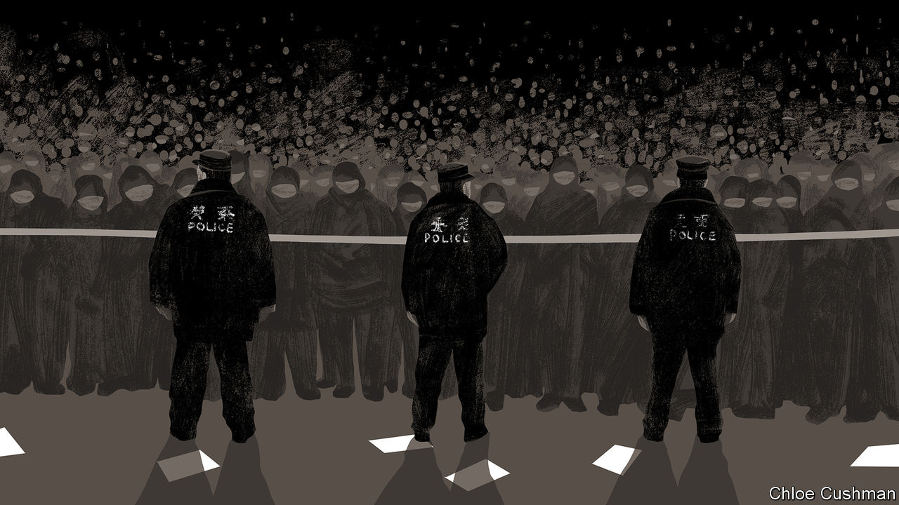

###### Chaguan

# Lessons from a Chinese protest 

##### On the streets of Beijing with youngsters angry at covid lockdowns 

 

> Dec 1st 2022 

Under a road bridge in central Beijing, just before two o’clock in the morning on November 28th, one of that city’s most powerful men came face to face with youngsters driven to despair by China’s harsh “zero-covid” controls. The brief meeting was revealing in several ways. It offered a glimpse of the security machine built by China’s supreme leader, President Xi Jinping, and the Communist Party’s confidence in it. On the protesters’ side, it showed how, in today’s China, youthful idealism is tempered by a sober understanding of the party’s might.

Overall, this is an alarming moment for Mr Xi and his regime. China’s covid-19 epidemic is raging and public frustration over the government’s virus controls is deep and broad. In recent days that has sparked protests in every corner of the country, binding angry workers, locked-down city residents and students. In the icy depths of that Beijing night, hundreds of young Chinese staged a rare demonstration in the capital. They lit candles for victims of lockdowns and called for an end to endless covid testing and the quarantining of every positive case. They sang the “Internationale” and a song of farewell for the dead, notably for families who died in an apartment-building blaze in the western region of Xinjiang, reportedly after fire exits were sealed. As social media spread word of this protest on the banks of the Liangma river, scores of cars drove past to sound horns in support. For five hours police in uniform and plain clothes had mingled with the crowd, filming every moment, without intervening. 

Now the remaining demonstrators found themselves outnumbered by police, with fresh columns of officers emerging each minute from the darkness. All there understood that the authorities were bringing this event to an end. The protesters sensed that a grey-haired man, flanked by a wall of police officers, was a , a leader. They were right. Quietly, after youngsters demanded to know his identity and whether he held a district- or neighbourhood-level rank, the man revealed his job: Beijing’s police chief.

Moments earlier, after hours observing the protests, Chaguan had been pulled from the crowd by police, questioned and told to leave. An eyewitness’s smartphone video captures the meeting with the police chief that began seconds later. A young protester in a white coat, maskless despite the certain risk of punishment, begins negotiating with the chief, Qi Yanjun. “If you’ve heard our voices then all this will not have been in vain,” says the protester, as if naming a price for leaving. Mr Qi is impatient, muttering: “Alright, alright. Let’s go.” The protester names another demand, saying: “We need to know who you are.” Without waiting for an answer, the young man uses an honorific dating back to imperial times, telling the police chief: “You are our .” That title, meaning “father-mother official” and often used to describe local magistrates in imperial times, harks back to Confucian teachings about filial duty and hierarchy, and the idea that the state should exercise social control like a stern parent. The moment says a lot about Mr Xi’s rule. As he begins his second decade at the top, China’s leader has built an autocracy that is at once unnervingly modern, backed by surveillance technologies that give opponents no place to hide, and strikingly traditional, drawing strength from patriarchal notions of state power. 

Mr Qi responds in kind. There are many police here, but none of them will lay a hand on you, they are protecting you, he tells the protesters. Then he makes a veiled threat: leave now, while you can go home safely. He growls “don’t shout” when the young man calls out: “Beijing’s police chief has heard what we have to say!” At last, his officers shoo everyone away.

The next day, prominent nationalist commentators praised the Beijing police for their restraint, before claiming that hostile foreign forces had organised the protests as a “colour revolution”. This was doubly misleading. For one thing, almost as soon as the protest ended, police moved to track down those present. Many youngsters have been called to police stations to sign statements, show officers their social-media contacts and answer questions about their political views. Fear increased as police turned up in force to smother protests called for the following night, after using some unknown mixture of mobile-telephone data, surveillance-camera images and infiltration of social-media groups to identify and track activists. For another thing, nationalists are wrong to call these events foreign-influenced. Those present were driven by authentic anger over covid controls that have limited their freedoms for nearly three years. What is more, their combination of daring, caution and an instinctive understanding of how far they can bargain with those in power is distinctively Chinese.

Life in a surveillance state

That night by the Liangma river youngsters approached your columnist to express excited incredulity that they were at a protest. Others shared fears of going too far, citing mass arrests seen the previous night at a protest in Shanghai. Individuals starting anti-government chants were quickly hushed or drowned out by renditions of the national anthem. As the police moved among the crowd, patiently filming and eavesdropping, those present pivoted between mocking officers and declaring their love for China. 

Anger over the zero-covid policy matters because the party has no good options for assuaging it. China cannot lift covid controls quickly without risking chaotic waves of infection. That is a serious dilemma, especially because resentment of lockdowns has prompted such diverse demonstrations, including by migrant workers unafraid of violence. Politically charged protests involving students, like those seen in Beijing, are harder to assess. Young Chinese demanding greater freedoms capture worldwide headlines. But it is unclear whether any of those present had any hopes of changing their country. Being heard was a victory of sorts. In coming days, those who spoke out will learn the price to be paid. ■


