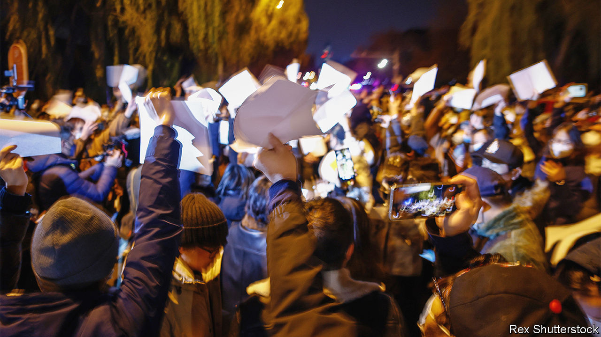

###### Testing the party

# Students are often at the heart of protests in China 

##### Their frustration goes beyond the zero-covid policy 

 

> Dec 1st 2022 

From the May Fourth Movement of 1919, to the pro-democracy demonstrations in Tiananmen Square seven decades later, university students have played a central role in China’s biggest protests. The Communist Party is therefore attuned to the risk of unrest on campuses. Under Xi Jinping it has stepped up indoctrination efforts. When Mr Xi visited his alma mater, Tsinghua University, last year, he implored students to be “confident in the system of Chinese socialism”.

But many students feel the system is failing them. Over the past year there have been sporadic protests on campuses. In the past week there were many more, coinciding with  in big cities.

For the students, it is not all about draconian lockdowns. Some are frustrated by a lack of freedom. Young protesters, on campus and off, have taken to holding up blank sheets of paper to highlight China’s tight controls on expression. In a more cerebral form of defiance, students at Tsinghua held up the Friedmann equations. These are formulae that describe the expansion of the universe. “Friedmann” also happens to sound a lot like “freed man”. 

Discontent among university students has been building for years. Next year’s graduating class of around 12m grew up during a period of strong economic growth. They arrived on campus in 2019, probably expecting to have a good time before starting their careers. Instead, they have often been sealed in their dorms and forced to take classes online. Chelsea, a university student in Beijing, describes a swimming class: “They would have to pretend to swim on the bed, then take a video and send it to the teacher. They would practise holding their breath in the sink.” In a desperate form of escapism, students at several universities started crawling in circles together. “Collective crawling is resistance to a lack of freedom,” claimed a student in an essay posted online. 

When the class of 2023 graduates they will face a different economy, too. China’s unemployment rate for those aged 16 to 24 in cities is nearly 18%. Covid restrictions are partly to blame. But Mr Xi has also dimmed private-sector dynamism by cracking down on the technology sector and increasing state control. More and more students are competing for lower-paid, but stable government jobs. Others are  in the hope that the job market will improve by the time they get out.

Some university administrators have sat down with students to discuss covid controls. Others are taking a different approach. “One day you will pay the price for everything you have done today,” an official told protesters at the Communication University of China in Nanjing. Several universities are encouraging students to go home, even though winter break does not begin until January.

This round of protests may fizzle as the police clamp down. But students’ frustration is clearly growing. “Everyone is very anxious,” says Chelsea. Mr Xi provides no balm. At the party’s five-yearly congress in October and in speeches thereafter, he implored youngsters to work harder, pursue realistic goals and “abandon arrogance and pampering”. Inspiring stuff.■


