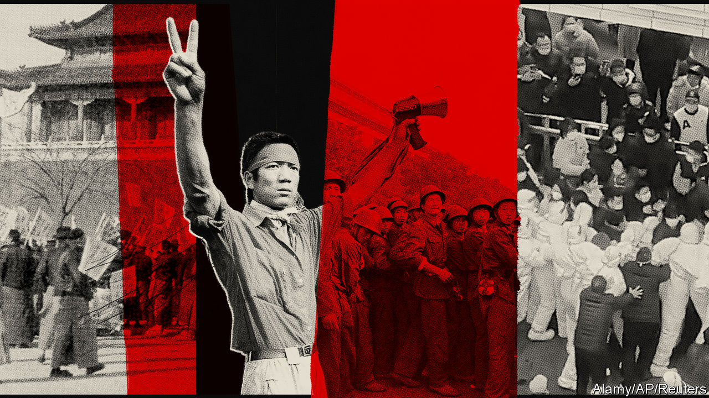

###### Echoes of the past

# What 1989 can teach us about the recent protests in China 

##### The differences are as important as the similarities 

 

> Dec 1st 2022 

China’s leader, Xi Jinping, often warns officials of the risk that Communist Party rule could unravel. He has told them to beware of efforts by “hostile forces” to foment a “colour revolution” in China: “a present danger”, as he sees it. He has ordered them to be alert to “foreseeable and unforeseeable” perils that could “evolve into political threats if not managed promptly and effectively”. He has repeatedly reminded them of how the Soviet Communist Party fell in 1991. The word he uses to convey that moment is . It is a crashing sound. 

Mr Xi’s calls for vigilance began in better times for the party, when China’s economy was still growing strongly and America had not yet launched its campaign to keep China’s rise in check. Imagine, then, how he now feels as he surveys the challenges—an economy choked by his efforts to crush covid-19, a virus that threatens to defy his draconian controls and a public that is showing signs of growing anger at . In recent days China has experienced the biggest wave of unrest since the . Between November 25th and 27th protests swept across several Chinese cities. They were triggered by an outpouring of sympathy for ten people who were killed by a fire in an apartment building in Urumqi, the capital of the far western region of Xinjiang. Protesters believe lockdown measures contributed to the deaths. Some demonstrators have gone further than mourning. They have called for Mr Xi and the party to relinquish power.

The protests subsided as police moved decisively to . But as someone so mindful of his own party’s history and that of other communist countries, Mr Xi will shudder at some of the echoes of the past. Students have gathered on numerous campuses, calling not only for freedom from covid-related lockdowns, but also broader political freedoms. Their actions recall the early days of the protests 33 years ago, when students seized an opportunity—official mourning for the death of a reformist leader—to press for political change. 

On November 30th another leader, , died at the age of 96. He is not remembered for being politically liberal when he ruled the country in the 1990s and early 2000s. But among some Chinese those times are remembered as less repressive, and Mr Jiang as someone who, unlike Mr Xi, had an affable, outgoing side. Disaffected Chinese may highlight that difference as a way of poking at Mr Xi. Some may even mourn Mr Jiang, who in his later years became the subject of viral internet memes. He ruled China in boom times, when the country’s rise seemed less beset by obstacles. 

The recent campus unrest resonates with events long predating the Tiananmen Square upheaval. The party’s own birth in 1921 took place amid intellectual ferment generated by student-led protests two years earlier. The May Fourth Movement, as it is known, was the grand progenitor of student activism in China. 

The party prefers to remember it as an outpouring of anti-Western sentiment. Participants were enraged by the giving away of German-held territory in China to Japan by the victors of the first world war. But it also spawned inquiry into what had made the West strong. Many concluded that the essential ingredients were science and democracy. In 1989 student protesters liked to present themselves as latter-day May Fourth campaigners, fighting for a long-neglected goal. On November 27th, at Tsinghua University in Beijing, a protester appeared to reflect a sense widely shared during the Tiananmen upheaval that students have a duty conferred by history to lead the fight for political freedom. “If we dare not speak out because we are afraid of being arrested, I think our people will be disappointed in us,” she told a  joined by several hundred students. 

There have been echoes of 1989, too, in the songs and slogans of the recent protests. As it was then, the Communist anthem, the “Internationale”, is a favourite. It plays a dual role in China. On July 1st last year, at a celebration of the party’s 100th birthday in Tiananmen Square, Mr Xi led a rally of thousands of people in singing its famous lines: “Arise, slaves afflicted by hunger and cold…” Protesters belt out the same words, thinking of themselves as the slaves of the party. 

“We want to be citizens, not slaves,” has also been a popular chant lately, among students as well as people from other walks of life who have joined gatherings on busy streets in Beijing, Shanghai, Guangzhou and elsewhere. The words are those used by a lone protester on banners that he tied to a bridge in Beijing on October 13th, days before a five-yearly party congress. He was swiftly arrested, but his daring action has sparked  in sympathy involving mainland students at numerous Western universities—the most widespread of their kind in decades.

The bickering back then

Mr Xi may take comfort, however, from differences between the recent unrest and events in 1989. A crucial enabling factor in the growth of the Tiananmen Square protests (they spread nationwide, affecting most big cities) was division and dithering among China’s leaders. The rifts among them were huge and obvious. On one side were reformers who wanted to give market forces a freer rein and create a more relaxed political climate. Conservatives wanted the opposite. Their bickering prevented swift action to curb the unrest. Students emerging from their campuses to march towards the square were surprised to find the police melting away. 

This time the police have stepped in more quickly. There is no sign of division among leaders. In October, after the party congress, Mr Xi  of the seven-member Politburo Standing Committee, the pinnacle of party power. For the first time all of its members are now clearly his loyalists. It was very different in 1989, when the committee included a reformist general secretary, Zhao Ziyang, and a deeply conservative prime minister, Li Peng. That the two men were at loggerheads was an open secret. During the protests Zhao was purged by Deng Xiaoping (then the country’s military chief) for showing sympathy with the students. 

Such tension is hard to imagine today. Mr Xi is general secretary and head of the armed forces. He has relegated the role of prime minister to the sidelines. Retired elders, who were then very influential, present little threat to Mr Xi. The death of Mr Jiang, his predecessor-but-one, has removed a figurehead of potential opposition, but Mr Jiang had long been too weakened, physically and politically, to pose any serious challenge. Mr Xi’s immediate predecessor, Hu Jintao, was never very strong politically. Even when he was in charge, he bowed to Mr Jiang. 

Mr Xi’s enormous power will not stop him worrying. In September, well before the recent protests, the mouthpiece of the armed forces, the , had warned that “hostile forces” were “stepping up” their efforts to instigate a colour revolution in China. Also that month, the country’s police chief, Wang Xiaohong, had called for “focus on preventing and resisting” such an event. Mr Wang, a longtime confidant of Mr Xi, was appointed in June following a purge of senior police officials deemed disloyal to the country’s leader. The sudden eruption of several simultaneous protests—though far smaller and less widespread than those of 1989—will have rattled Mr Wang, too.

Mr Xi may fret in particular that some protesters have gone beyond the political boundaries that were commonly observed by their counterparts in Tiananmen. In 1989 some demonstrators chanted “down with Deng Xiaoping”, but most stopped short of calling for the party’s overthrow. There was far less reservation among the hundreds who gathered on November 26th on Shanghai’s Wulumuqi Road (its English name uses an alternative spelling of Urumqi—the site was chosen because of its relevance to the fire in Xinjiang). Their shouts of “Xi Jinping step down!” and “Down with the Communist Party!” were a heresy that Mr Xi will not forget. He will make doubly sure it does not happen again. ■


