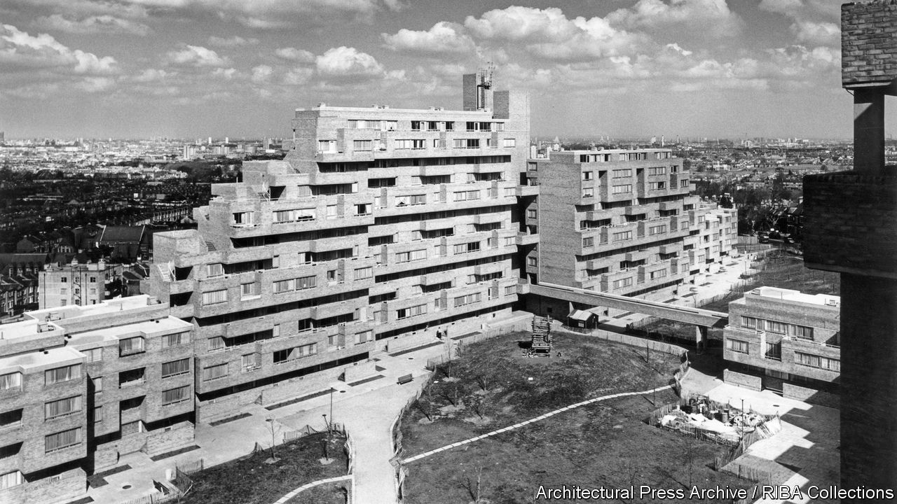

###### Social housing

# The dream and nightmares of council estates 

##### John Boughton’s chronicle of council housing is a guide to a bolder, sometimes foolish, lost Britain 

 

> Dec 1st 2022 

By John Boughton. 

This book measures 25cm by 21cm. It is elegantly designed, with beautiful photographs printed on hefty paper. The publisher is the Royal Institute of British Architects, which also produces books such as “Inspired by Light” and “The New Country: City Style for Rural Living”. It even smells nice. It is a lovely book on the distinctly unglamorous subject of British council estates. 

And why not? At the peak, in 1981, fully 32% of English people lived in social rented accommodation—mostly in the form of houses and flats built by local councils. Even today, after four decades of mass council-home sales and very limited new building, they shape millions of people’s lives. The 100 council estates described in John Boughton’s book are not just places to eat and sleep, but domains with distinct cultures and reputations. To move from one council estate to another is not merely like moving from one road to another. It is more like moving to a different town, even a different country. 

The inhabitants of council estates have experienced (or, it has sometimes seemed, been subjected to) some of the most important currents in post-war architecture. Despite a recent , middle-class Britons tend to live in Victorian and Edwardian homes, or in more modern houses that look Victorian or Edwardian. By contrast, many council tenants have been shoved into modernist towers and . Dawson’s Heights (pictured), an estate in south London, is a ziggurat. Duffryn in south Wales resembles a giant snake. 

The earliest social homes were almshouses—institutions for the old and decrepit built by rich benefactors with an eye on their souls. By the late 19th century philanthropic groups like the Peabody Trust were putting up bigger estates. Then local governments started building, and soon made all previous efforts appear trivial. Spooked by Bolshevism, the authorities constructed huge numbers of houses for working-class people after the first world war. Some estates were as big as towns. The mostly two-storey Becontree estate in east London occupied four square miles and had a population of 112,570 when major works finished in 1934. 

Early council tenants adored their homes, which had modern conveniences such as indoor toilets. One resident described the Becontree estate as “heaven with the gates off”. They often paid steep rents for them. Councils tried to ensure that their new estates would be dominated by affluent workers; one was criticised as “dainty villas for already well-paid artisans”. In their defence, councils argued that when successful workers moved onto new estates, their old homes became available to poor slum-dwellers. The theory was known as “filtering up”. 

Eventually, councils had to build homes for the truly poor. At that point council estates became architecturally bolder but frequently worse in every other way. After the second world war the vogue was for “system building”—assembling blocks of flats from prefabricated materials, often as cheaply as possible. Architects created walkways known as “streets in the sky”, which they hoped would encourage neighbourliness. Instead they were haunted by muggers and vandals. 

In 1966 Leeds City Council approved Hunslet Grange, a cluster of towers built from prefabricated materials. Richard Hoggart, a cultural historian who grew up there, called it “some of the worst, most crass and inhumane public housing I have seen in any developed country”. Demolition of the estate began less than two decades after it was created. Another council tower, Ronan Point in London, was so badly constructed that it almost demolished itself following a minor gas explosion in 1968. 

Mr Boughton casts a wide net, picking urban, suburban and rural estates. He includes many Scottish and Northern Irish projects; some of the latter are especially tragic. The , completed in 1972, were poorly built and quickly squatted by Catholics desperate to escape sectarian violence elsewhere in the city. They became a Republican stronghold and the site of many deaths, with an army observation post on top of one of the towers. 

Planners and architects sometimes built estates according to their own firm notions of working-class culture, and went badly wrong. Had they asked, council tenants would have told them their housing preferences were almost exactly the same as those of middle-class homeowners. As one resident of the Hulme estate  put it: “We wanted more houses than flats, gardens, lots of greenery and safe areas for children.” Mr Boughton admires councils such as Norwich and the London borough of Camden, which tried to reconcile those traditional desires with the need to build densely and fairly cheaply. 

He is a defender of council housing in general. Despite the disasters, he argues, the great British public building project of the 20th century improved many people’s lives. That conclusion is debatable: estates can start out heavenly but end up concentrating poverty and . What is not arguable, however, is that British councils used to be far more powerful and ambitious when it came to housing their poorer inhabitants. This is an essential guide to a bolder, sometimes foolish, lost Britain. ■


