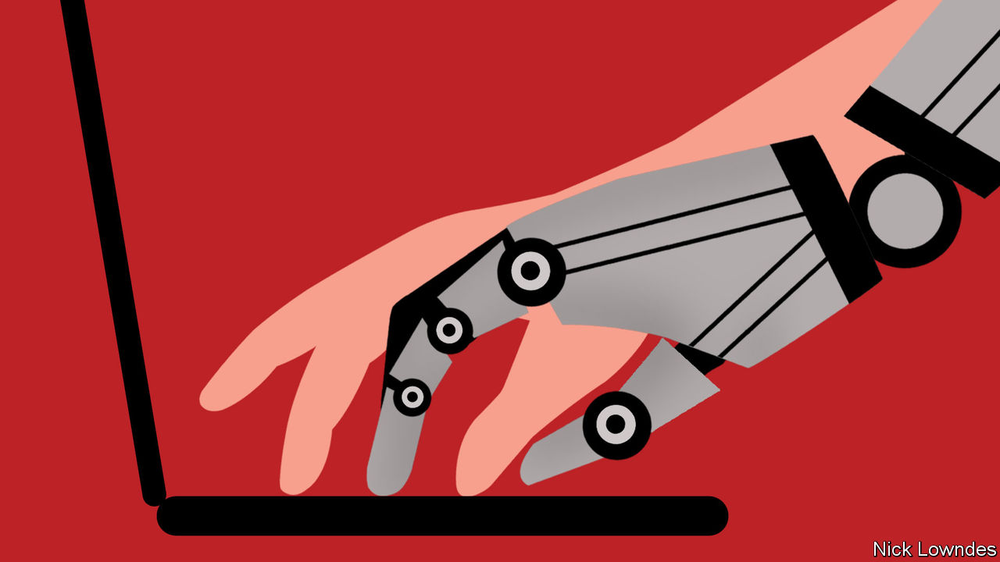

###### Johnson

# The translator of the future is a human-machine hybrid 

##### There will still be a place for humans with specialist knowledge 

 

> Nov 30th 2022 

THIS FIRST paragraph can read a bit oddly. As an experiment, Johnson wrote it in English, and then ran it through Google Translate to turn it into French, before running it through the same process in reverse, to render it back to English.

But the prose is only slightly odd. The software has turned the original “may” into “can”, which made the first sentence sound a little off. In the second, the original “has written” became “a écrit” in French, which was then translated as “wrote” in English—accurately, but with a small change in emphasis. 

Once such round-trip translations were an endless source of humour. Some people took serious texts and put them through this two-way process yielding hilarious results. And bad computerised translation is hardly consigned to the past. “Chinglish” signs are still a source of amusement for English-speakers visiting the Chinese-speaking world. On one , sour black-eyed peas with snails becomes “acid fry cowpea screw meat”. The joke cuts both ways: Westerners sometimes botch the Chinese characters in their tattoos.

Yet as Johnson’s experiment shows, for most workaday purposes  (MT) has got a lot better in the past five years or so. The biggest source of improvement has been the deployment of “deep learning” in training such systems, which are meant to mimic the action of a brain’s neurons. 

But  for business purposes has also come about through a proliferation of clever companies solving individual tasks. Some have created specialist dictionaries so that important terms can be translated accurately and consistently. An entire MT engine can now be trained only on data from a professional domain (such as law or medicine), improving accuracy further. Other gizmos integrate mt with a human translator’s editing tools. This means many of those humans spend most of their time checking and refining MT output, rather than doing the bulk of the translating themselves.

Being a machine’s editor may sound depressing. For some translators, indeed it is. This can be seen the other way round, however. A human repeatedly translating identical formulae is in principle little different from a machine trained to do the same. Such work can be drudgery. Allowing the machine —the chunks that are translated the same way, over and over—frees the translator to apply specialised linguistic and subject-matter knowledge, solving more intellectually satisfying problems.

What are those problems? One Madrid-based translator for a big law firm describes some recent tasks. One was finding a cultural example to replace a reference to a short story that is famous in Spain but little-known to English-speakers. Another involved catching a fairly fine-grained but critical distinction: a Spanish word () that is properly translated as “wilful misconduct”, but which was translated only as “malice” by software. Since the law in question considerably magnifies penalties when the misconduct is “wilful”, the omission was potentially disastrous—and could only have been caught by someone with the right combination of legal and linguistic nous.

That technology has upended translation is well-known. Many translators have been silently (and guiltily) relying on computers for years. What is newer is the willingness of translation firms, and individual translators, to be out and proud about using MT, not as a crutch but as a means to cut costs and turnaround times. Part of the job becomes knowing what can be automated and what cannot. Invoices and instruction manuals can be left to MT. Ditto, for the most part, contracts, which have lots of boilerplate language, so long as a human makes sure that slips like the  case above are avoided. A novel legal argument, says the translator in Madrid, needs to be almost entirely translated by hand.

This is not doable by someone who merely knows Spanish and English and took a few translation classes. The bad news for some translators is that a spigot of repeatable, easy work is being turned off. The good news is that what remains will be brain-challenging stuff for people who have a knowledge of a language and something else. 

Tales of artificial intelligence usually pit humans against encroaching machines, “Terminator”-style. But the translators of the future will be . They will be human beings with mechanical enhancements. Call them cyborgs.■


