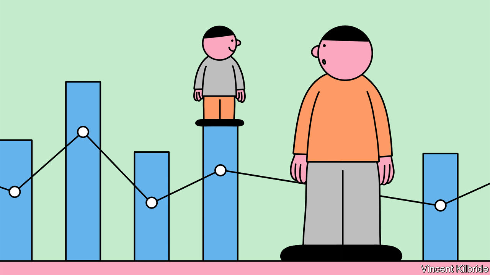

###### The algorithm’s mercy

# Two new books explore the upside of big data and AI 

##### They are a refreshing counterbalance to alarmist commentary 

 

> Nov 30th 2022 

 By Orly Lobel. 

 By Erica Thompson. 

TWO YEARS ago, when Elinor Lobel was 16, a “smart” insulin pump was attached to her body. Powered by  (AI), it tracks her glucose levels and administers the right  at the right time to keep her healthy. It is a miraculous innovation for diabetes sufferers and just one of myriad new ways that data and ai can help improve lives. 

Books that decry the dark side of data abound. With menacing titles such as “Weapons of Math Destruction” and “Algorithms of Oppression”, they suggest that there is much more to fear than fete in the algorithmic age. The public is duly alarmed; ditto policymakers. For instance, a proposed  may hold back some educational applications of ai, such as its use in marking exams.

But the intellectual tide may be turning. One of the most persuasive proponents of a more balanced view is Elinor Lobel’s mother, Orly, a law professor at the University of San Diego. In “The Equality Machine” she acknowledges AI’s capacity to produce . But she shows how, in the right hands, it can also be used to combat inequality and discrimination. “We need to cut through the utopian/dystopian dualism,” she writes. “The goal should be progress, not perfection.”

For example, women selling goods on eBay tend to receive less money than men for the same item. Apprised of that bias, the website can hide vendors’ personal details until an offer is made, or alert them to higher prices in similar transactions. Meanwhile women looking for jobs are less likely than men to respond to postings that use military jargon such as “mission critical” and “hero”. Textio, an AI firm, helps companies recruit female employees by scanning listings and recommending alternative language. 

“The Equality Machine” buzzes with such examples, revealing a hidden world of coders, data scientists and activists who are working on the technical means to achieve ethical ends, not simply griping about ai’s lapses. The book aptly describes the workings of various AI systems, but its main contribution is to reframe problems in constructive ways.

A tenet of privacy rules is “minimisation”: collect and retain as little information as possible, especially in areas such as race, gender and sexual orientation. Ms Lobel flips the script, showing how in countless cases of medical diagnosis and treatment, as well as in hiring, pay and the legal system, knowing such characteristics can lead to fairer outcomes. For example, in the past American regulators did not track the performance of medical devices by the sex of patients, though an independent study suggested women experience twice as many deaths and injuries as men. 

Ms Lobel’s call to use more, not less, personal information challenges data-privacy orthodoxy. But she insists that “tracking differences is key to detecting disparities.” She advocates a careful loosening of intellectual-property rules to provide more transparency over algorithmic decisions. And she floats the idea of a sort of affirmative action in ai to support disadvantaged groups. For instance,  for highly paid jobs to men—because they mostly clinched such posts in the past—can be programmed to show them equally to women.

As Ms Lobel says, AI need not merely reproduce or . It can help expose them. And it is easier to fix an algorithm than it is to change people’s minds. 

The problems with algorithmic formulae are tackled in depth in “Escape from Model Land” by Erica Thompson of the London School of Economics. These statistical models are the backbone of big data and AI: if data is the input, algorithms are the tool and models are the product. They are everywhere, from e-commerce tips to economic and climate-change forecasts.

Yet rather like the full-scale map of an empire imagined by the writer Jorge Luis Borges, a perfect model of the teeming world will always be beyond reach. The task is to ensure that the abstractions correspond to reality as far as is humanly possible. “All models are wrong,” runs a venerable saying. “Some are useful.” 

Model students

Ms Thompson focuses on a challenge she calls the Hawkmoth Effect. In the better known Butterfly Effect, a serviceable model becomes less reliable over time because of the complexity of what it is simulating, or because of inaccuracies in the original data. In the case of climate change, say, this might lead to a prediction for rising temperatures being out by a fraction of a degree. In the Hawkmoth Effect, by contrast, the model itself is flawed; it might fail to take full account of the interplay between humidity, wind and temperature. This sort of mistake can be much more misleading, and much harder to rectify. 

The author calls on data geeks to improve their solutions to real-world issues, not merely refine their formulae—in other words, to escape from model land. “We do not need to have the best possible answer,” she writes, “only a reasonable one.” Before there is a statistical model, she notes, there is a mental version. Data scientists need self-awareness and empathy as well as mathematical skill. 

Both these books exhibit a healthy realism about data, algorithms and their limitations. Both recognise that making progress involves accepting constraints, whether in law or coding. Ms Lobel calls on AI practitioners to remedy the technology’s problems; Ms Thompson asks data scientists to be conscious of the choices and values in a model’s design. Their reflections offer the basis for a constructive agenda. As Ms Lobel puts it: “It’s always better to light a candle than to curse the darkness.” ■


