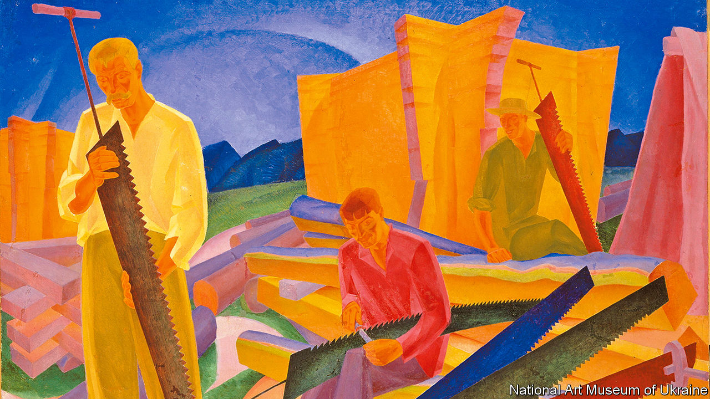

###### Art against war

# Ukraine’s Modernist art has defied censorship and missiles 

##### A new exhibition in Madrid is a tribute to Ukrainian creativity and resilience 

 

> Dec 1st 2022 

In the final room of “In the Eye of the Storm”, an exhibition of Ukrainian Modernist art that opened this week at the Thyssen-Bornemisza museum in Madrid, hangs “Sharpening the Saws” by Oleksandr Bohomazov (a detail of which is pictured). A triumph of form and colour, it shows workmen preparing their elongated, jagged tools for the following day. Painted in 1927, its theme nodded to what would soon become the official Soviet artistic cult of Socialist Realism. But its mood is contemplative, almost abstract, rather than heroic and propagandistic.

Bohomazov, who taught at the Kyiv Institute of Art, had absorbed all the European vanguards, from Cubism to Expressionism, before developing his own visual language. His painting was to be both apogee and requiem for a remarkable artistic flowering in Ukraine in the first three decades of the 20th century, a burst of creativity that is celebrated in this exhibition. At its core are three dozen works from the National Art Museum of Ukraine in Kyiv, augmented by others from the State Museum of Theatre, Music and Cinema Arts, the Thyssen itself and private collections. 

A few familiar names crop up. Sonia Delaunay was born in Odessa but worked in France;  came from Kyiv but worked mainly in Russia. Still, most of the artists represented will be new to the public in the West. As well as Bohomazov they include Aleksandra Ekster, Anatol Petrytsky, Vadym Meller, who worked on costume designs for the theatre, and Mykhailo Boychuk, who founded a movement of Byzantine Revivalism. They formed part of fluid international networks with Russian and western European artists; but they also drew on Ukrainian traditions of folk and decorative arts that had endured under rule by the tsars and other outside powers.

The first world war and the  set off upheaval in Ukraine. A bid for independence was swallowed in the Soviet conflict with Poland and the carnage of civil war. The Bolshevik victors at first encouraged the Ukrainian language and culture. But the 1930s were much harsher. Forced collectivisation led to an  in which around 4m people died.

And the commissars snuffed out the flame of artistic experimentation. From 1937 many of the works in this revelatory show were removed from Ukrainian museums and stored in a secret deposit. The artists were denounced as public enemies, “formalists” and “nationalists”. Boychuk, his wife and several others were executed. Others disappeared into the gulag; some managed to move abroad.

Outside interest in their work revived in the 1960s. But “Russia appropriated their names”, says Maryna Drobotiuk, the chief curator at the National Art Museum. Independent Ukraine has reclaimed them—yet now their work is once again under threat. These paintings, loaded on two trucks, left Kyiv on November 15th, a trip coinciding, as it turned out, with one of the war’s heaviest missile strikes. They were held up at the Polish border for 12 hours after a stray missile landed on the other side. “We were getting more and more nervous,” said Francesca Thyssen-Bornemisza, who launched a campaign to help Ukraine’s museums and inspired the exhibition.

It has two aims. One is to showcase the richness of Ukrainian culture. “This exhibition will tell us what Russia is trying to ,” Volodymyr Zelensky, Ukraine’s president, said in a video message recorded for the opening. The second is to keep the works safe until the violence comes to an end. The show will travel to the Museum Ludwig in Cologne and then, if necessary, elsewhere.

That itinerancy will strike a chord in Madrid. During the  the Prado’s most prized works were crated up and dispatched by truck, dodging air raids, to Switzerland. In 1937 the Spanish pavilion for the international exhibition held in Paris was an artistic outpost for a beleaguered republic. Its most famous exhibit was Picasso’s “Guernica”. Tragically the scenes of horror that he portrayed are being repeated. Bohomazov’s saws have been replaced with weapons of war. ■


