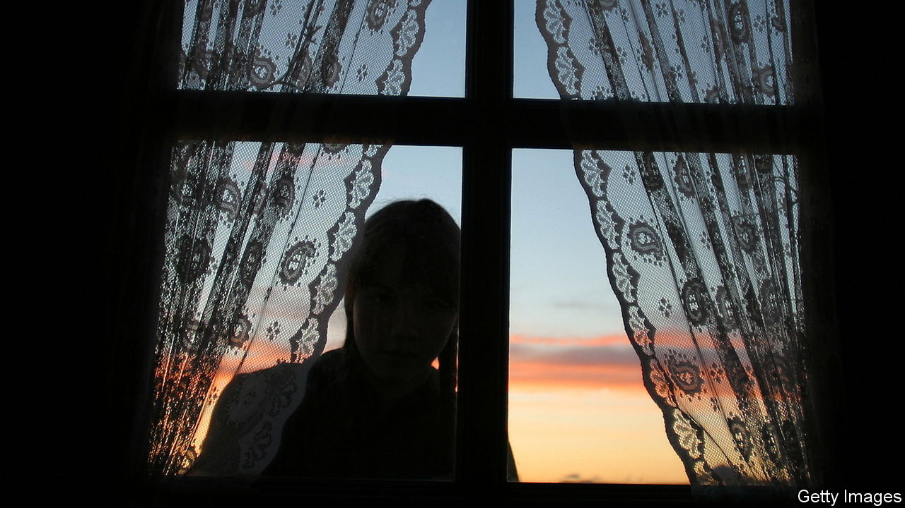

###### Icelandic fiction

# “Animal Life” is the latest book from a thought-provoking novelist 

##### Audur Ava Olafsdottir explores life and death, darkness and light 

 

> Dec 1st 2022 

By Audur Ava Olafsdottir. Translated by Brian FitzGibbon. 

Every novel by Audur Ava Olafsdottir is a multifaceted gem, with a sparkle concealing dark hues and sharp edges. The Icelandic writer often charts the mixed fortunes of characters trying to keep their heads and find their feet in new surroundings. In “Butterflies in November” a luckless woman packs her bags and her goldfish for a road trip with a deaf-mute boy. In “Hotel Silence” a man goes to a war zone to die, but reconsiders. The heroine of “Miss Iceland” moves to Reykjavik and learns the hard way that hers is a man’s world.

Those novels are all journeys of self-discovery. The author’s latest book to appear in English tells a different story. Deftly translated by Brian FitzGibbon, “Animal Life” features a heroine who stays put . This time the truths she uncovers are not about herself but rather a great-aunt whose work and views continue to resonate after her death.

Domhildur is a midwife—literally, in Icelandic, a “mother of light”. There is a long tradition in her family of “handling people at their points of entry and exit”: she is descended from four generations of midwives on her mother’s side, while her paternal forebears have been undertakers. Christmas is coming but so is a terrifying storm. She takes refuge in the flat she inherited from her great-aunt and namesake, whose unconventional approach to midwifery has left a lasting mark.

Coming across her great-aunt’s papers, Domhildur begins to piece together her life. She reads letters from a Welsh pen pal and reflects on the travels her relative made around Iceland. Old articles by the dead woman are full of prescient views on the . And in three disjointed manuscripts—one entitled “Animal Life”—she finds wonderment at the natural world coupled with waning faith in humankind.

This novel is more character-led than plot-driven. Domhildur consoles a grieving mother, bonds with an Australian tourist and takes stock of her sister’s weather warnings. Much goes unsaid: the protagonist “almost became a mother”, she says without elaborating. Some of the cast exhibit the author’s customary quirks. Domhildur’s colleague compiles a list of interesting tattoos spotted on patients; an electrician works with light because he is scared of the dark.

For the most part, though, Ms Audur Ava Olafsdottir reins in the strange foibles and zany antics. The result is a tranquil yet compelling meditation on life and , darkness and light, from a reliably thought-provoking novelist. ■


