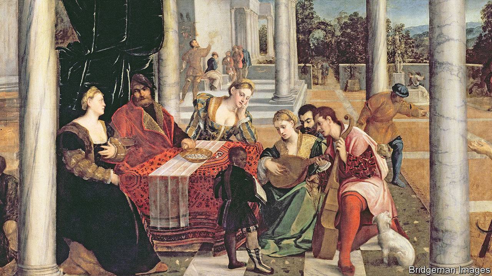

###### In the doge house

# “La Serenissima” is an entertaining ode to Venice 

##### But Jonathan Keates’s adoring tribute is blind to the city’s faults 

 

> Dec 1st 2022 

By Jonathan Keates. 

Among the many beautiful illustrations in this book is a reproduction of Bonifacio Veronese’s “Parable of Dives and Lazarus” (pictured)which hangs in the Accademia gallery in VeniceThe woman playing a lute is thought to be Gaspara Stampa, among the saddest figures in literary history. Abandoned by her paramour, who went off to war and seems never even to have written to her again, she captured the pleasure and pain of love in what Jonathan Keates calls “one of the most potently expressive of all the great Renaissance sonnet sequences”. It was published after her death in 1554 at the age of 31. 

Veronese’s canvas captures two themes that recur in this entertaining and erudite romp through the  One is the role of women. After a stint as queen of Cyprus, for instance, Caterina Cornaro survived lethal dynastic machinations to preside over a court in Asolo, near Venice, which attracted some of the finest minds of the late 15th century. Influential female intellectuals have included Veronica Franco, a poet and courtesan, Sara Coppio Sullam, a writer and champion of Judaism, and more recently that most eminent of adopted Venetians, Peggy Guggenheim.

Another recurrent theme is the . In the painting, Stampa is reading a score held by an African boy—doubtless modelled on a slave, possibly one of the many who began life as a subject of the Ottomans or Mamluks and were captured at sea by Venetian mariners. For about a century and a half, Venice was part of the Byzantine empire. At least as early as the eighth century,  were haggling in the markets of the Arab world. Over time it acquired an empire, the Stato da Mar, stretching from the Mediterranean to outposts on the Black Sea that gave it access to the western end of the Silk Road.

Some of the best-known paintings of Venice feature exotic animals and figures in turbans and robes. Modelled on a church in Constantinople, St Mark’s Basilica is highly unusual among Italian cathedrals. Even today, Venice has unique global connections. Where else would you find an island community of Armenian monks?

Faced with recounting more than a thousand years of the city’s rich and tangled history, Mr Keates has taken the understandable decision to just leave out the boring bits. Like a savvy gondolier with a boatload of the more intelligent sort of tourist, he steers from topic to topic, giving his readers enough information for a basic understanding of each before slipping down the next , political, military or diplomatic canal.

His love of the city radiates from every page. That is sometimes a drawback, for he is all too dismissive of his beloved’s shortcomings. Time and again, successive popes and sundry allies deplored what they saw as the city-state’s amoral rapacity. And, indeed, the Venetians seldom let their much-vaunted faith stand in the way of profitable trade with the enemies of their fellow Europeans.

Mr Keates offers a long list of the goods that Venetian merchants brought back from their Black Sea colony of Tana, near the mouth of the Don. Yet he neglects the trade in slaves. Venice’s deep involvement in the trafficking of human beings, also repeatedly deplored by the papacy—not least because many of the victims were sold to Muslims—gets a single page of text. In Venice itself, the author claims, slaves like the one in Veronese’s painting were “looked after, protected and given the wherewithal to thrive in the outside world once set free”. If so, it was after years of vulnerability to rape and flogging.

In similarly breezy fashion, he asserts that, in the Stato da Mar, “subject populations were content enough to become, by adoption, sons and daughters of St Mark, living in relative safety and public order.” Tell that to the exploited, expropriated Cretans who revolted 27 times during the four and a half centuries of Venetian rule. As poor Gaspara Stampa would have agreed, love can be thrilling, but blind. ■


