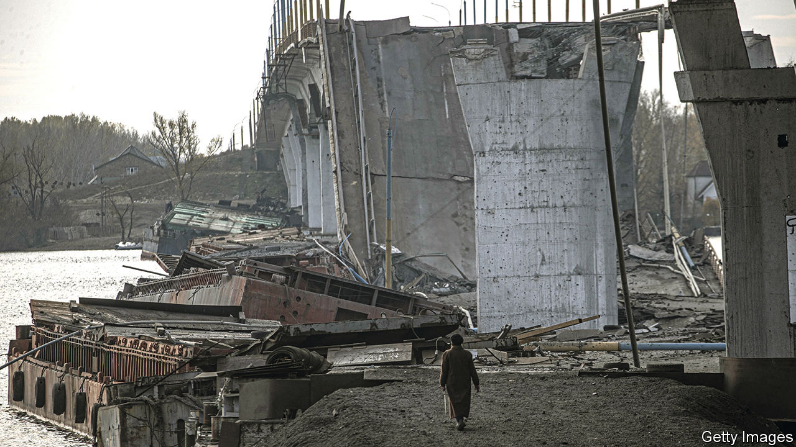
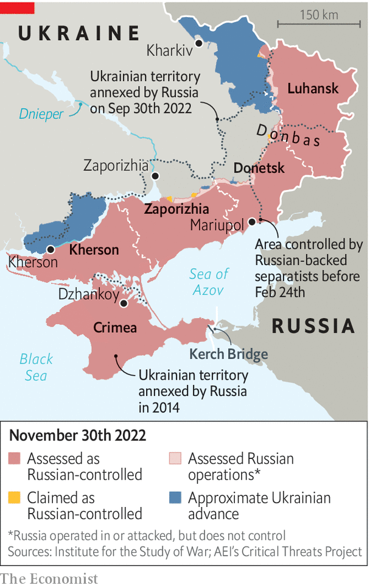

###### Crimean war

# A Ukrainian attempt to retake Crimea would be bloody and difficult 

##### And Western support can hardly be relied on 

 

> Nov 27th 2022 

VLADIMIR PUTIN hoped to take over Ukraine in ten days. Nine months later, he faces  holding on to the slice of territory he did manage to seize. Momentum is on Ukraine’s side following two counter-offensives, around Kharkiv in the north-east, and  in the south, that were conducted with a minimum of loss and a maximum of triumph.

But those two victories now raise the prospect of what would be much more humiliating Russian reverses in Donbas and Crimea, territory seized by Mr Putin in 2014. In an interview published on November 24th Volodymyr Zelensky, Ukraine’s president,  to “return all lands”. This is what Ukrainians tell pollsters they want, but Ukraine’s Western backers are less sure. They fear that an operation to retake Crimea, or Donbas (militarily an easier proposition), might drive Russia to escalate, perhaps even to use nuclear weapons. 

Ukrainian commanders are, not unreasonably, coy about their next moves. “If we telegraphed our plans on social media and on TV, we’d achieve nothing,” says Mykhailo Zabrodsky, a former commander of Ukraine’s air-assault forces, who remains close to the planning process. The lieutenant-general insists an operation to take back Crimea is not only possible, it was something that was being prepared for 2023. When exactly an operation might begin is another question: there are many battles to win first. But history shows, he says, that an occupying force “always finds it difficult to hold on to Crimea”. 

Sources in the armed forces say that “nothing” is off the table, including operations against territory seized by Russia before February 24th. The roads leading to Crimea are now within range of Ukrainian firepower, including the HIMARS rocket systems that have so dramatically disrupted Russian logistics since they were first introduced in the summer. Russian-appointed authorities in Crimea are preparing to resist a ground attack, ordering the construction of new fortifications and trenches, and declaring emergency threat-levels in several parts of the peninsula. Locals in Dzhankoy report trenches are being built near an airbase that was targeted in August and, apparently, again a few days ago, in what are likely to have been attacks by Ukrainian special forces. 

But Ukraine seems likely to focus its firepower elsewhere first. Cutting Mr Putin’s land bridge, the occupied territory linking mainland Russia to Crimea, remains the priority. Russian military planners understand this too, and have devised and manned defensive lines accordingly. A source in military intelligence is confident that Ukraine’s structural advantages, principally its ability to stage highly mobile hit-and-run attacks and break up supply lines, will prevail. “We’ve demonstrated at every stage that our tactics and focus on logistics are correct. We will show it again,” the source says. 

The many battles for Crimea over the centuries provide Ukrainian planners with plenty of insights. The largely bloodless Russian annexation in 2014, during which only two Ukrainian soldiers lost their lives, is not a typical example. Military operations in Crimea more usually end with thousands dead: in the last century alone hundreds of thousands have fallen at its gates, primarily in the Russian civil war and the second world war, to say nothing of the vast casualties during the Crimean war of the 1850s. Taking the peninsula has usually required crossing narrow, open strips of land, or marshes. 

Military experts with intimate knowledge of the peninsula say that the topography should give Ukraine pause for thought. Admiral Mykola Zhibarev, who back in 1992 provoked the break-up of Russia’s Black Sea fleet by declaring his frigate to be Ukrainian, now says that diplomacy is the most promising route to regaining the contested territory. Andrii Ryzhenko, a retired navy captain who was born in Crimea, says that a successful operation would require a lot to go right. “There is a real prospect that things will end in a bloodbath. That is an operation Ukraine does not need.” 

 


Lieutenant-General Zabrodsky insists that Ukraine’s planners have devised tactics that might work. Ukraine does not intend to enter into a senseless frontal assault on Crimea, he says. There are other “interesting” possibilities for combined-arms manoeuvre, using land troops, sea landings and air attacks. Russian naval and air dominance could be thwarted with “asymmetric tricks”. The Ukrainian drone attacks on the Black Sea fleet in late October, damaging the flagship , and the destruction of part of the  (see picture) were examples. “We will surprise people—and many times—again.” 

Ukraine’s Western backers have refrained from talking down Ukraine’s military ambitions in public. Ukraine likewise insists that its allies have not held back military planners in private either. But gaps appear to be opening up in the rhetoric. America’s top soldier, General Mark Milley, who is on the more cautious end of government opinion in that country, said on November 16th that a Ukrainian victory in Crimea was unlikely to be “happening any time soon”. Ukraine’s military planners understand that America, and the weapons it supplies, are the key to whether it will ever happen at all.

Political leaders in Kyiv privately concede that retaking Donbas and Crimea is a lot more complicated than the government’s confident slogans suggest. They accept that a large proportion of the population there remain hostile to Kyiv. Ukraine’s operations to recapture Kharkiv and Kherson, among other places, were helped by a network of sympathetic informers in occupied territory. The opposite will be the case in the areas of Donbas held by Russia since 2014, from where most of those sympathetic to Kyiv have long ago fled or been chased out. An operation to retake Crimea would probably encounter partisan resistance from pro-Russians. It is far from clear that Ukraine could even count on more sympathetic parts of the population, such as the Crimean Tatar community, many of whom have by now accepted Russian rule as a. 

But Mykola Bielieskov, an analyst at Ukraine’s National Institute for Strategic Studies, says Mr Zelensky is now tied to his promise to win back Crimea. Even before the successful counter-offensives in Kharkiv and Kherson, polls showed more than 84% of Ukrainians were against making any territorial concessions to Russia in eventual negotiations; those numbers are now surely higher. That raises the possibility that Ukraine’s war president might be manoeuvring himself into a corner. An attempt to bring Crimea back under Ukrainian rule would be a costly military endeavour—and might cause splits with allies that he cannot afford to alienate. ■


