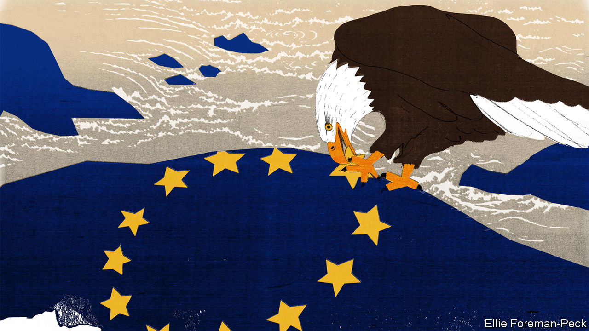

###### Charlemagne

# America’s green subsidies are causing headaches in Europe 

##### A transatlantic trade rift is brewing 

 

> Dec 1st 2022 

For years, Europe has nagged the world to follow its lead in cutting carbon emissions. In August America’s federal government at last heeded its advice; President Joe Biden signed a jumbo package of green subsidies. Far from pleasing Europe, the “” (IRA), which will dole out $369bn in corporate bungs as early as January, has caused a transatlantic spat. Talk of a trade war pitting Europe against America is brewing even as both are allies in a real war in Ukraine. By mimicking policies that many Europeans favour, America has stoked strife among its friends. 

Europe wants America to go green, but not like this. The primary gripe of the EU, which deals with matters of trade on behalf of its 27 member states, is that vast swathes of the IRA are earmarked for companies making stuff in America (or its immediate neighbours, Canada and Mexico). Electric cars assembled in North America, for example, will qualify for a tax break worth up to $7,500; those even part-made in Europe will get nothing. 

This breaches free-trading principles that are supposed to bind all members of the World Trade Organisation (WTO). Americans understand Europe’s frustration but are unapologetic. The protectionist bits are popular with union-backed Democratic lawmakers. Without them, Mr Biden’s team would not have been able to wrestle the bill through Congress, insiders say. Better an imperfect deal than none at all. And it takes chutzpah for Europe to object to a blend of protectionism, subsidies and statist visions of what industries ought to look like. Such things are not exactly rare on the old continent.

Europe has never been thrilled when WTO norms are flouted: to its credit, it does tend to follow them. For a while, it was prepared to look the other way, deeming a little rule-bending an acceptable price for getting America to cut carbon more ferociously. But its patience is now exhausted. In recent weeks several European industrial giants have unveiled plans to invest in America, rather than at home. Who can blame them? Energy has become , especially since Russian tanks rolled into Ukraine in February. One reason is that Europe has agreed with America to impose tough sanctions on Vladimir Putin’s regime, which has prompted Russia to cut off almost all gas deliveries. Europe suffers far more from this than the land of the free and the home of the frackers. To European politicians, it rankles that European factories are threatened not only by Russian revanchism but also by Uncle Sam’s subsidies. America and Europe are close allies geopolitically. Economically they increasingly look like foes.

Europe is still hoping America will water down the IRA’s protectionist elements. France’s president, Emmanuel Macron, has been making the case this week while on a state visit to America; officials are meeting behind the scenes to see if the fine print can be tweaked. But anything beyond cosmetic change seems unlikely. That will leave Europe having to respond. None of its options looks good, and each would divide the EU in a different way.

A first possible tack would be to take America to the WTO, in the hope of a ruling that its new subsidies are illegal. Such wranglings are long, dull and unrewarding: the transatlantic battle over aircraft subsidies to  lasted 17 years. By the time it ended in 2021, it was impossible to say who had won (apart from the lawyers). Nowadays it is unclear that the WTO even has the capacity to process such a case. (Donald Trump, and later Mr Biden, paralysed its dispute-resolution mechanism by blocking all new appointments of judges to it.) And if Europe were somehow to prevail at the wto, and win permission to retaliate with its own tariffs, it might not want to do so. A trade war would expose a rift between Europeans who are sceptical of globalisation—France, say, which has been pushing for “Buy European” schemes—and others like the Netherlands and Ireland who believe their prosperity depends on open trade. Both America and Europe know that China, a common economic rival, is happy to watch them squabble. 

America’s trade envoy, Katherine Tai, has suggested a second possibility for Europe: it should simply respond to the IRA with a jumbo subsidies programme of its own. That would indeed level the playing field—if Europe could afford it. Some countries can. Germany, say, has lots of industry and little debt. But if it splurges on aid to domestic firms, that would deal a harsh blow to the EU’s single market. A €200bn ($206bn) German plan to help households and businesses deal with higher energy prices has irked other Europeans. How can a Slovak firm compete with a German one, given the Slovak government’s tiny budget? Here the divide is between big EU countries with deep-pocketed governments and big global firms, and smaller countries that have neither. 

A third option would be to imitate America’s subsidy-fest, but have it funded by the EU. Some would like a reprise of the NGEU, a €750bn post-pandemic fund raised by joint borrowing that will be repaid mainly by rich countries but will be spent across the bloc. Mere talk of such a scheme has reopened the oldest European rift of all, pitting spendthrift southerners against skinflint northerners who don’t want to subsidise them. It looks like a non-starter.

Trade offs

European grumbling about American protectionism would carry more weight if the EU hadn’t itself already devised policies quite similar to Mr Biden’s. Mr Macron proclaims the need for “strategic autonomy” so loudly and so often that America has clearly overheard. No European scheme is as brazenly trade-hampering as the IRA. But the EU’s planned tariffs on imports from countries with no intention of cutting carbon emissions are protectionism-adjacent, as are new rules designed to keep some foreign firms from investing in the EU. And while it is true that subsidies paid out in Europe are also available to foreign firms, local ones know better how to lobby to get more than their fair share. Europe is getting burnt by American policies, but it helped start the fire. ■


