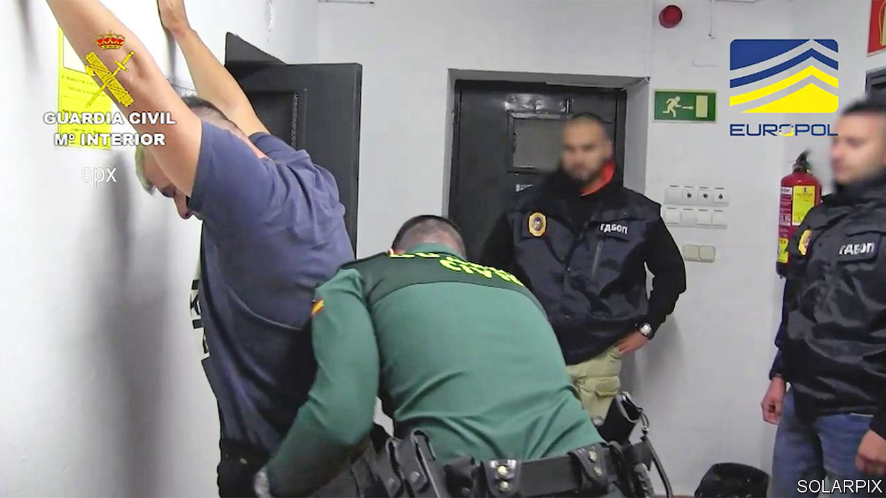

###### So goes the blow

# Europol pulls off a massive cocaine bust 

##### It may be the biggest in history 

 

> Dec 1st 2022 

A MAN SITS bare-chested with his hands fastened behind his back as a masked police officer looks on. A woman takes a wad of cash from a figure at a computer, unaware that she is being filmed by a hidden camera. Cut to glimpses of a luxury hotel, then a clutch of Ferraris—scenes that could be from a narco-thriller.

They feature instead in a video that was released by Europol, the EU’s law-enforcement agency, on November 28th as it revealed what is arguably the world’s biggest-ever drugs bust. More than 30 tonnes of cocaine were seized this month in a series of raids involving police from the Netherlands, Belgium, France, Spain, America and the United Arab Emirates (UAE). The combined haul was more than twice the amount taken in 1984 from Tranquilandia, the jungle laboratory of Pablo Escobar, a Colombian cartel boss.

The operation, code-named Desert Light, highlighted Europe’s booming cocaine trade: Europol estimates 60% of exports from South America come to, or pass through, Europe. It also showed, though not for the first time, that digital technology, which has been crucial to the globalisation of organised crime, is a double-edged weapon. Operation Desert Light drew on intelligence gathered from a telephone platform that was hacked by police who then used it to listen to communications between drug-traffickers. 

The criminal organisation targeted in the operation is thought to have smuggled around a third of all the cocaine reaching Europe. Though dubbed a “super cartel” by Europol, it was more akin to a network in which each stage in the transport of the drugs was entrusted to a different, specialist group. 

The outstanding novelty of Operation Desert Light was the UAE’s involvement. Dubai has become a favourite refuge for mobsters. Following an agreement in September, a UAE liaison officer is now based at Europol’s headquarters in The Hague. Of the 49 people arrested this month, six—all “high-value targets”—were detained in Dubai. “That is the big message of this operation,” said a Europol official. “Dubai is no longer a safe haven for criminals.”

The latest busts will certainly disrupt the cocaine trade. But the “blow“ will continue to flow, though perhaps along different routes. Recent years have seen a shift from ports in Spain and Italy towards those of Belgium and the Netherlands. According to the Dutch prosecution service, the drugs impounded this month were unloaded in Antwerp and Rotterdam. But, says Ruggero Scaturro, an analyst with the Global Initiative against Transnational Organised Crime, there is now growing evidence of narcotics traffickers switching to ports in south-eastern Europe—notably Piraeus, the ancient port of Athens. ■

