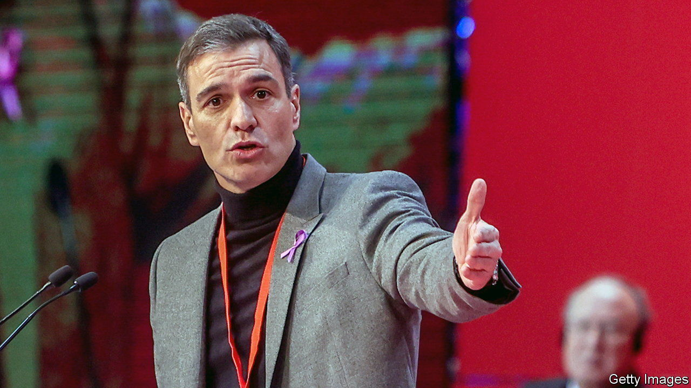
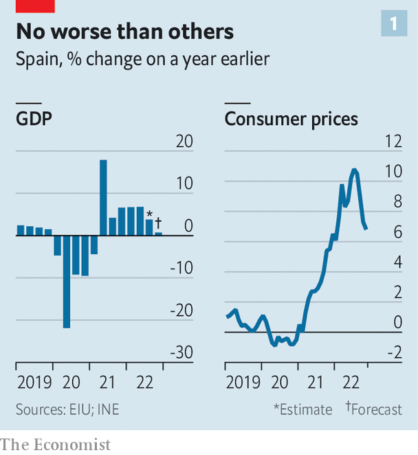
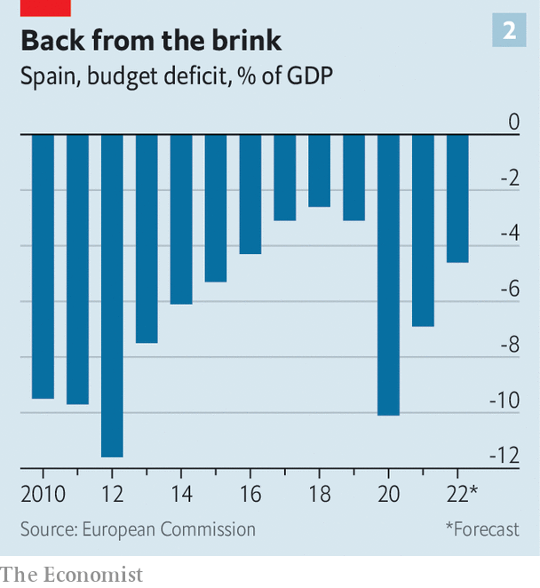

###### Unreasonably blue

# The Spanish are too grumpy about their politics 

##### Things are actually going quite well 

 

> Dec 1st 2022 

MOST PEOPLE see their own countries in a better light than foreigners do. Not so Spaniards: in a study in 2021 for the Elcano Real Institute, a think-tank in Madrid, Spanish respondents were among those of just five countries (out of a total of 24) to have a lower opinion of their country than those outside it do. 

Fine weather, liveable cities and strong bonds among friends and family make for a happy day-to-day life. On one score, though, Spain is one of the worst performers in Europe: trust in political parties is just 8%, and in governments 22%, against EU averages of 18% and 37% respectively. As Spaniards look back over 44 years of democracy, they wonder what went wrong, even as average incomes doubled, social freedoms blossomed and the country joined the European mainstream.

 


An answer lies in politics. From 1982 until recently Spain had single-party governments, of the centre-left Socialists or centre-right People’s Party (PP). But the financial crisis and the  from it have splintered the political line-up, and also given a boost to regional nationalists, notably Catalonia’s independence movement. The government that emerged out of two elections in 2019 is led by a Socialist party that won just 120 of 350 seats in parliament. Having promised never to do so, Pedro Sánchez, the prime minister, brought the populist and far-left Podemos into coalition. Lacking a majority still, he was forced to rely on both Catalan and Basque separatist parties for his investiture as prime minister.

Mr Sánchez has managed this situation fairly deftly. His government looks likely to survive for a full term, despite many predictions that such an unwieldy contraption would not. On November 24th he passed his budget on time—an achievement in Spain—through the lower house of parliament, ensuring its approval. But the compromises made recently with his allies have infuriated many Spaniards.

 


The most controversial decision was to announce a reform of the law of sedition. It was under this statute that organisers of Catalonia’s  in 2017 were tried. Nine of those leaders were found guilty; others (including Carles Puigdemont, at the time Catalonia’s regional president) went into exile. Mr Sánchez pardoned those nine in 2021. His government had long hinted that it would also reform the sedition law, in place since 1822, saying that it was out of step with European norms. But the proposal to do so led to an explosion of fury, with the right calling him a traitor for letting the leaders of 2017’s “coup” off lightly in order to secure the support of the Catalan republican left for his budget.

Another high-voltage row has broken out over the reform of the law on sexual consent, known as the “only yes is yes” law. It was the brainchild of Irene Montero, the equality minister, who hails from Podemos. Passed in August, it was advertised as requiring clearly expressed consent to sex by both parties. (After a gang rape caught on video in Pamplona in 2016, the perpetrators were initially given light sentences because the victim did not visibly resist her attackers.) But since the law came into force, those found guilty of sex crimes have in fact seen sentences reduced due to the reorganisation of the categories of offence. Before it was passed, right-wing opponents said that Ms Montero’s bill would lead to kangaroo courts and easy convictions. Now they say she is responsible for letting rapists walk free. The attacks were particularly vicious from Vox, the party to the PP’s right. 

The left is happy to return fire. The PP leads in most polls, but if it won elections (due at the end of next year) it would need Vox’s support to govern. Spain’s left is busy trying to scare voters over the prospect of a government with Vox:  (“fascist”) is an everyday insult in a country where many people remember Francisco Franco, and a few still miss him. A new Democratic Memory Law became another flashpoint recently. It led to the exhumation of Gonzalo Queipo de Llano, a bloodthirsty Francoist general, from a Seville church. 

Commentators have long spoken of “the two Spains”, destined to be forever at odds. This hostility is hardly visible on Spain’s streets, warm in temperature and in spirit. But it poisons Spanish politics, ever more so where parties at the extremes so often set the tone. ■

