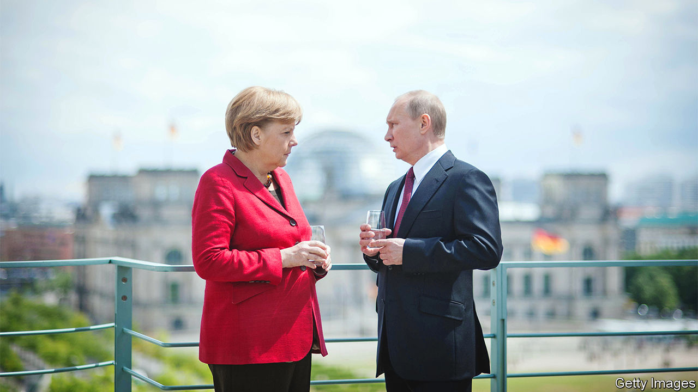

###### Faded glory

# Views of Angela Merkel’s 16 years in power have become harsher 

##### The war in Ukraine makes plainer the former German chancellor’s errors 

 

> Dec 1st 2022 

Asked whether Barack Obama is content with his legacy, Angela Merkel, the former German chancellor, replied in a series of interviews published last week with , a German weekly, that she believes the former American president is at peace with himself, whereas she is still searching. To endure criticism is part of democracy, said Mrs Merkel, but she added that she reckoned that a retired American president is treated with more respect in public than a retired German chancellor.

A year after she stepped down as chancellor, the war in Ukraine has cast a shadow over Mrs Merkel’s reputation. She used to be widely admired for her moderation and pragmatism. “Merkel”, a new documentary by Eva Weber, a German director who lives in London, which premiered in Berlin on November 23rd, largely reflects this view. 

On the whole, it paints a portrait of her as she was seen when she left office, at which point she was still perhaps the most popular of European leaders, both at home and abroad. But Germans’ assessment of her legacy has changed dramatically since then. It is presumably because she worries about how history will judge her that she recently gave long interviews to  and to , another weekly, which put her on the cover last week. 

In the 12 months since Mrs Merkel retired, Europe has seen a war erupt. The prices for natural gas and electricity have rocketed, and Germany is questioning the foundations of its economic, military and security policies. Mrs Merkel is now seen as naive for allowing Germany to become so dependent on energy supplies controlled by an obvious thug like Vladimir Putin. She is also blamed for the relative feebleness of Germany’s armed forces, for the country’s sluggish digitisation, and for the unhealthy dependence on China of some of its biggest companies.

“Merkel” is a watchable documentary about a remarkable leader who was the first woman, eastern German and scientist to hold Germany’s top job. It captures her dry humour, her modesty and her ill-concealed contempt for Donald Trump. But its favourable portrayal feels out of date. 

In her recent interviews Mrs Merkel refuses to admit any fault with her Russia policies, even though other German leaders, such as Frank-Walter Steinmeier, the president, have been honest enough to do just that. Mrs Merkel would rather make excuses. “I no longer had the power to persuade others because everyone knew ‘she’ll be gone by autumn’,” she told , explaining how she and Emmanuel Macron, the French president, had tried in vain to set up another round of talks after a meeting in the summer of 2021 between Mr Putin and President Joe Biden. 

Worst of all, Mrs Merkel ignores the fact that she could have stopped Nord Stream 2, a now defunct pipeline intended to bring gas from Russia to Germany. The aim of that pipeline, Putin-watchers warned, was to let Russia keep exporting gas to Europe even if it cut off supplies to Ukraine, which Nord Stream 2 bypassed. Had Mrs Merkel been firmer, Mr Putin might have felt less confident about bullying Ukraine. ■

