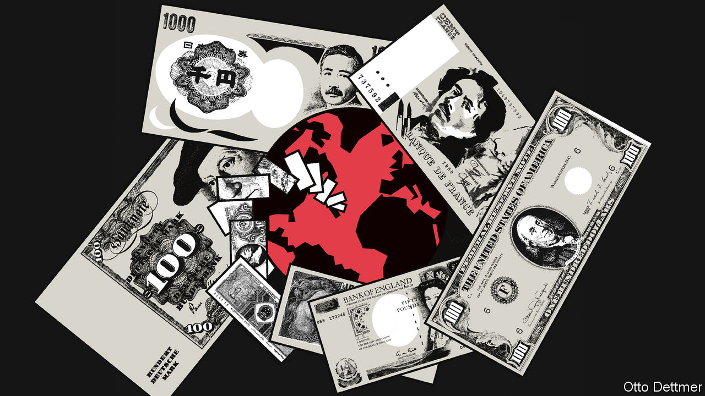

###### Free exchange

# A playbook from the 1980s for dealing with inflation 

##### Do today’s politicians have the stomach? 

 

> Dec 1st 2022 

Across the rich world consumer prices are rising by 10% year on year, the highest rate since 1983. That year holds a special place in the history books. It was the final year, after many, in which annual inflation was in double figures. Thereafter it moved downwards, paving the way for the low inflation of the 1990s.

Today’s central bankers hope to repeat the trick and thus enter monetary policy’s hall of fame alongside the giants of the 1980s. Paul Volcker, who led the Federal Reserve from 1979-87, is the biggest giant of all. But Gerald Bouey in Canada, Carlo Azeglio Ciampi in Italy and Karl Otto Pöhl in Germany—who memorably compared inflation to toothpaste (“once it’s out, you can hardly get it back in again”)—also presided over disinflation in that decade. 

Central bankers hope their job will not be too hard. The Fed’s projections suggest that by 2024 inflation will be close to target, at the price of just a small rise in unemployment. The current period of high inflation is relatively short, so the hope is that expectations of price pressure are not entrenched. Others say that price rises are in large part driven by supply-side disruptions, which should soon fade. Yet over time, the inflationary surge appears to be broadening almost everywhere. In many places expectations are starting to look stubbornly high. 

So the experience of the 1980s may become instructive. And once you dig into the history, the decade holds three tough lessons for today’s policymakers. First, inflation can take a long time to come down. Second, defeating inflation requires the participation not just of central bankers, but other policymakers too. And third, it will come with huge trade-offs. The question is whether today’s policymakers can navigate these challenges. 

Take the path of disinflation first. In the 1980s it was a slog. Italy saw success faster than most. Under Ciampi the central bank moved from the treasury’s plaything to a quasi-independent institution: inflation fell from 22% in 1980 to 4% by 1986. But that still meant five long years where prices rose by more than 10%. Even if the rich world today reduces inflation as fast as Italy did, its average inflation rate would not come down to 2% before late 2025.

In any case most countries had more trouble than Italy. In 1980-81 rich-world inflation fell, but progress came to a halt in 1982-83. Then in 1987-88 there was another inflationary spike, fuelled by energy costs. In some countries inflation jumped around. In early 1984, with inflation at 3.5%, New Zealand’s wonks thought they had slain the monster. By mid-1985, however, it exceeded 16%. We estimate that in only 53% of months in the 1980s did inflation in the average rich country decline relative to the previous month. Disinflation was happening, but often it did not feel that way.

The second lesson of the 1980s is that central bankers can only do so much. “Inflation was not conquered in the 1980s by monetary policy alone,” argues John Cochrane of Stanford University in a new paper. Some say that the liberalising reforms of the 1980s helped in the fight, increasing competition and thereby lowering prices. imf research has found that labour- and product-market reforms can, under certain conditions, reduce prices. These reforms, though, probably took some time to kick in. 

Economists can make a stronger case for the role of fiscal policy in the anti-inflation fight. In the 1980s policymakers across the world recognised, as they had failed to do in the 1970s, that loose fiscal policy could add fuel to the inflationary fire. They held back on spending even as households’ real incomes declined. Mr Cochrane points out that America’s primary budget deficits (ie, excluding interest payments) were “unremarkable, especially given the severe recessions of 1980 and 1981-82”. 

Governments elsewhere were harder-nosed. Japan reduced its primary deficit from 3.2% of gdp in 1980 to a surplus by 1985. Denmark experienced a tough period of austerity. Even France kept a firm lid on borrowing. A growing number of economists today are urging policymakers to learn these lessons. In a new piece Tobias Adrian and Vitor Gaspar of the imf argue that “[f]iscal responsibility...demonstrates that policymakers are aligned against inflation.” They reckon a given fiscal tightening can reduce core inflation by almost as much as a dose of monetary austerity. 

The third lesson of the 1980s is that disinflation is painful. The world economy did not benefit from a “soft landing”, where inflation falls without provoking recession. Average unemployment across the rich world doubled in the five years after 1979. Some parts of the economy cratered. Home construction, for instance, fell by a fifth in 1980-82. 

Unsurprisingly, therefore, there was anger. A carpenter sent Volcker a plank of wood in the post—a symbol that lumber was unneeded since no one was buying houses. In Canada car-workers shut down highways. Policymakers nonetheless stayed the course, showing the public that they were deadly serious about getting inflation under control.

It was acceptable in the 80s

Do policymakers today have the stomach for the fight? Coming so soon after the fiscally austere 2010s, many are reluctant to tighten the tax-and-spending screws once again. Indeed many politicians have gone the other way, and now seem uncomfortable with the notion that anyone should lose out from anything, ever. They are offering hundreds of billions’ dollars-worth of deficit-financed fiscal support that will fuel inflation, whether by subsidising energy bills (in Europe), offering “cost-of-living payments” (in Australia and New Zealand) or forgiving student debt (in America). 

Policymakers are thus ignoring the fundamental lesson of the 1980s. Fighting inflation is hard. It requires all hands on deck, and immense courage over a long period of time. It is also, unfortunately, almost inevitable that some groups lose out, if only in the short term. As politicians run scared, the 2020s risk earning a special place in the history books, too—for failing to tame inflation. ■


