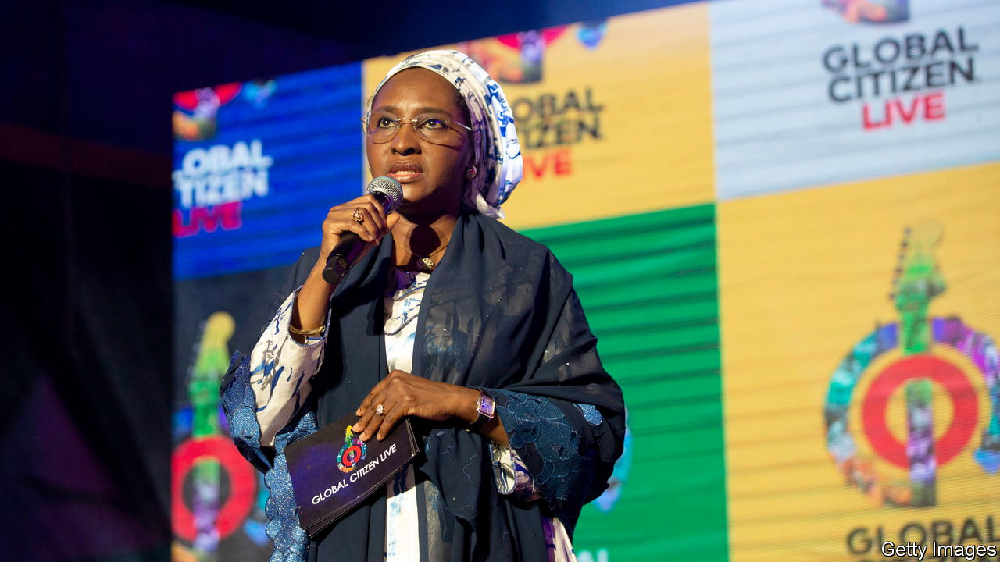
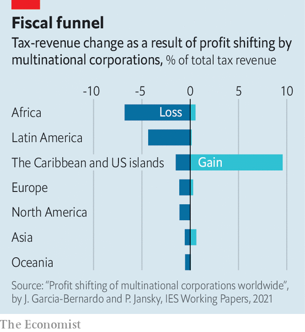

###### Fiscal feud

# Developing countries take tax talks to the UN 

##### They want more of a say 

 

> Dec 1st 2022 

Who makes the rules about international tax? For 60 years the answer has mostly been the Organisation for Economic Co-operation and Development (OECD), a club of rich countries. The rest of the world thinks that is unfair. Developing countries have long argued for a leading role for the UN, where they hope to have more of a say.

That idea came a step closer on November 23rd, when UN members resolved to begin talks on international tax co-operation. The decision makes no difference to a landmark OECD-led tax deal signed by 137 countries and jurisdictions last year. But it does expose the limitations of the so-called “Inclusive Framework” through which that plan is being implemented. Although non-oecd negotiators are becoming more assertive, winning some concessions, they make up less than a quarter of attendees at working-party meetings. Only half of African countries are participating in the talks. African tax officials complain of being presented with documents in the evening for comment the next morning. 

 


Ironically, the resulting deal claims to address a longstanding demand of developing countries: that firms pay more tax in the places where they do business, regardless of where they are resident. For decades governments have complained that multinationals make sales in their countries but pay little tax in return (see chart). 

But developing countries argue that old biases are baked in. The deal reallocates taxing rights on a fraction of profits from about a hundred giant firms. And it sets a minimum corporate tax rate at 15%, far below the effective rate of 25-30% that is common in Africa, Asia and Latin America. 

Signatories are also expected to renounce digital-service taxes of their own. The finance minister of Nigeria, which collects such a levy, has said that the overall package could leave her country worse off. Africa’s largest economy is one of four which joined talks but refused to sign the deal. Others might drag their feet when asked to put the plan into action, says Martin Hearson of the International Centre for Tax and Development, a research group.

Initial estimates from the OECD, before the plan was finalised, suggested that it would boost corporate-tax revenues by about 3-4% in poor countries—a similar proportion as in rich countries, but only around 0.1% of their GDP. Some governments would have liked to have gained more or given up less, acknowledges Grace Perez-Navarro, the oecd’s tax director. But she argues “everybody needs to come to the table to compromise” and developing countries “have an equal seat”.

Many of them beg to differ. “The flaws in the deal indicate that after ten years of trying at the OECD, it is time to give space to the UN,” says Irene Ovonji-Odida, a Ugandan lawyer who has sat on panels investigating illicit financial flows. The fraught history of climate talks, which are held under UN auspices, suggests it can give developing countries a voice but cannot eradicate power imbalances.

The push for tax talks at the un is going nowhere fast. As the resolution passed, delegates speaking for America and the EU warned that it would “undermine” the progress made by the OECD. But for developing countries it was a historic moment: a staging post in the struggle to determine who gets taxed, by whom. ■


