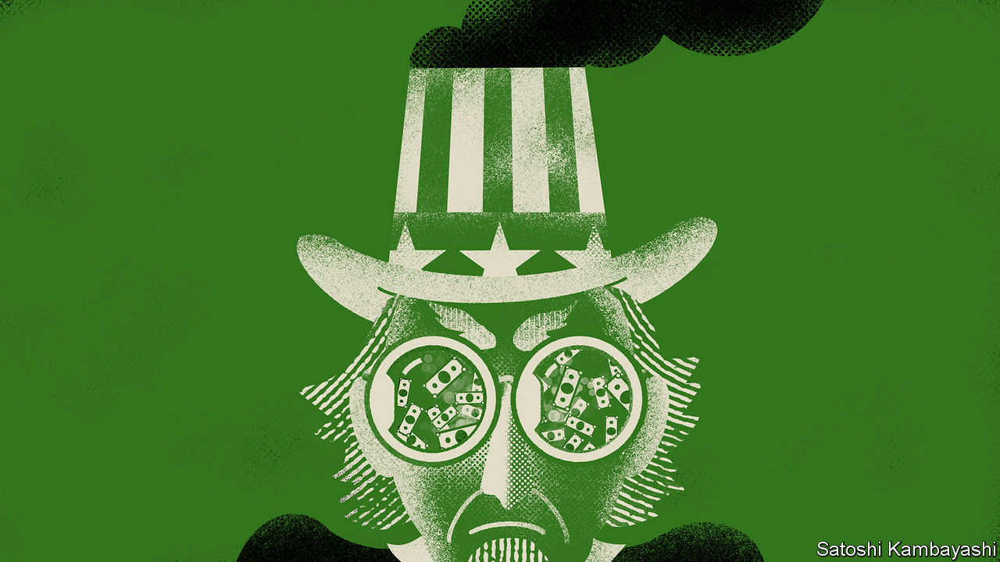

###### Uncle Sham

# Dubious green funds are rampant in America 

##### New research suggests Wall Street is banking on bogus claims 

 

> Dec 1st 2022 

It is not easy being green. In November Amundi, Europe’s largest investment manager, downgraded most of its €45bn ($47bn) of funds ranked Article 9, the highest grade in the EU’s sustainability disclosures, to Article 8, or “light green”. New regulations are forcing many others to recast their wares in less virtuous colours. Nearly one-tenth of all Article 9 funds have left the category since the European Commission tightened its criteria, in July. 

That has exposed European fund managers to accusations of greenwashing, and for some the label is deserved. But new research published this week in the , an academic journal, suggests American firms are doing worse. When it comes to sustainable investing, Wall Street stalwarts appear to run a fully fledged laundromat of exaggerated sales pitches and bogus claims.

To gauge this the authors examined funds that have signed up to the UN-sponsored Principles for Responsible Investment (PRI), a scheme that investment managers can sign up to certify they take account of environmental, social and governance (ESG) principles when making investment decisions. On the face of it, that is a promisingly large sample: 2,000 investors, overseeing $135trn of assets, now say they will obey the PRI. The problem is that such pledges can mean little. Looking at the period from 2003 to 2017, researchers found no sign that the portfolios of PRI signatories in America had higher ESG scores, across a range of metrics, than non-signatories. Their peers across the pond scored much higher. “There could be a couple of bad apples in Europe. But it’s not the entire cart that’s rotten,” points out Alex Edmans, a finance professor at London Business School and the editor of the study. 

American fund managers might argue, in their defence, that they are trying to help dirty companies get greener rather than simply dumping their shares as European funds might do, and are being penalised for this. But the researchers find little evidence of that. Instead they report that American PRI signatories were less likely to engage, as shareholders, with the companies they owned than their European counterparts. Three years after the initial investment, ESG scores at those investee firms were found to be no better. Higher grades may not be the answer anyway. ESG ratings are themselves often flaky and may be a poor proxy for emissions.

The transatlantic divide, the paper suggests, may stem from a divergence in regulation. Europe’s rules are tedious and sometimes misguided. But at least they provide detailed guidance on what counts as sustainable and how green mandates should fit with fund managers’ fiduciary duties. By contrast American firms seem to be defining their own rules; some simply sign up to the PRI in the sole hope of attracting green-conscious investors, with little to show for their claims. 

Sometimes greenery is even used to keep assets under management growing even as managers post sub-par returns. The authors find that poorly performing American funds are more likely to join the PRI than higher-flying peers. ■


