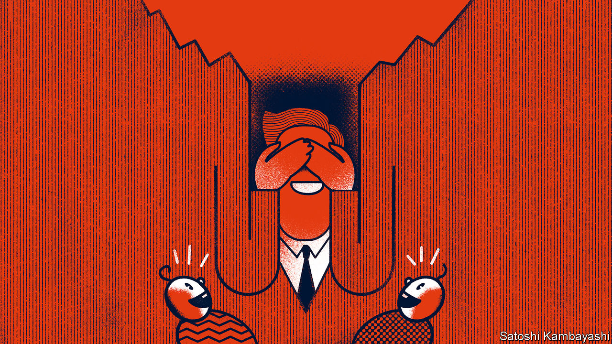

###### Buttonwood

# Has private equity avoided the asset-price crash? 

##### No, but everyone is enjoying the charade 

 

> Dec 1st 2022 

Babies lacking object permanence—the understanding that things they cannot see continue to exist—love the game of peekaboo. An adult hides their face from sight, then suddenly comes back into view, prompting squeals of delight. Grown-ups no longer enjoy being deceived—unless they invest in private equity and venture capital, where hiding bad news is part of the fun. 

A huge gap between the valuations of publicly listed companies and their unlisted peers’ has opened in 2022. Lincoln International, a bank, reckons the enterprise value of firms held by private-equity funds globally rose 1.9% in the third quarter, leaving them up 3.2% for the year to date. The S&amp;P 500, by contrast, fell 22.3% in the same period. 

That is a relief to many institutional investors, such as pension funds, who cannot afford big losses. In the past decade they have splurged trillions of dollars on private assets. Soon these could also be found in greater volumes in 401k plans, America’s employer-sponsored retirement schemes. When interest rates were low, fans of buy-outs and venture capital were drawn to their high reported returns. Now that market chaos reigns, their lower volatility is the bigger selling point. 

The gulf in valuations cannot be justified on economic grounds. All firms face the same toxic cocktail of slowing growth, rising interest rates and stubborn inflation. If anything, private ones, often more leveraged, should be more exposed when credit tightens. Instead the gap is mostly an illusion rooted in the peculiarities of private investing. One is well known. While public markets are constantly repriced in full view of the world’s investors, shares in private firms are traded far more rarely and opaquely. Some founders would rather sink with their ship than agree to a cut in valuation. 

Less appreciated is the array of tricks private funds use to smooth out returns. Many keep their valuation-work in house: a 2015 survey by Grant Thornton, a consultancy, found that only around a quarter of them sought an independent opinion on the growth and discount rates they use in their models. That gives managers the discretion to make assumptions that flatter the prospects of the firms they own. Many have also taken to borrowing money to do deals instead of calling for investors’ capital straight away. This has the effect of artificially boosting a fund’s internal rate of return, a key performance benchmark. 

Cliff Asness of AQR Capital Management, an investment firm, once dubbed such obfuscation tactics “volatility laundering”. Today they are paying off. Smoothing returns can limit the upside of private equity during the most frenetic stages of a roaring market, but it keeps returns afloat when the economy faces a storm. Private funds are still reporting gains that were made during the steroid-fed bull run of 2020 and 2021. 

Massaging techniques can be used to nefarious ends. The collapse of Abraaj Group, a Dubai-based private-equity firm, was partly caused by inflated valuations intended to mask poor performance. But more often return-smoothing provides the funds’ knowing clients exactly what they want. Research by academics at the University of Florida published in October shows private-property fund managers fiddle returns more when they manage a greater share of their investors’ total assets—that is, when their manipulations matter more to the end clients’ overall performance. 

How long can the illusion last? During the bursting of the dotcom bubble in 2000, it took American venture-capital managers nearly half a year to report impairments after public markets peaked. American buy-out funds held off even longer after listed equities crashed in 2007. In fact public markets began recovering in 2009—quickly enough that private investors never had to mark down the full extent of the slump. 

It is unlikely private firms will be able to levitate long enough this time. Over a year has passed since the peak of the Nasdaq Composite, a tech-heavy index. The cash holdings of some private firms are eroding, leaving little for return-smoothing financial engineers to play with. In August Masayoshi Son, the boss of Softbank Group, a Japanese investment giant, predicted private valuations would rejoin public-market ones within 12 to 18 months. Without a 2009-style recovery in public equities in sight, an unavoidable downgrade looms. No doubt many investors would prefer to continue playing along with the peekaboo charade. But soon private-fund managers will have nowhere to hide. ■


