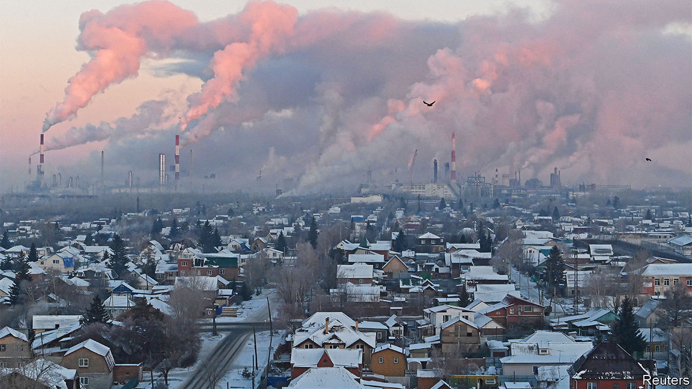
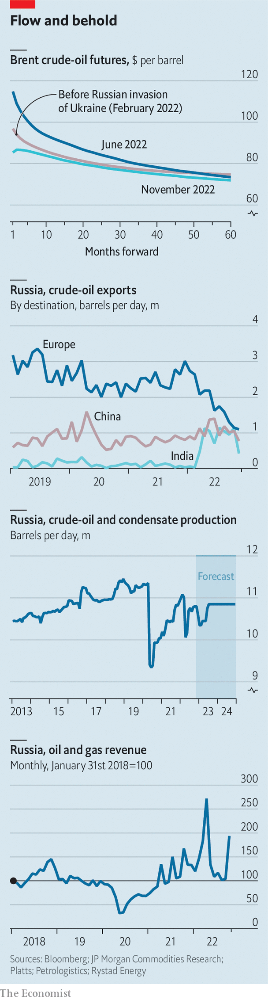

###### Crude weapon

# How the West’s price cap on Russian oil could roil energy markets 

##### Traders expect a damp squib; they could get dynamite instead 

 

> Nov 30th 2022 

Ever since Russia invaded Ukraine in February, America’s energy policy has pursued two grand, seemingly contradictory aims. The first is to keep global oil supply high enough that prices remain tolerable and public support for sanctions stays strong. The second is to asphyxiate Vladimir Putin’s  by stemming the  Russia earns by flogging oil barrels. Together they form a circle that is hard to square because, with supply closely tracking demand amid a dearth of new production, taking any oil off the market mechanically triggers higher prices. The West has nevertheless tried to defy the law of physics by crafting a growing array of measures to meddle in oil markets.

The ones that have been deployed until now have often been piecemeal and involve uncomfortable compromises. Puncturing its own , on November 26th America granted permission for Chevron, a big American oil firm, to crank up its production there. America has also released huge volumes from its strategic crude-oil stocks; the reserve is now at its lowest level since 1984. The White House’s least productive effort has aimed to cajole Gulf states into pumping more. Within months of President Joe Biden fist-bumping Muhammad Bin Salman, the de facto Saudi ruler, in Riyadh in July, the petrostate and its allies in the Organisation of the Petroleum Exporting Countries (OPEC) declared they would cut output instead. On December 4th the cartel meets again. It looks unlikely to help by increasing output now. 

 


Yet the West’s most carefully constructed campaign to outsmart Mr Putin has yet to come into action. In June the EU announced that, come December 5th, it would ban imports of Russian seaborne crude oil, which accounted for 2m barrels per day (b/d), or about 40% of Russia’s total crude exports, a year ago. Then it said it would also bar European providers of maritime services, tankers and insurance from helping non-EU buyers get hold of the Russian barrels it shuns—a powerful tool, given those firms dominate the global shipping market. It soon dawned on America that, together, those two measures had the potential to squeeze global oil supply. And so it insisted on introducing a weakening clause: provided they agree to pay a maximum price, set by the G7, for Russia’s oil, non-Western buyers could continue to buy European insurance.

As we went to press the level of this “price cap” was still being debated among Europeans. Some, led by Poland and the Baltic states, want the cap to be low so as to hurt Russia’s finances. Others, worried about their shipping industries or retaliation from Russia, want to keep it close to market levels. Rumours filtering out from the talks suggest it may end up near $60 a barrel—a discount of nearly 30% to the current price of Brent, the global benchmark, of $85 a barrel—which is about what Russia sells its oil for these days anyway. Whatever the outcome one thing is certain. Never before has such a fiddly set of measures hit the global oil market at once. Many of these have been signalled for so long that they may cause few problems. But there are reasons to think the boat could be rocked, at least for a while. 

In an optimistic scenario the package of sanctions could manage to reconcile the West’s two contradictory aims. The embargo would ensure Europe no longer fuels Mr Putin’s war: last month the bloc still bought 2.4m b/d of crude and refined oil from Russia. Meanwhile the price cap, says an American Treasury official, would act as a “release valve”, keeping the global market in balance by letting developing countries buy Russian oil at a discount. Russia would receive less money whether or not those countries sign up to the plan, because the mere existence of a cap, or so America reckons, would boost their bargaining power.

In the absence of a low enough price cap, as is likely to be the case, the cost to Russia would be real but modest. It would add yet more inconvenience to that created by the West’s broader arsenal of sanctions, which may impair Russia’s economy in the long run but have hardly proved terminal so far. The discounts borne by Russian grades over regional benchmarks have widened in recent weeks but remain well below those seen in the aftermath of the invasion. At least the embargo would not roil crude markets—or so commodities markets suggest. Brent futures, which in June indicated a year-ahead oil price approaching $100 a barrel, now place it closer to $85 (see chart panel). Most traders expect an acceleration of the shift in fuel flows seen so far this year, with India and China taking over from Europe as Russia’s biggest customers. 

This happy story assumes no logistical hiccups will prevent decades-old trading patterns from undergoing a smooth but rapid transition. A less rosy scenario, however, could see sanctions throw spanners in the spigots by introducing unwanted friction. Three bottlenecks stand out: a crunch in tankers, an insurance gap and a global shortage in risk appetite. 

Start with the tankers. Cyprus, Greece and Malta loom so large in shipping that Europe’s ban on the provision of maritime services to countries that do not sign up to the cap—and many of them, loth to endorse American interference in commodity markets, have signalled they won’t—could create a big shortage of ships capable of carrying Russian crude. Claudio Galimberti of Rystad Energy, a data firm, anticipates a shortfall of some 70 vessels, with an aggregate carrying capacity of 750,000 b/d, lasting two to three months.

Eventually this problem should work itself out. Industry insiders point to an ever growing “dark fleet” that is absorbing vessels from established sanction-busters in Iran and Venezuela. Russian firms are bringing mothballed vessels back into service; EU shipowners are also transferring assets to operators outside the G7. A top energy trader reckons that, by February, there will be enough ships to transport Russian crude, though vessels to redirect refined products such as diesel from short-haul routes in Europe to distant new customers may stay scarce for some time.

The crunch in insurance coverage is a bigger potential snag. It is not that Middle-Eastern or Asian countries keen on Russian barrels do not have local firms with the financial muscle to insure tankers and cargo. What they may soon lack is cover for much bigger risks like oil spills, liabilities for which can easily reach half a billion dollars. Few insurers new to the market will look forward to becoming liable for an ageing Venezuelan vessel going through Danish straits a mere 15m deep, says a veteran oil trader, without a big backstop. 

The problem is that this sort of backstop—reinsurance—demands deep pools of private capital hard to find outside the West. Perhaps the Chinese and Indian governments could be persuaded to offer sovereign reinsurance, though market insiders doubt they have the stomach. In fact some traders reckon Asian buyers could buy less Russian oil rather than more as the insurance ban comes into force.

The third bottleneck could be a lack of appetite outside the g7 for the perceived risks of circumventing a scheme designed by the West. Many do not believe American promises to remain hands-off if countries choose to go around the cap. It does not help that, in its most recent sanction campaigns, such as those targeted at Iran, America has studiously kept the perimeter and degree of enforcement of penalties vague so as to deter anyone from dealing with its foes. The practice, known in sanctions parlance as “constructive ambiguity”, is hard to roll back.

All this could cause a chunk of Russian oil exports to fall off the map, prompting prices to jump. But a much worse scenario, where Russia voluntarily slashes its oil exports and prices get out of control, is also possible. It may happen if China, having to forsake its purchases from other countries to buy yet more Russian oil, tries to drive too hard a bargain. More likely it would be a unilateral decision by Mr Putin. It could incur huge costs: Russia derives 40% of its export revenues from oil sales. But that might be worth bearing temporarily if it drives global prices up, hurting the West and giving Russia more leverage in negotiations with buyers, without inflicting intolerable damage to wells. The country’s decision to shut temporarily nearly 2m b/d of crude production during the pandemic resulted in only a 300,000 b/d loss in long-term capacity, according to Energy Intelligence, an industry publisher.

Up to now the G7’s energy policy has been hashed out in painstaking detail in Washington, DC, and Brussels. But, to paraphrase Mike Tyson, everyone has a great plan until they get punched in the face—and, facing serious setbacks on the battlefield, Mr Putin is pulling no punches right now. The price-cap’s first contact with reality could be rough. ■


