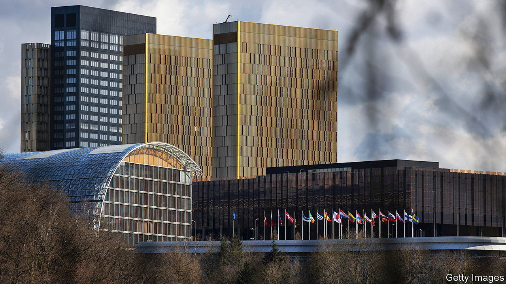
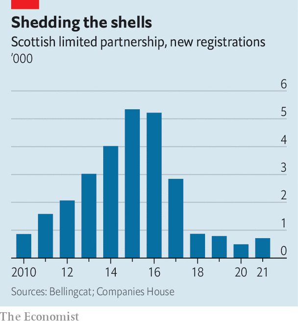

###### Laundry softener

# The EU’s top court just made it harder to uncover dirty money 

##### Sanction busters rejoice 

 

> Dec 1st 2022 

Despite the armies of bankers and bureaucrats vowing to stop international money-laundering, there is still gobs of it going on. Money-laundering cases at Eurojust, the EU’s justice agency, have doubled in the past six years. One reason is that tracking dirty money is very hard. Criminals and kleptocrats create webs of shell companies with bogus owners and officers, seeking out countries with lax rules. 

A good tool to fight this are ultimate-beneficial ownership (UBO) registries, where corporations must declare which human beings control them and receive their profits. The EU has required UBO registers since 2018, and America since 2020. The best, such as Britain’s, created in 2016, can be accessed by anyone. The EU later made that a requirement too.

But on November 22nd the European Court of Justice (ECJ) decided this went too far. In a case brought by an anonymous plaintiff in Luxembourg, it ruled that open-access UBOs violate owners’ right to privacy and struck down an EU directive that opened them to the public. European countries with open registries quickly suspended access. Civil-society groups were blindsided. Big international investigations such as the Pandora Papers depend heavily on public registers, says Pavla Holcova of Investigace, a group that mapped the network of firms controlled by Andrej Babis, a former Czech prime minister.

The court’s decision does not strike down the registries, but it forces governments to change the rules so that only parties with a “legitimate interest” can ask for information. If researchers have to justify each request, they may be unable to uncover connections. “We’re typically looking at thousands of companies at the same time,” says Ross Higgins of Bellingcat, an open-source investigative group. Tracking down Russian officials’ illicit villas in Europe would become “close to impossible”, says Maria Pevchikh of the Anti-Corruption Fund, a group set up by Alexei Navalny, a Russian opposition leader. 

 


Open access itself can deter dodgy dealings. Mr Higgins’s research on Scottish limited partnerships, a form of corporation, showed that many were used to hide dirty money, such as $1bn stolen from Moldovan banks in 2014. After a law passed in 2016 forced them to disclose their UBOs, new partnerships dried up (see chart).

Money-laundering is not the only issue. UBO registries are a crucial tool in enforcing international sanctions against Russia and others. “The implementation of sanctions is completely outsourced to the private sector,” says Adam Smith, a former American sanctions official. Firms that transact with blacklisted entities, even unknowingly, risk huge fines. With ownership now obscured they may simply avoid anyone remotely linked to sensitive areas. 

Tax evasion, too, could become harder to combat. Firms created to funnel profits to low-tax jurisdictions may continue to fly under the radar. The ruling privileges sophisticated international businesses over local ones that cannot hide their ownership, notes Andres Knobel of the Tax Justice Network, a lobby group: “If you look at who is happy, it’s mostly trusts and people working for high-net-worth individuals.”

The European Commission and EU finance ministers are studying the ECJ decision and working on new rules. Any new system will probably let banks use UBO registries, and the court says governments should consider granting access to journalists and civil-society organisations. But the decision deals a blow to global efforts to root out dirty money, says Oliver Bullough, a journalist who writes on money-laundering. “In the game of Jenga, they pulled out a really important block.” ■


