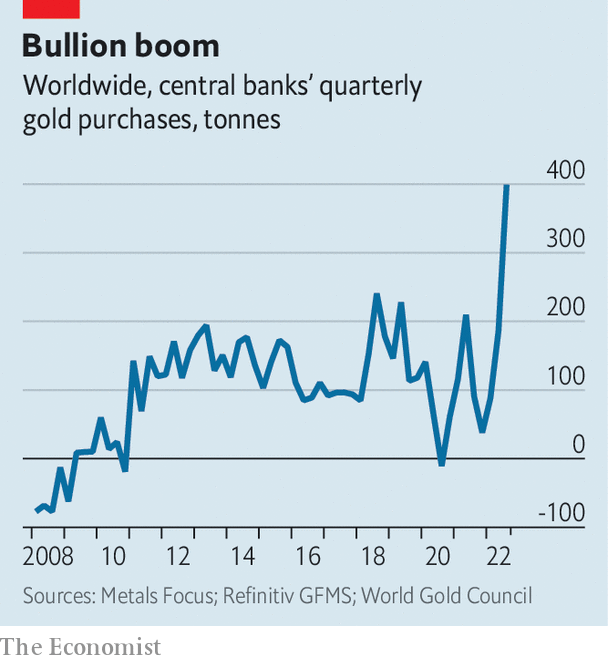

###### Vault face

# Why central banks are stockpiling gold 

##### The metal offers a hedge against inflation—and a way to circumvent sanctions 

 

> Dec 1st 2022 

In 1968 the London Bullion Market closed for two weeks. The world’s largest precious-metal market had run out of gold, drained by a five-month run on America’s stash by European central banks. The crisis marked the beginning of the end for the Bretton Woods standard that had kept the dollar pegged to gold, and currencies elsewhere to the dollar, since 1944. 

 


Now central banks are furiously buying gold again (see chart). In the third quarter alone 400 tonnes moved into their reserves. That has pushed the total from January to September to 670 tonnes, a pace unseen since the Bullion Market debacle. In May Turkey snapped up almost 20 tonnes in one go. India and Qatar are also ravenous. The metal now makes up two-thirds of Uzbekistan’s reserves, months after it planned to reduce gold to under half. Kazakhstan is also doubling down. 

In part this is because gold, snubbed in good times because it generates no yield, recovers its shine in times of volatility and high inflation. In the long run, it is seen as a store of value and, not tied to any individual economy, seems immune to local political and financial turmoil. Central bankers may also think they are getting a bargain. Even though it has resisted better than most, the price of the metal has dropped 3% this year. Gold bugs expect a rebound. 

Like in the past, however, buying gold bars is also a way to ditch some dollars. Except this time it is not Europe but emerging markets who grumble about the greenback. They need dollars to pay for imports and external debts. But their reserves are mostly made of treasuries, not actual banknotes. And as the Federal Reserve has raised interest rates, buoying yields, the value of government paper has dropped. Lesser central banks have taken this as a cue to swap them for precious metal rather than bet on the Fed taming inflation.

Shadier motives are also at play. Gold provides a way to circumvent Western sanctions on Russia, much of whose reserves have been frozen since March and whose banks have mostly been disconnected from the dollar-based international-payments system. Almost no central banks keep roubles as foreign-currency reserves. For those countries that traditionally do a fair bit of business with the Kremlin—from Turkey to Turkmenistan—gold offers an alternative, if clunky, means of exchange. This motley group of emerging markets have been among the biggest buyers of gold this time around.

This is not something the West can do much about. Russian gold is banned on the London market, but no one can get at its gold reserves, which are mostly sourced from its own mines. And Russia’s central bank no longer reports how much gold it holds, making swaps impossible to track. Moving the physical metal is a logistical headache, but it keeps transactions under the West’s digital radar, which is useful for those playing both sides—like Qatar or Turkey. The World Gold Council, a trade body, says unknown buyers account for a big chunk of this year’s bonanza. 

One consolation for the dollar is that no other currency is gaining ground. The portion of foreign reserves held in yuan globally has stalled this year. The euro, yen and pound are treading water too. Central banks may have gold fever but there is no regime change on the horizon. ■


