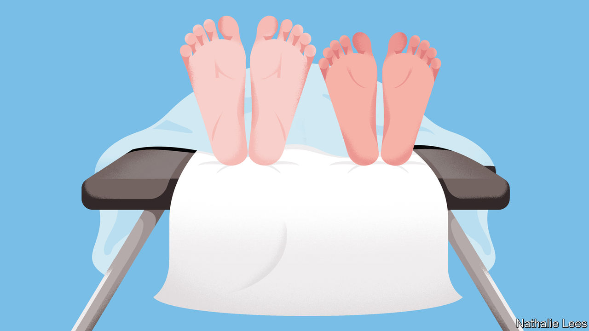

###### The wounds of silence

# Sexual problems can wreck lives. Yet remedies are often simple 

##### Doctors and schools should be franker about pleasure 

 

> Dec 1st 2022 

A GENERATION AGO being depressed or anxious—let alone having serious mental-health problems—meant suffering mostly in silence. Stigma meant few people wanted to talk. Doctors turned a blind eye. Most saw mental illness as regrettable but not something that made much difference to a patient’s physical health. These days the stigma has faded, if not entirely disappeared. Early treatment often nips things in the bud. 

A similar transformation is due for sexual problems, which lie beneath the same blanket of taboo and embarrassment as mental health once did. One in five men in America and Europe has erectile dysfunction at some point in his life; half of British women say they had a sexual problem in the past year, including pain during sex or difficulty reaching an orgasm. Plain old lack of desire is common, especially among women. 

Trivialities? A topic best left unmentioned? Sexual problems can be harbingers of other illnesses, such as diabetes. Erectile dysfunction is up there with smoking and a family history of heart disease as a predictor of heart trouble. Doctors who ask about it can make an early diagnosis, and offer preventive coronary treatment. 

Sexual problems more generally are thought to contribute to between a fifth and half of all divorces; reducing that number would spare many adults and children from misery and impoverishment.  are both a cause and a consequence of anxiety, which can make life harder to cope with. Poor productivity at work is twice as high among men with such problems as among those without them.

Tackling sexual dysfunction can be simple and cheap. One easy win would be to change the way children learn about sex. Instead of focusing only on avoiding the downsides, such as diseases or unwanted pregnancies, teachers could encourage discussions of pleasure, and of how to talk to a partner about it, as well as how to communicate and understand enthusiastic consent. Sexual problems often crop up in adolescence, made worse by general teenage awkwardness around the opposite sex (or indeed the same one). So teach them about those too, and never mind the giggles at the back. 

Critics may object that sex is everywhere in modern culture, and the last thing anyone needs is more of it. But this misses the point. The sex in film and television dramas, let alone pornography, bears scant relation to real life. Trying to learn about sex from Hollywood is like watching James Bond for tips on a career as a British civil servant. Better to point teenagers to more realistic sources, such as BISH, a British website that answers all sorts of niche questions that trouble young people as they begin stumbling their way through sexual relationships.

More ambitiously, sexual problems should be a core part of medical education. Only then will doctors begin to discuss them routinely—as they do with boils, exercise, heart disease and other health-related matters. A lot of suffering can be alleviated by simply giving people frank information about what is happening to them and why. That, plus a few sessions of therapy, some pelvic-muscle exercises, or suggestions for simple changes in lifestyle, is often all patients need. Such things are now packaged in apps, some of which have been approved by medical regulators. 

Scientists should shed their inhibitions, too. It is hard to fix problems without first understanding them. Research projects are often blocked because committee members find the subject uncomfortable. And for the puritans out there, who doubt that mere pleasure is sufficient grounds for changing things, it is worth noting that better research into sex is likely to improve public health. Studies find that when discussion of pleasure is part of HIV-prevention schemes, people use condoms more. (Putting one on can be part of foreplay, for example.) 

From tragedy to romance

Sex is one of the greatest joys in a human life. At its best, it is a source of ecstasy and a shared expression of lasting affection. That so many people nonetheless find it painful or disappointing is a tragedy. Yet for a large proportion of them, it can be turned into something far more agreeable. Being more open about sex is one of the easiest ways to enhance happiness and health. So why not try it? ■

