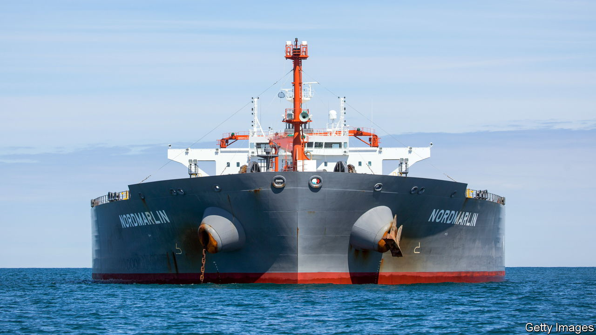
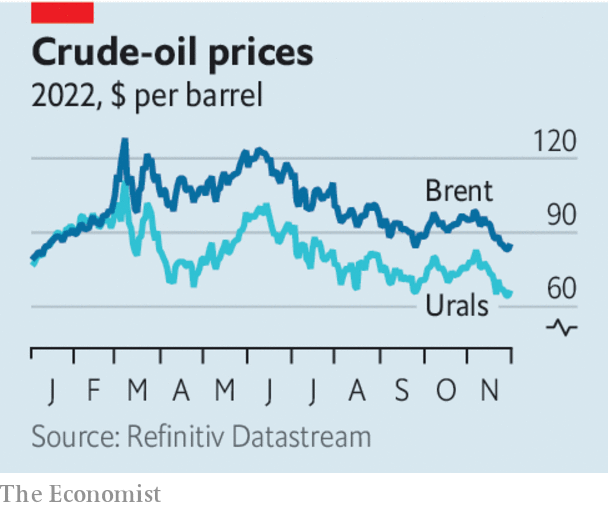

###### Will the cap fit?

# The West’s proposed price cap on Russian oil is no magic weapon 

##### The global energy system is far more flexible than you think 

 

> Nov 30th 2022 

Nine months after the invasion of Ukraine, oil money continues to fill Vladimir Putin’s war chest. Even as the West has imposed sanctions, Russia’s crude exports have held up and the Urals oil price remains close to its average in 2014-20. Russia’s current-account surplus this year is expected to be $265bn, second only to China’s. But the story is not over yet. On December 5th the European Union will at last implement a plan originally cooked up in May. It will ban seaborne imports of Russian oil. It will also prohibit European firms from insuring, shipping or trading Russian crude anywhere in the world—unless the oil is sold at a price below a cap set by the West. 

Ever since the war began in February this year, the West has grappled with a conundrum. How should it cut Russia’s fossil-fuel earnings without also reducing the global supply of oil and fuelling inflation that hurts consumers around the world? When Europe first dreamed up its ban, it threatened to deal a serious blow to Russia’s oil cashflows. European insurers and shipping firms have long had a vice-like hold on energy markets. Fully 95% of property and indemnity insurance for all oil tankers has been handled by firms from Britain and the eu. This appeared to be a lever with which the West could control the sale of Russian oil globally.

 


Yet even as the ban was announced a flaw was apparent. If Russian oil fails to make it to market, then global oil prices may spike, hurting Western consumers. Hence America’s Treasury department has since devised a cunning plan to water it down: to let European firms continue to offer their services, provided the oil involved is bought at a suppressed price set by the West.

On paper, this looks astute. Setting the price below the market rate Russia receives today would lower its earnings. And as long as the price is above its cost of production (which is thought to be in the region of $20-44 a barrel), Mr Putin would still have a reason to pump oil. Consumers would get oil at a discount and inflation would be kept in check. Non-aligned countries such as China and India would surely leap at this bargain. 

According to hard-headed oilmen, however, life rarely turns out so neatly. There are two uncertainties. One is how Mr Putin responds if European firms really do have a stranglehold and can block his ability to get some oil to market. Russia has already said it will refuse to use tankers that join the oil-cap scheme. It could cut its oil exports, relying on a smaller group of non-Western tankers and insurers, and sending global prices spiralling. 

Fear of this could explain why the West has been careful to peg the oil price at a level that is still attractive to Russia. At the time of writing, the level was expected to be established at around $60 a barrel, which is broadly the current l. Yet that would mean the embargo-and-price-cap scheme has little bite.

The other uncertainty is how much power the West will ultimately wield over global oil markets. A shortage of non-Western tankers could curb Russian supply over the next couple of months. Some kinds of insurance, for example, against big spills, are hard to find outside the West. Still, countries such as China, India and Indonesia want to avoid participating in Western sanctions and embargoes. They are seeking alternative sources of day-to-day insurance—and, because the ban was announced six months ago, have had time to prepare. 

The true balance of power in oil markets will become apparent after December 5th. A violent price spike is possible. But the lesson from this year is that, over time, the global oil system is more adaptable than you might think. Just as financial sanctions have energised attempts to evade the Western banking system, so the war will lead China, India and others to circumvent the West’s energy infrastructure. As weapons, sanctions and embargoes have their limits—and a finite shelf-life. ■


