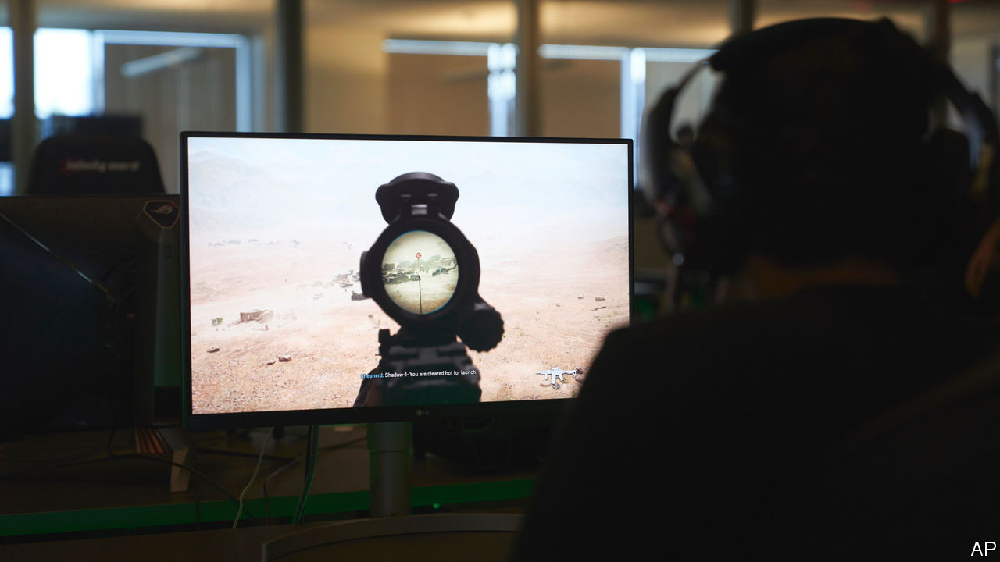

###### CoD and chips

# Trustbusters should let Microsoft buy Activision Blizzard 

##### Blocking the deal is as likely to harm consumers as it is to protect them 

 

> Dec 1st 2022 

In the PAST two decades video gaming has gone from a nerdy hobby to a blockbuster industry, with revenues over five times bigger than the cinema box office. Today it is home to one of the largest tech mergers in history. In January Microsoft agreed to pay $69bn to buy Activision Blizzard, a game studio. Yet the megadeal may not go ahead. America’s Federal Trade Commission—one of 16 regulators around the world to have taken an interest—will probably say soon that it will sue to block it.

 have two main worries. The first is the jewel in Activision Blizzard’s portfolio: “Call of Duty”, a military-themed first-person shooter game, the latest version of which sold over $1bn-worth of copies in just ten days. It is available on both Microsoft’s Xbox games consoles and Sony’s competing PlayStation. Regulators fear Microsoft could make “Call of Duty” exclusive to the Xbox, undermining competition between the ecosystems.

Microsoft says that it does not want to freeze out PlayStation. Its aim is to add titles to Game Pass, its monthly subscription service which, in effect, rents out a bundle of games rather than selling them individually. Herein lies regulators’ second concern. At the moment Game Pass is chiefly an Xbox service, but it could one day have much broader reach as games are streamed from cloud-computing services onto people’s televisions, web browsers and phones. Microsoft’s cloud-computing business, Azure, might give it a technological edge while Game Pass—expanded to include Activision Blizzard’s portfolio—provides the best content. Trustbusters worry that Microsoft could gain an insurmountable lead in a nascent market.

Neither worry is a reason to block the merger. Take “Call of Duty”. Microsoft is starting from third place in the console market—in which it sells the Xbox at a loss—and Activision Blizzard earns hundreds of millions of dollars a year from selling “Call of Duty” to more numerous PlayStation users. Recent history suggests Microsoft should hesitate to give up those revenues. In 2018 at&amp;t, a telecoms company, bought Time Warner, a media giant. It then pulled stellar exclusive content, such as the sitcom “Friends”, from rival broadcasters’ streaming platforms in an effort to promote its own service. That helped cause a collapse in profits and the unwinding of the merger. Although Microsoft would have good reason not to make “Call of Duty” exclusive, regulators could in any case insist it honours a promise to keep selling the game to PlayStation users on reasonable terms.

Television also offers a lesson about game streaming. In 2016 Hollywood was rife with fears that Netflix would become a monopoly. Some argued it wielded so much power that fed-up creative types were scared to criticise it. Its advantage did not last. Today its growth is stalling as it faces competition from Amazon and Disney. Games are harder to make and stream than sitcoms. But plenty of firms are capable of challenging Microsoft, including gaming rivals like Nintendo and technology giants like Nvidia and Apple. Microsoft would not own blockbuster games from “Fortnite” to “FIFA”, made by the studios Epic Games and Electronic Arts, respectively. By one estimate, a merged Microsoft-Activision Blizzard would account for only 14% of global gaming revenues among the biggest listed gaming companies.

Stay frosty

Trustbusters are twitchy about technology mergers, having failed to stop Facebook buying Instagram and WhatsApp in the early 2010s, which led to a time when social media was less competitive than it should have been. But Microsoft is experimenting with an unproven business model, not picking off a competitor. Game Pass is only about 15% of Microsoft’s revenues from Xbox games and streaming accounts for well under 1% of game spending today. The fact that a market is only just getting off the ground is a reason for regulators to be cautious, not for them to intervene. Preventing Microsoft from buying Activision Blizzard is as likely to harm consumers by stopping a new product from taking shape as it is to protect them from a big company with excessive market power. ■

