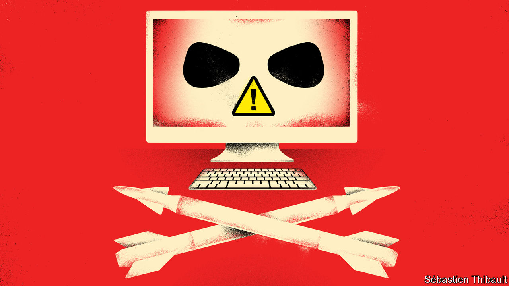

###### Lessons from the cyber-front

# Why Russia’s cyber-attacks have fallen flat 

##### Ukraine benefited from good preparation and lots of help 

 

> Dec 1st 2022 

Wars are testbeds for new technology. The Korean war saw jet fighters employed at scale for the first time. Israel pioneered the use of drones as radar decoys in its war with Egypt in 1973. And the Gulf war of 1991 was a coming-out party for gps-guided munitions.  is the first time that two mature cyber-powers have fought each other over computer networks in wartime. The result is a lesson in the limits of cyber-power and the importance of having a sound defence.

The popular notion of cyberwar has been shaped by lurid and dystopian scenarios of an “electronic Pearl Harbour”, first envisaged in the 1990s and accentuated by the relentless digitisation of society. Those fears have been fanned by glimpses of the possible. The American-Israeli Stuxnet worm, which came to light in 2010, inflicted damage on Iranian nuclear machinery with fiendish ingenuity. Russian malware sabotaged Ukraine’s power grid in 2015 and 2016. 

Yet when a full-blown cyberwar came to Ukraine, the result was modest. This was not for want of trying. Russia has thrown vast amounts of malware at Ukraine—the largest onslaught ever, say some officials. There were some notable successes, such as the disruption of Viasat, a commercial satellite-communications service used by Ukraine’s government and armed forces, less than an hour before the invasion.

But, despite , Ukraine’s lights, power and water stayed on. The banks remained open. Perhaps most important, Volodymyr Zelensky, Ukraine’s president, continued to make nightly television broadcasts to the nation. How?

Part of the answer lies in Russia’s . It limited its initial strikes because it assumed that Ukrainian infrastructure would soon come under its control. Russia’s cyber-forces also have less experience of integrating cyber-operations with military ones than their American counterparts, who have been doing it for 30 years. 

The conflict also shows how wartime cyber-power has been miscast. Spectacular cyber-attacks are rare because they are much more demanding than commonly thought. The Russian sabotage of Ukraine’s power grid in 2016, for instance, took more than two years to prepare. Viasat-like attacks are not mass-produced missiles that can be launched at any target. They are custom-made.

All this has two implications. One is that cyber-campaigns can run out of steam.  planned for a week-long war. So, too, did its hackers. When the invasion dragged on, they had to adjust their ambitions. They resorted to more basic attacks that could be launched at high tempo and scale. These were, and remain, a challenge for Ukrainian forces—but a manageable one. 

The second implication is that elaborate cyber-offensives are often needed the most when raw violence is off the table. If a war is raging anyway, why use exquisite code when  will do? Russia’s recent air attacks show that Iranian drones are a cheaper and simpler way to knock out the power grid.

Wartime cyber-offensives tend to complement military action rather than replace it. The most important cyber-operations are not those aimed at shutting down banks and airports, but those which quietly carry on intelligence-gathering and psychological warfare—tasks that have been part of battle since long before the existence of computers or the internet.

But if the cyber-conflict has underwhelmed, it is Ukraine that ultimately deserves the most credit. Russia treated Ukraine as a cyber-testing-range in the years after its first invasion in 2014. Ukraine was thus prepared. On February 24th its cyber-teams fanned out across the country, so that they were dispersed. Much of Ukraine’s digital infrastructure migrated to servers abroad, beyond the reach of Russian bombs.

Western governments and their cyber-agencies also played a role, sharing intelligence, fortifying Ukraine’s networks and rooting out Russian intruders in December and January. So, too, did private firms like Microsoft, an American tech giant, and eset, a cyber-security company from Slovakia, which monitor traffic on Ukrainian networks, often using artificial intelligence to comb through huge volumes of code. “The cyber-defence of Ukraine relies critically on a coalition of countries, companies and ngos,” wrote Microsoft in a lessons-learned report in June.

It is still early to draw solid conclusions. The war is raging and new malware is appearing all the time. Russia may be keeping some of its most potent cyber-capabilities in reserve. Yet the first signs are encouraging. It has often been assumed that the cyber-domain is an attacker’s playground, and that malware will always get through and cause devastation. Ukraine has defied expectations and shown that even one of the planet’s best-resourced cyber-powers can be kept at bay with a disciplined and well-organised defence. ■


