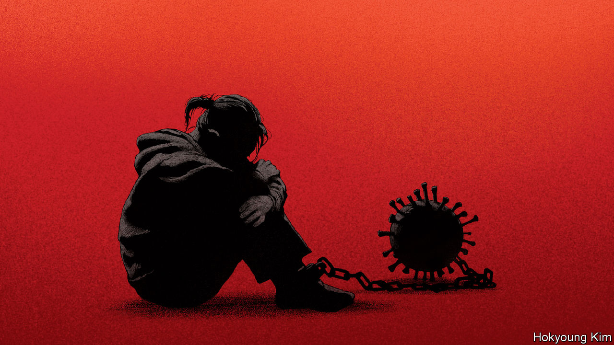

###### China and the pandemic

# Xi Jinping’s zero-covid policy has turned a health crisis into a political one 

##### Caught between raging disease and unpopular and costly lockdowns, he has no good fix 

 

> Dec 1st 2022 

CHINA INVENTED covid-19 lockdowns. During the first weeks of the pandemic, the government of Xi Jinping corralled tens of millions of people to stop the disease spreading out of Wuhan. Almost three years later, lockdowns have become China’s undoing. A combination of protests and rising cases means that Mr Xi will have to navigate between mass lockdowns and mass infection—and possibly end up with both. The coming months will pose the biggest threat to his rule since he came to power in 2012 and the biggest threat to the authority of the Communist Party since the protests around Tiananmen Square in 1989.

Sporadic local pickets are common in China. But demonstrations erupted across the country after at least ten people died in a fire in Urumqi, capital of Xinjiang, where residents were allegedly sealed in a building because of covid. Last weekend in Beijing protesters called for “freedom”; in Shanghai they demanded that Mr Xi step down. The crowds were small, but in a place as heavily policed as China it is remarkable they ever formed.

If demonstrators were the only opposition, the security forces could restore order. But Mr Xi also faces an implacable virus. To grasp the political and economic turmoil that lies ahead, you need first to understand how China’s epidemic has gone wrong.

One problem is hubris. The zero-covid policy started as a stunning success, by sparing millions of Chinese lives. At first, less disease also meant less economic harm. For the past three years, most Chinese have got on with things. Month after month, state media trumpeted that this proves Mr Xi and the party are competent and humane, unlike decadent Western politicians presiding over mass death.

These words have now turned to ash. Mr Xi’s policies have left China ill-protected against an endemic virus that is becoming harder to control. Almost 90% of the population has had two jabs. But our modelling, based on predictions of the rate at which people become infected and recover or die, suggests that, if the virus spread unencumbered, infections would . Around 680,000 people would die, even if vaccines remained potent and all of them received care. In reality vaccines wane and many would go untreated. The need for intensive-care beds would reach 410,000, almost seven times China’s capacity. 

Many of these fatalities would be the result of Mr Xi’s policy. Only 40% of the over-80s have had three covid shots, needed to prevent serious disease and death. Because a healthy 80-year-old is over 100 times more likely to die from covid than a healthy 20-year-old, that is a catastrophic mistake. The party is willing to lock down millions for weeks on end, but it has failed to deal with vaccine scepticism among the elderly. The government initially licensed vaccines for the under-60s only. It cast doubt on the safety of foreign vaccines while promoting traditional medicine. And it failed to incentivise local officials to put jabs first. 

Unless China changes course, its resilience to covid will fade. The latest subvariants are more infectious than Omicron, which is more infectious than Delta. Protection from serious disease and death decays much faster in those who have only been vaccinated than it does in those who have been infected as well. Regardless, China has not yet staged a campaign for a fourth shot. If booster coverage were 90% and 90% of cases had the best antiviral treatment, our model says that deaths would fall to 68,000, even if the virus were free to spread. 

In a world with plenty of vaccines and antivirals, the benefits of Mr Xi’s zero-covid policy are no longer accruing, even as the economic and social costs continue to mount. The number of domestic flights in China is down by 45% year on year, road freight is 33% lower and traffic on city metros has fallen by 32%. Urban youth unemployment is almost 18%, nearly double what it was in 2018. In contrast with the last peak of infections in the spring, restrictions are currently in place in all the big cities. Some places have been locked down on and off for months. Little wonder people have taken to the streets.

And so Mr Xi faces a dilemma: to keep the disease in check has become socially and economically costly, but to lighten the burden risks causing an epidemic. Worse, the stable middle ground between runaway disease and intolerable lockdowns appears to be shrinking, if it exists at all. On November 19th, barely a week after the government tried to ease up by announcing 20 less stringent control measures, Gavekal, a research group that tracks China city by city, detected a sharp increase in restrictions as infections took hold across the country. 

The implications go wider than . By making the zero-covid policy into a test of loyalty, Mr Xi has turned a health crisis into a political one. By imposing the daily apparatus of detection and enforcement, he has cut against the idea that his covid policy puts “people first” and instead brought an unbending authoritarian state into every home. By sticking with zero-covid despite the effects on the economy, he has cast doubt on one of the party’s chief claims to power—that only it can guarantee stability and prosperity.

This test of Mr Xi’s leadership comes at a bad time. Winter is when respiratory diseases like covid spread most easily. As Chinese viewers of the World Cup noticed before the censors got to work, they are locked down when other countries are free and maskless. As the world looks on, the failure of zero-covid is not only a life-threatening error, but also an embarrassment. 

Mr Xi has no easy path out of the epidemic. The party has rightly said it will strive to vaccinate the elderly. But administering the vaccine and procuring antivirals could take months. Lockdowns will be harsh and even then the disease may break out. In the best scenario China will experience an exit wave of deaths and disease, and economic disruption.

How Mr Xi handles these trade-offs will define him. Nobody knows how much Chinese people blame him and the central government for what has gone wrong, or whether the system of surveillance and control that the party has laboured to create is able to withstand mass dissent. And nobody can be sure how much China’s increasing nationalism ensures loyalty towards the Communist Party. During his first ten years in power Mr Xi exerted increasing control over politics and the economy without paying a price. Covid throws all of that into doubt. ■


